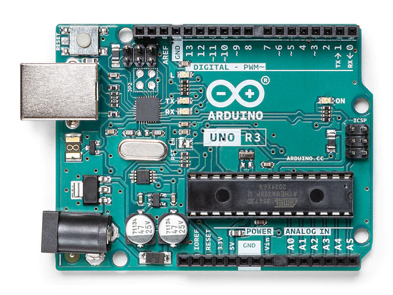
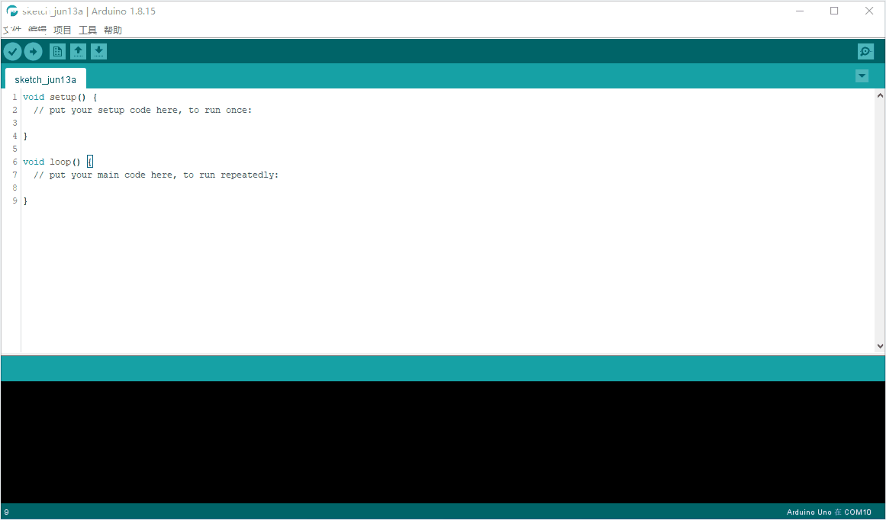

# **Arduino Uno R3介绍**

## 概述

​       

 Arduino Uno是一款基于ATmega328P微控制器的开发板。它是一个开源的跨平台电子原型开发平台，广泛应用于各种DIY电子设计、机器人、智能家居以及教育用途。

​       它有14个数字输入/输出引脚（其中6个可用于PWM输出）、6个模拟输入引脚，一个16 MHz的晶体振荡器，一个USB接口，一个DC接口，一个ICSP接口，一个复位按钮。它包含了微控制器所需的一切，你只用简单地把它连接到计算机的USB接口，或者使用AC-DC适配器，再或者用电池，就可以驱动它。

 Arduino Uno的引脚布局如下图所示： 

# 技术参数

| 型号                 | Arduino Uno                     |
| -------------------- | ------------------------------- |
| 微控制器             | ATmega328P                      |
| 工作电压             | 5 V                             |
| DC头输入电压（推荐） | 7-12 V                          |
| 数字I/O引脚          | 14                              |
| PWM通道              | 6                               |
| 模拟输入通道（ADC）  | 6                               |
| 每个I/O直流输出能力  | 20 mA                           |
| 3.3V端口输出能力     | 50 mA                           |
| FlASH                | 32 KB（其中引导程序使用0.5 KB） |
| SRAM                 | 2 KB                            |
| EEPROM               | 1 KB                            |
| 时钟速度             | 16 MHz                          |
| 板载LED引脚          | 13                              |
| 长度                 | 68.6 mm                         |
| 宽度                 | 53.4 mm                         |
| 重量                 | 25 g                            |

​        Arduino Uno R3支持多种编程语言，包括C、C++、Arduino语言。Arduino IDE是开发Arduino Uno的主要工具，可以通过USB接口连接电脑，利用简单的代码实现各种控制和交互功能。

​        除了Arduino Uno，Arduino公司还推出了多种型号的开发板，如Arduino Nano、Arduino Mega等。这些板子通常具有相似的架构和接口，但在具体的规格参数和尺寸上有所不同，可以根据项目需求选择合适的型号。

# 安装驱动

​        在连接 Arduino Uno R3 开发板时，电脑需要正确识别和安装驱动程序，否则无法使用该设备。下面是 Arduino Uno R3 驱动安装的方法： 

### 下载Arduino IDE软件

​       点击[Arduino官网(https://www.arduino.cc/en/software)]( https://www.arduino.cc/en/software)下载并安装Arduino IDE软件 。

### 连接Arduino Uno R3开发板

​       将Arduino Uno R3开发板通过USB线缆连接到电脑。在电脑的设备管理器中的"端口(COM和LPT)"，可以看到 Arduino Uno 的串行端口。注意，如果设备没有被识别或驱动程序没有正确安装，电脑可能会提示“未知设备”或“驱动程序无法安装”的错误信息。 

如下图:

### Windows安装Arduino Uno R3（官方版、官方兼容版）驱动

- 如果您使用Windows系统，可以从Arduino IDE软件自带的驱动目录或Arduino官网下载驱动程序。找到Arduino安装目录下的\drivers文件夹，在该文件夹中找到“arduino.inf”文件并右键单击，然后选择“安装”。

  [点击下载驱动](./arduino/drivers.zip)

  如下图:

  

### Windows安装CH340G（改进版）驱动

  1. 首先，在操作系统的设备管理器中查看CH340G设备是否已经安装驱动程序。可以在“端口（COM和LPT）”或“USB控制器”中找到。
  2. 下载CH340G驱动程序。可以从官方网站下载，也可以从第三方网站或CD中获取。建议从官方网站下载以避免下载恶意软件或病毒。CH340G官方下载地址[https://www.wch.cn/downloads/CH341SER_EXE.html](https://www.wch.cn/downloads/CH341SER_EXE.html)

  3. 打开下载的驱动程序，根据安装向导的提示完成安装。在安装过程中，可能需要选择操作系统类型和设备类型。如下图：

     

  4. 如果出现“Windows受限制”错误提示，可以通过以下步骤解决：

     - 右键单击桌面上的“此电脑”，选择“管理”。
     - 在左窗格中，选择“本地用户和组”，然后选择“用户”。
     - 右键单击“Administrators”组，选择“属性”。
     - 在“属性”对话框中，取消选中“账户已禁用”选项，然后点击“确定”按钮。
     - 关闭“计算机管理”窗口，然后重新启动电脑。

  5. 安装完成后，重新连接CH340G设备，然后查看设备管理器中是否已经正确识别设备并启用驱动程序。

### 电源

可以通过USB口或者直流电源座给Arduino Uno供电。Arduino Uno带有自动切换电源功能。
电源引脚如下：

##### Vin

电源输入引脚。当使用外部电源通过DC电源座供电时，这个引脚可以输出电源电压。

##### 5V

5V电源引脚。使用USB供电时，直接输出USB提供的5V电压；使用外部电源供电时，输出稳压后的5V电压。

##### 3V3

3.3V 电源引脚。最大输出能力为50 mA。

##### GND

接地引脚

##### IOREF

I/O参考电压。其他设备可通过该引脚识别开发板I/O参考电压。

### 存储空间

ATmega328p 有32KB Flash存储空间（其中0.5KB被用于存储bootloader），2KB 的SRAM和1KB 的EEPROM。
可以使用官方提供的EEPROM库读写EEPROM空间。

### 输入输出

Arduino Uno有14个数字输入输出引脚，可使用 pinMode()、digitalWrite() 和 digitalRead() 控制。
其中一些带有特殊功能，这些引脚如下

##### Serial

0（RX）、1（TX），被用于接收和发送串口数据。这两个引脚通过连接到ATmega16u2/CH340G等串口驱动芯片来与计算机进行串口通信。

##### 外部中断

2、3，可以输入外部中断信号。中断有四种触发模式：低电平触发、电平改变触发、上升沿触发、下降沿触发。

##### PWM输出：

3、5、6、9、10、11，可用于输出8-bit PWM波。对应函数 analogWrite() 。

##### SPI：

10（SS）、11（MOSI）、12（MISO）、13（SCK），可用于SPI通信。可以使用官方提供的SPI库操纵。

##### L-LED：

13号引脚连接了一个LED，当引脚输出高电平时打开LED，当引脚输出低电平时关闭LED。

##### TWI：

A4（SDA）、A5（SCL）和TWI接口，可用于TWI通信，兼容I²C通信。可以使用官方提供的Wire库操纵。

Arduino Uno 6个模拟输入引脚，可使用analogRead()读取模拟值。每个模拟输入都有10位分辨率（即1024个不同的值）。默认情况下，模拟输入电压范围为0～5V，可使用 AREF引脚和analogReference()函数设置其他参考电压。

相关引脚如下：

##### AREF：

模拟输入参考电压输入引脚。

##### Reset：

复位端口。接低电平会使Arduino复位，复位按键按下时，会使该端口接到低电平，从而让Arduino复位。

##### 指示灯（LED)

Arduino Uno R3带有4个LED指示灯，作用分别如下：

##### ON：

电源指示灯。当Arduino通电时，ON灯会点亮。

##### TX：

串口发送指示灯。当使用USB连接到计算机且Arduino向计算机传输数据时，TX灯会点亮。

##### RX：

串口接收指示灯。当使用USB连接到计算机且Arduino接收到计算机传来的数据时，RX灯会点亮

##### L：

可编程控制指示灯。该LED通过特殊电路连接到Arduino的13号引脚，当13号引脚为高电平或高阻态时，该LED 会点亮；低电平时，不会点亮。可以通过程序或者外部输入信号，控制该LED亮灭。

### 通信

Arduino Uno具备多种通信接口，可以和计算机、其他Arduino或者其他控制器通信。

ATmega328p 提供了UART TTL (5V)串口通信，其位于0 (RX) 和1 (TX)两个引脚上。Uno上的ATmega16U2/CH340G等串口驱动芯片会在计算机上模拟出一个USB串口，使得ATmega328p 能和计算机通信。Arduino IDE提供了串口监视器，使用它可以收发简单文本数据。Uno上的RX\TX两个LED可以指示当前Uno的通信状态。

SoftwareSerial库可以将Uno的任意数字引脚模拟成串口，从而进行串口通信。

ATmega328p也支持I2C (TWI)和SPI通信。Arduino IDE自带的Wire库，可用于驱动I2C总线，自带的SPI库，可用于SPI通信。

### 自动复位

一些开发板在上传程序前需要手动复位，而Arduino Uno的设计不需要如此，在Arduino Uno连接电脑后可以由程序控制其复位。在ATmega16U2/CH340G等串口驱动芯片上的DTR信号端，经过一个100nf 的电容，连接到ATmega328p 的复位引脚。

当计算机发出DTR信号时（低电平），复位端将得到一个足够长的脉冲信号，从而复位ATmega328p。在Arduino IDE中点击上传程序，在上传前即会触发复位，从而运行引导程序，完成程序上传。

### 注意事项

Arduino Uno上有一个自恢复保险丝，当短路或过流时，电流超过500mA，其可以自动断开供电，从而保护计算机的USB端口和Arduino。虽然大多数计算机USB端口都提供了内部保护，但是此保险丝可以提供了额外的保护。

### 编程

可通过Arduino IDE对Arduino Uno编程。
在Arduino Uno使用ATmega328p 芯片上，存储有bootloader程序，使得用户可以上传程序到开发板上，而不需要使用额外的编程器。这个上传程序的过程使用STK500协议完成。
你也可以不使用bootloader，通过ICSP接口连接编程器给Arduino Uno上传程序。

[点击下载《Arduino语法手册》](./arduino/ArduinoGrammarHandbook.pdf)

##### Arduino IDE上传Blink程序

)

