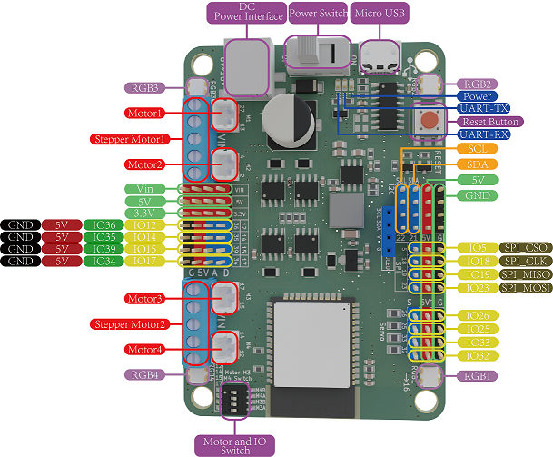
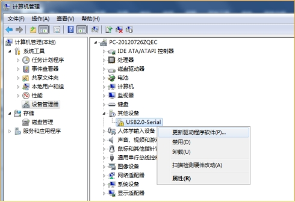
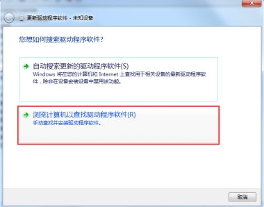
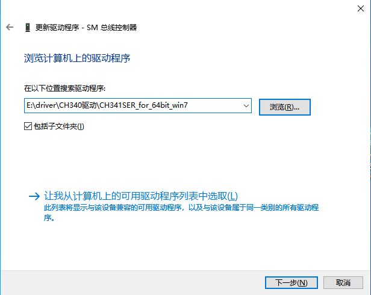
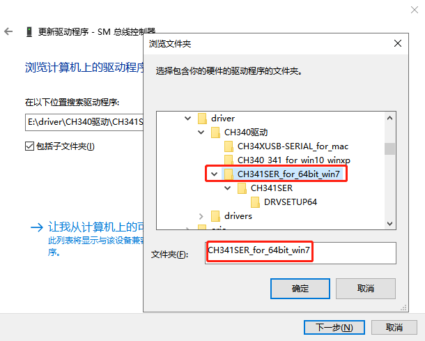
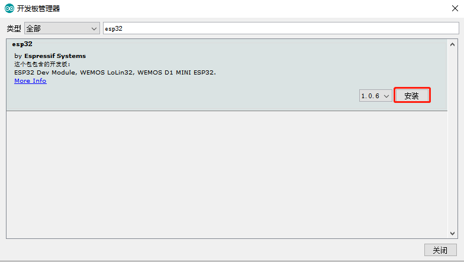
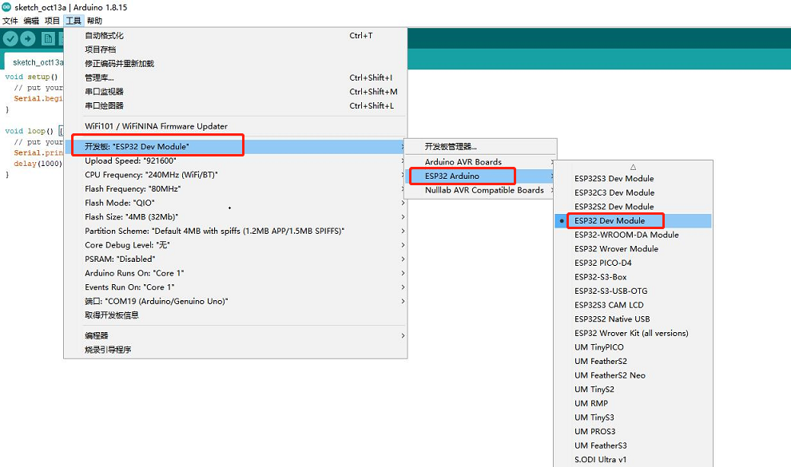
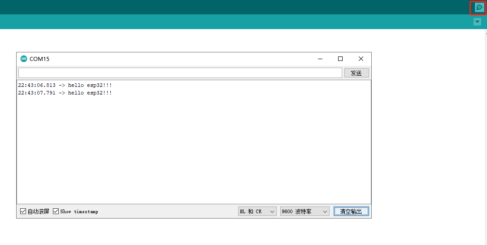
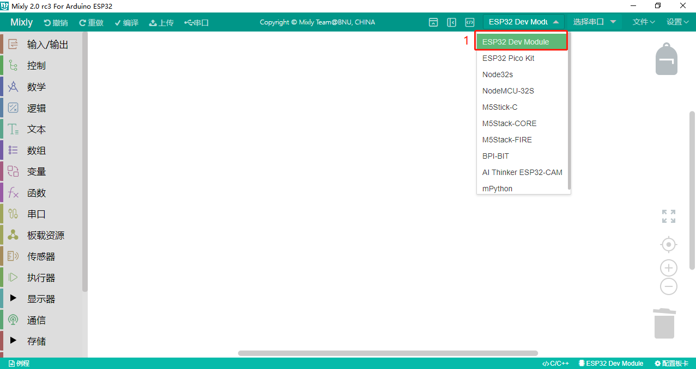

# Maker-ESP32 使用说明书

## [淘宝购买链接](https://item.taobao.com/item.htm?spm=a21dvs.23580594.0.0.3c3a3d0dhaSOlC&ft=t&id=688324885925)

## 产品简介

   Maker-ESP32是基于乐鑫科技的 [ESP32-WROOM-32](https://www.espressif.com/sites/default/files/documentation/esp32-wroom-32_datasheet_cn.pdf) 模组基础上开发的一款适用于创客教育的标志性产品，Flash大小4MB，集成 2.4 GHz、Wi-Fi 和蓝牙双模的单芯片方案。采用东芝的电机驱动芯片，电流最大可达3.5A。

## ESP32模组参数

* 448 KB ROM,520 KB SRAM,16 KB RTC SRAM

* QSPI 支持多个 flash/SRAM

* 内置 8 MHz 振荡器

* 支持自校准

* 内置 RC 振荡器，支持自校准

* 支持外置 2 MHz 至 60 MHz 的主晶振（如果使用 Wi-Fi/蓝牙功能，则目前仅支持 40 MHz 晶振）

* 支持外置 32 kHz 晶振，用于 RTC，支持自校准

* 2 个定时器群组，每组包括 2 个 64-bit 通用定时器和 1 个主系统看门狗

* 1 个 RTC 定时器

* RTC 看门狗

* 34 个 GPIO 口 • 12-bit SAR ADC，多达 18 个通道

* 带有专用 DMA 的以太网 MAC 接口，支持 IEEE 1588

* 双线汽车接口（TWAI®，兼容 ISO11898-1） • IR (TX/RX)

## 产品参数

* 4个电机端口；2个步进电机端口；电流最大达到3.5A
* 板载4个RGB灯(16引脚)
* 5个I2C插针接口,1个SPI插针接口
* 4个舵机接口（25、26、32、33）
* 8个IO引脚(12、14、15、17、34、35、36、39)
* 输入电压： 6-24V
* 产品尺寸：80mm×57mm；PCB厚度：1.6mm；净重：35g
* M4定位孔直径：4.6mm，兼容乐高
* 软件支持Mixly、Arduino IDE、Python

## 引脚说明

**注:**  1.  Motor and IO Switch: 当拨码开关打到IO口端时，M3、M4电机端口不工作，不能驱动电机，引脚为普通端口；当拨码开关打到M3A/M3B/M4A/M4B时，M3、M4为电机端口，可以驱动电机。

2. 因为ESP32芯片特性，在Arduino框架下，主板的34、35、36、39引脚不能作为输出；并且34、35、36、39引脚做为输入时，不能设置上拉或下拉模式。

#### **[产品原理图](./esp32/Esp32_V1.5.pdf)**

## Maker-ESP32驱动安装

1. 接上主板，右键点击“我的电脑-->属性-->设备管理器-->端口（COM和LTP）”，如果看到下图所示，则说明驱动已安装。

   

   如果没有显示端口或者显示以下状态时，说明驱动没有安装成功。

   

2. 安装驱动

   2.1、Windows7系统驱动安装步骤

   1）右键点击“我的电脑-->打开设备管理器-->端口（COM和LPT）。 此时你会看到一个“USB串行端口”，如下图"USB2.0-Serial"，右键单击“USB串行端口(USB2.0-Serial)”并选择“更新驱动程序软件”选项。

   

   2）接下来，选择“浏览计算机以查找驱动程序软件”选项。

   

   3）最后选择名为“CH341SER_for_64bit_win7”的驱动程序文件，下载[CH340驱动](./esp32/CH340驱动.zip)，请根据自己的电脑系统型号选择相应的驱动版本！

   

   

   4）成功安装之后便会出现下图所示的界面，通知你驱动成功。

   

   此时，我们再返回“设备管理器”界面，可以看到电脑已成功识别到端口,如下图。接下来打开编译环境，就可开启编程之旅了。

   

   **注意：**在Win10系统中，系统会自动下载相对应的驱动，无需自己安装驱动，但是如果系统没有识别到，就需要按照上述的步骤手动安装驱动。

   如上图所示我们可以看到USB 串口被识别为 COM30，但不同的电脑可能不一样，你的可能是 COM4、COM5 等。如果没找到 USB 串口，则有可能是你安装有误，或者系统不兼容。

3、Windows8系统驱动安装步骤

   如果你的电脑是Windows8系统：在安装驱动程序之前，您应该保存您正在编辑的这些文件因为在操作过程中会有几次关机。

   1）按下“Windows键”+“R”

   2）输入shutdown.exe / r / o / f / t 00

   3）点击“确定”按钮。

   4）系统将重新启动到“选择一个选项”屏幕

   5）从“选择一个选项”屏幕中选择“疑难解答”

   6）从“疑难解答”屏幕中选择“高级选项”

   7）从“高级选项”中选择“Windows启动设置”屏幕

   8）点击“重新启动”按钮

   9）系统将重新启动到“高级启动选项”屏幕

   10）选择“禁用驱动程序签名强制”

   11）一旦系统启动，您安装驱动程序与Windows7相同

## Maker-ESP32通过Arduino IDE下载程序

请前往 [Arduino官网](https://www.arduino.cc/en/Main/Software)  下载最新IDE

1. 打开Ardunio IDE;

2. 安装ESP32库；

   1) 点击Arduino IDE菜单栏：【文件】-->【首选项】

    把`https://dl.espressif.com/dl/package_esp32_index.json`添加到【附加开发板管理器网址】 如下图；

   

   2) 菜单栏点击 【工具】->【开发板】->【开发板管理器】搜索esp32，然后安装，如下图：

#### **注：**

下载第一个工具的时候可能会出现错误的情况，这种情况直接重新点击下载就可以了，下载的比较慢，不要着急。

下载第二个工具的时候可能会出现下载错误，不要慌，再试几次如果不行的话，使用手机（不使用流量也可以）开个热点，电脑连手机的热点就可以下载了。虽然下载的较慢，但是步骤极为简单。

## 通过Ardunio IDE上传程序

和Arduino上传程序一样，先选择主板，如下图

将写好程序点击上传按钮，等待程序上传成功，如下图。

点击串口工具就可以看到串口的打印。如下图

## Mixly使用(以Mixly2.0为例)

1. ### 板卡选择

   

2. ### 主板选择

   

3. ### 导入案例

   

4. ### 下载

   

## Mixly示例程序

[点击下载电机示例程序](./esp32/esp32_mixly/esp32_motor_test.zip)

[点击下载RGB灯示例程序](./esp32/esp32_mixly/esp32_rgb_test.zip)

[点击下载舵机示例程序](./esp32/esp32_mixly/esp32_servo_test.zip)

[点击下载OLED示例程序](./esp32/esp32_mixly/esp32_oled_test.zip)

[点击下载电机舵机综合示例程序](./esp32/esp32_mixly/esp32_motor_servo_test.zip)

电机舵机一起用时，不要用Mixly自带的电机驱动块，需使用操作引脚来控制，因为舵机电机一起使用时，mixly自带的驱动块PWM管道冲突，属于mixly软件库本身的问题。

[点击下载步进电机示例程序](./esp32/esp32_mixly/esp32_stepper_test.zip)

以28BYJ-48步进电机，接Stepper1接口为例, 接线方式如下表格：

| 步进电机线的颜色 |       引脚(主板背面丝印)            |
| :---------: | :-----------------------------------: |
|    橙色     |                   A01                  |
|    粉色     |                   A02                  |
|    红色     |                   VIN                  |
|    蓝色     |                   A03                  |
|    黄色     |                   A04                  |

## Arduino示例程序

[点击下载电机示例程序](./esp32/esp32_arduino/motorTest.zip)

[点击下载RGB灯示例程序](./esp32/esp32_arduino/rgbTest.zip)

[点击下载舵机示例程序](./esp32/esp32_arduino/servoTest.zip)

[点击下载OLED示例程序](./esp32/esp32_arduino/oledTest.zip)

[点击下载电机舵机综合示例程序](./esp32/esp32_arduino/motorServotTest.zip)

[点击下载步进电机示例程序](./esp32/esp32_arduino/stepperTest.zip)

以28BYJ-48步进电机，接Stepper1接口为例,接线方式如下表格：

| 步进电机线的颜色 |       引脚(主板背面丝印)            |
| :---------: | :-----------------------------------: |
|    橙色     |                   A01                  |
|    粉色     |                   A02                  |
|    红色     |                   VIN                  |
|    蓝色     |                   A03                  |
|    黄色     |                   A04                  |

## ESP32系列连接使用PS3蓝牙无线手柄

[点击查看ESP32系列连接使用PS3蓝牙无线手柄](./ps3_esp32.md)

[点击下载PS3控制电机舵机案例](./esp32/esp32_arduino/esp32PS3ControlTest.zip)

[点击下载Mixly库PS3手柄](./esp32/esp32_mixly/esp32_emakefun_sensors_mixly.zip)

## FAQ

**Q**: Mixly下载程序不成功？

**A**：1. Mixly的安装路径不要包含中文、空格等特殊字符；放在电脑的根目录下，层级目录不要太深；比如                          D:\mixly2.0-win32-x64就是根目录安装；  

2. 查看串口是否选择正确，如果没有串口，请先安装CH340G驱动；串口不要被其他应用占用；
3. 检查程序是否有错误；

**Q**: 电机程序上传成功，但是电机不转？

**A**: 1. 电机需要DC头供电，6-24V，建议使用两节3.7V锂电池，电源开关是否打到ON；

   2. 第一步已经完成的话，还出现问题，请检查Motor and IO Switch开关是否拨到电机方向(即 标有ON的方       向)；
   3. 检测程序设置的电机引脚是否和电机实际引脚一一对应；

## 联系我们

**技术 + 合作：TEL:  13242991035(WX同号)**
