# MicroBit
## 什么是Micro:Bit?
Micro:bit是由英国BBC公司推出的面向青少年编程教育的微型计算机，别看它身材不大，但麻雀虽小五脏俱全，一块小板子上集成了加速度传感器，磁力传感器，两个可编程按钮，25个单色led，蓝牙等常用传感器设备，而尺寸只有信用卡的一半大小，采用micro usb口供电，可外接电池盒，在底部还有多个环孔连接器，可用于控制外接设备。
             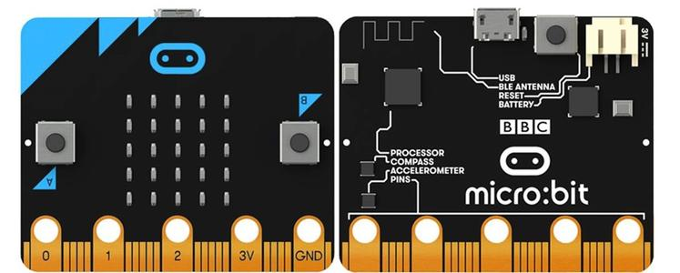

## micro:bit有什么用处？
Micro:bit可以通过鳄鱼夹与各种电子元件互动，支持读取传感器数据，控制舵机与RGB灯带，因此能够轻松胜任各种编程相关的教学与开发场景。此外，micro:bit还可以用于编写电子游戏，声光互动，机器人控制，科学实验，可穿戴装置开发等（点击购买[microbit主板](https://item.taobao.com/item.htm?spm=a230r.1.14.34.34d143dbJxeVYm&id=602180967919&ns=1&abbucket=16#detail),点击购买[microbit扩展板](https://item.taobao.com/item.htm?spm=a1z10.3-c-s.w4002-21556097790.15.2f7832c52Xc4tS&id=602180967919)）
进入micro:bit官网——>[BBC micro:bit](https://microbit.org/)

# MagicBit产品

## 适用人群
micro:bit多功能电机驱动扩展板适用于：小学生智力开发/教育培训机构/中小学实验室/创客教育

## 产品特色
1. 与乐高兼容，通过不同的积木搭建、配合MagicBit实现更好更多更富创造性的功能，充分发挥学生的创造力
2. 板载Micro-usb接口充电器和3.7V锂电池座，为产品提供更好的能量来源
3. 同时支持驱动8路舵机和4路直流电机，为天马行空的想法和复杂的功能实现提供可能
4. 支持驱动2路4线步进电机
5. 板载4个RGB全彩灯，无源蜂鸣器
6. 板载红外接收头，通过红外遥控器实现红外线远程控制
7. 包含一个PH2.0-4Pini2c的接口，接口防反插的设计更加安全方便
8. 1个PH2.0-4PinRGB超声波(RUS-04)模块接口

## 产品参数
* PCB板厚度：1.6mm
* 小圆孔直径：3.7mm
* 大圆孔直径：4.6mm
* 产品的尺寸：86mm×57mm×23mm
* 净重(不含电池)：
* 18650电池电压/容量：3.7V/3000mAh
* USB输入电压：5V

## 购买链接
点击链接进入淘宝购买——>>[Magicbit V2.0](https://item.taobao.com/item.htm?spm=a1z10.3-c-s.w4002-21556097790.16.545832c5PZ3CCi&id=602180967919)

## 发货清单
* 单扩展版：Magicbit裸板
* Micro:bit单主板：Micro:bit主板
* 基础套装：Magicbit裸板、3.7V锂电池、emakefun红外遥控器、220cm杜邦线10pin、扩展版积木底座、micro:bit数据线、PH2.0-4pin单头15cm、硅胶套
* 超值套装：Magicbit裸板、3.7V锂电池、emakefun红外遥控器、220cm杜邦线10pin、扩展版积木底座、micro:bit数据线、PH2.0-4pin单头15cm、硅胶套、RGB超声波模块

## 产品学习资料
Magicbit V2.0含有丰富的学习资料，免费提供在线售后技术支持、解决在调试、组装、学习过程中遇到问题。并且有专门的技术交流群与广大的创客一起交流分享。做智能机器人开发和售后服务我们是认真的。

## 产品实物图
micro:bit多功能电机驱动扩展板与emakefun红外遥控器

## 软件介绍
microbit编程方式：Makecode/python（Mu editor）

### Makecode软件编程

Makecode软件使用方便简介，图形化的编程入门要求低，提高学习者的兴趣，让学习者更加专注于编程逻辑的设计，更好的开发智力。

### Python编程（Mu editor）
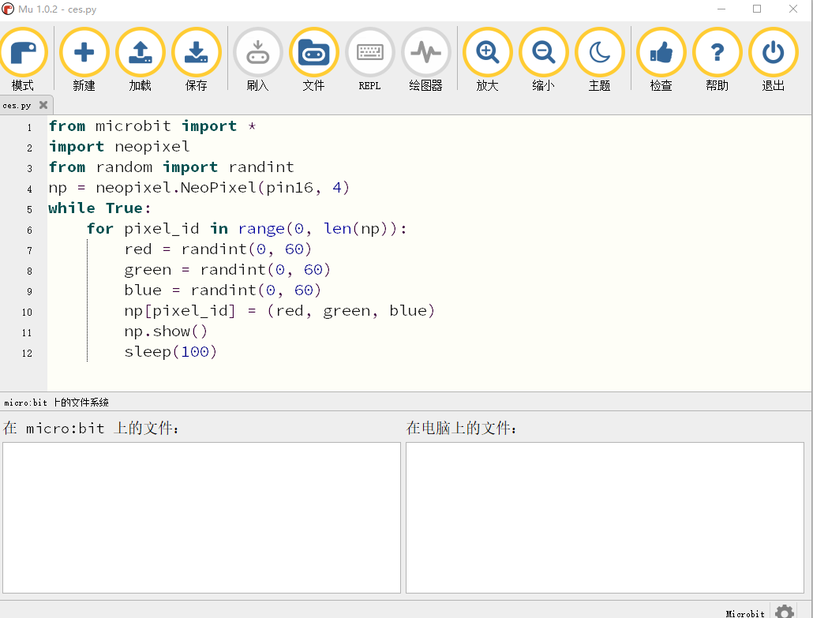

对于习惯代码编程的人来说，使用Mu editor这款编程软件是不错的选择。使用Python来学习micro:bit可以提高开发者的代码编程能力，更好的学习Python，为后期发展打下基础。

## 硬件接口介绍

### 正面

### 背面

### 扩展版各单元模块详解

#### 乐高孔 

- 专为micro:bit设计的兼容乐高积木的机器人多功能扩展板，可以搭配乐高积木来玩 创意无限。在刚刚拿到扩展版时，可以使用乐高积木来为扩展版搭建一个底座，保护扩展版，防止扩展版因为一些碰撞导致损坏。

#### 电池座和充电口
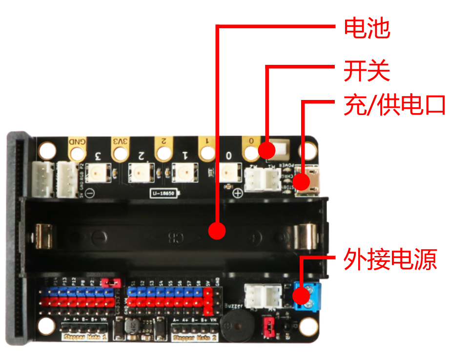
- 板载micro-usb接口充电器和3.7V锂电池座，在安装电池时注意电池的正负极，电池凸起的方向对应电池座的’＋‘号，另一端对应’ —‘ 号，使用接口充电器时、插拔不可用力过猛。在使用扩展版时、安装电池或者连接充电器前，扩展版上的电源开关应处于关闭状态，当电池按要求安装完毕或者使用usb线连接好后，再打开扩展版上的总开关。当电池安装在扩展版上时，可以使用usb线连接到扩展版来为电池充电。

#### 8路舵机接口

- 同时支持驱动8路舵机，方便开发者创造功能更加复杂的产品，扩展版上舵机的接口规格统一，方便接线

#### 步进电机接口

- 支持驱动2路4线步进电机

#### 蜂鸣器

- 板载无源蜂鸣器，可以通过蜂鸣器来实现声音报警或者唱歌。

#### RGB炫彩灯
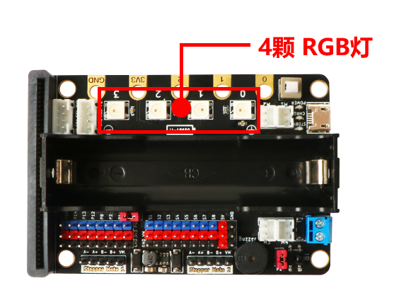
- 板载4个RGB全彩灯，通过调用micro:bit的P16来进行控制四个RGB灯亮灭和颜色。

#### 红外接收头

- 板载红外接收头,可以通过拖拉相应的程序积木块设定相应的功能，再使用emakefun红外遥控器来进行控制(注意红外遥控接收头处的跳线帽，必须接好)

#### I2C接口
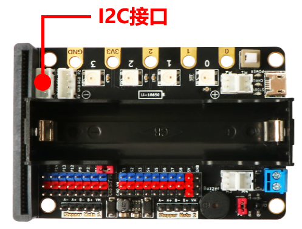
- 一块好的扩展版怎么能没有I2C接口？MagicBit扩展版包含1个PH2.0-4Pin i2c接口，开发者可以通过对该接口的使用来实现更具有创造性的设计。

#### RGB超声波

- 1个PH2.0-4Pin Rgb超声波（RUS-04)模块接口，该接口有两个用途，一方面可以作为超声波的TX和RX引脚口，另一方面也可以控制超声波模块的RGB彩灯，让超声波模块更加炫彩灵性。

#### 直流电机接口

- 想要开发一辆四驱车电机接口不够怎么办？MagicBit包含4个PH2.0-2Pin 直流电机接口（也可以连接到排针上），为你的想法保驾护航。

### 8Pin IO口引出
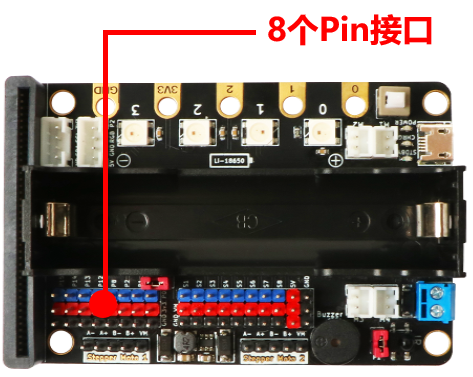
- 8个引出的IO口，为更多想法被实现提供可能

## 使用教程(编写控制MagicBit的RGB灯)

### 硬件准备
* 物料准备：Micro:bit主板、Micro:bit数据线、电池、MagicBit扩展版

#### 电池安装
* ___注意！！！！___在安装电池的时候，注意电池的正负极与电池座的正负极方向，电池的凸起为电池的正极，光滑的一面为负极。电池正极对应电池座的“+”号、电池的负极对应电池座的“—”号

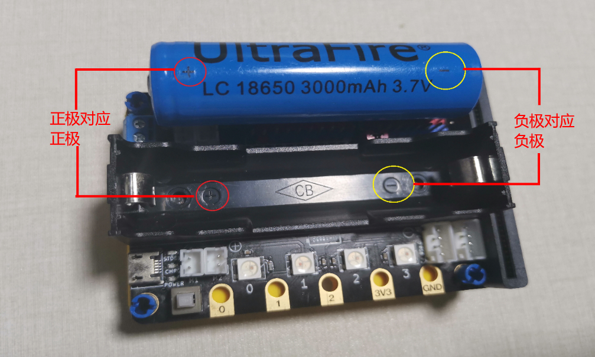

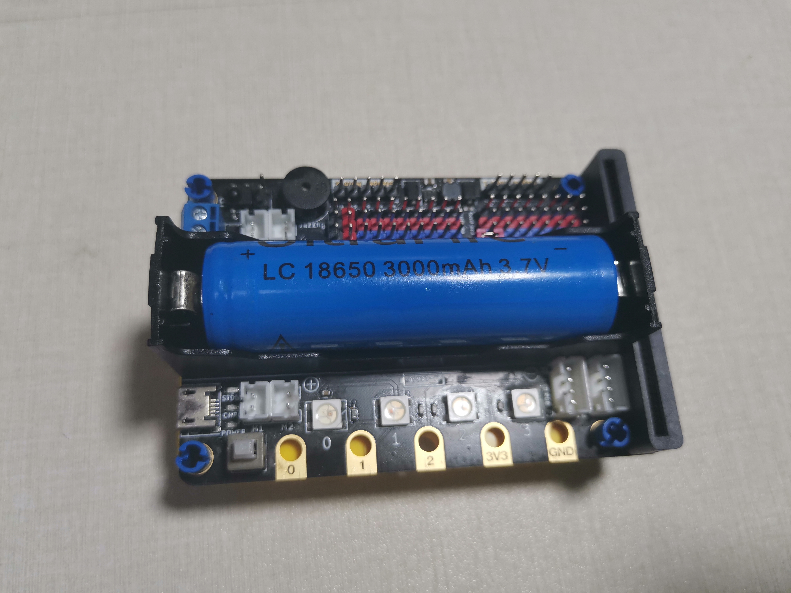

#### 插入micro:bit
* 拿取microbit主板，把两个按钮的方向朝外安装到扩展版的microbit板槽里，在安装的过程中卡槽对应整齐后再插入，防止用力过猛造成损坏。

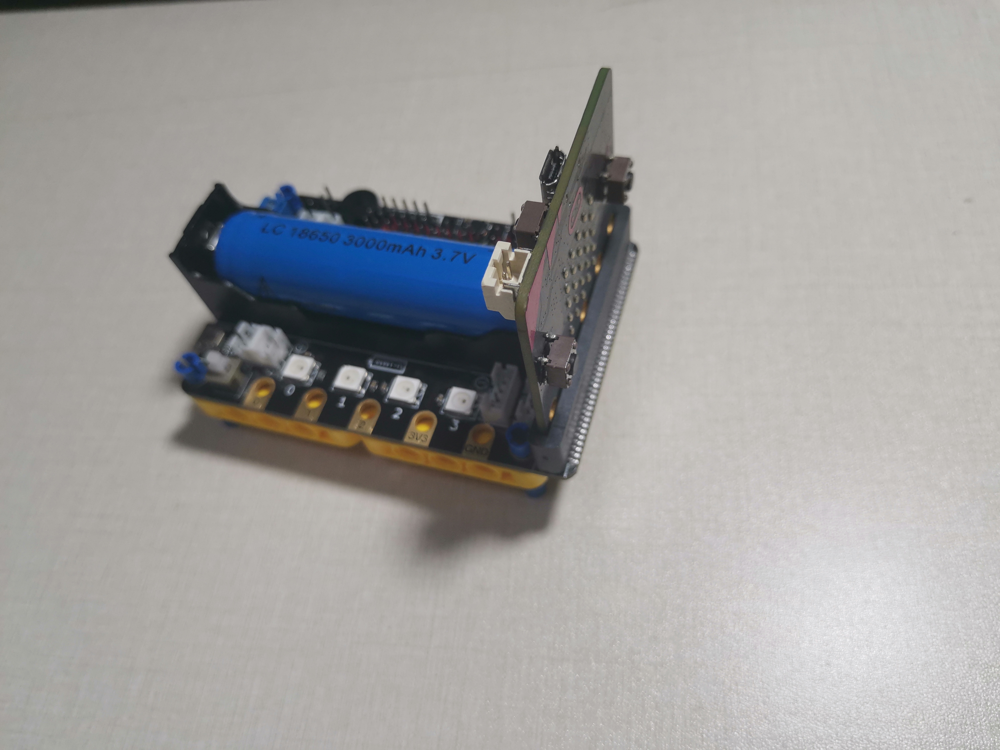

#### 打开电源开关
* 电源总开关建议常闭，需要时再打开

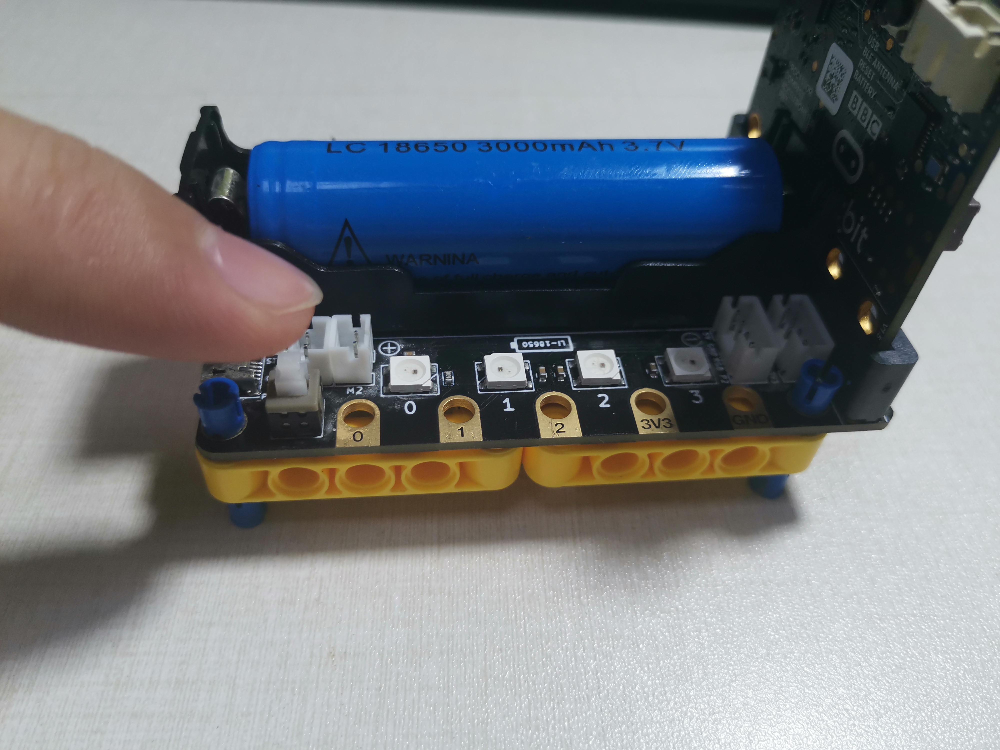

#### 数据线连接micro:bit和电脑
* 此时数据线是用来把程序从电脑下载到micro:bit

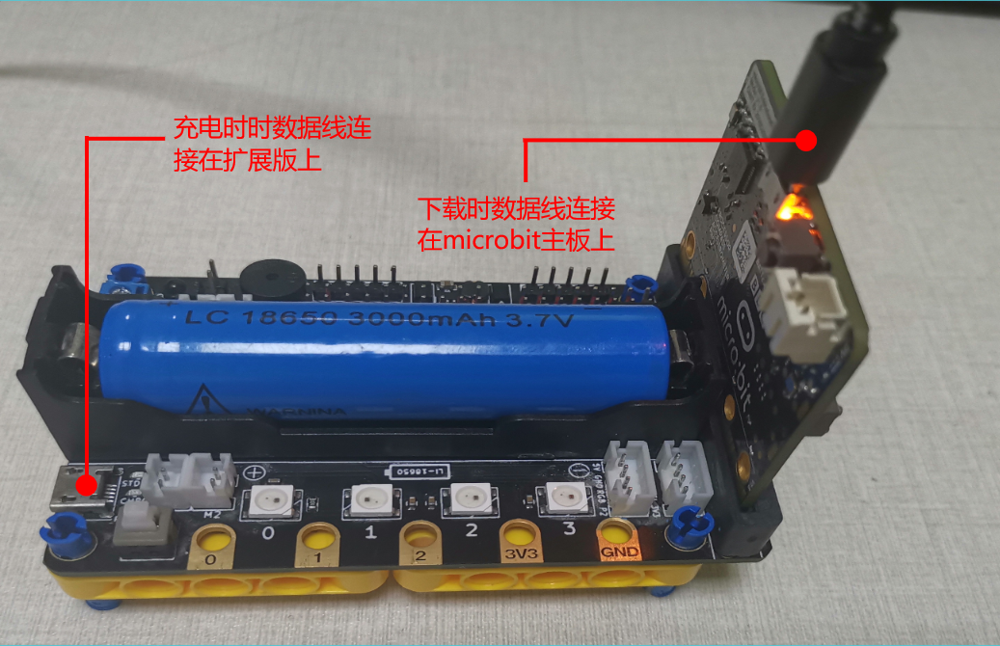

### 程序编写

#### 打开编程网页
* 打开浏览器，输入网址`https://makecode.microbit.org/` 或者点击[makecode](https://makecode.microbit.org/)进入编程官网

#### 新建项目
* 点击黑色箭头指向的**`新建项目`** ，进入到编程界面

#### 添加包
* 点击**`高级`**—>**`扩展`**—>输入网址搜索`https://github.com/emakefun/pxt-magicbit.git`—>点击magicbit包

#### 拖拉相应程序积木块编程
* 在Neopixel功能模块里选择白色箭头指向的程序积木块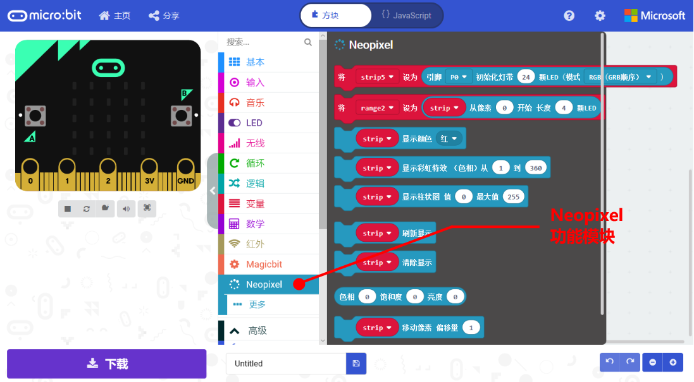

* 拖拽到编程页面的相应位置、注意黑色箭头所指可以调节引脚号、选择引脚为`P16`：红色箭头所指可以改变控制的LED数量、改变灯带为`4`，蓝色箭头所指可以调节RGB的模式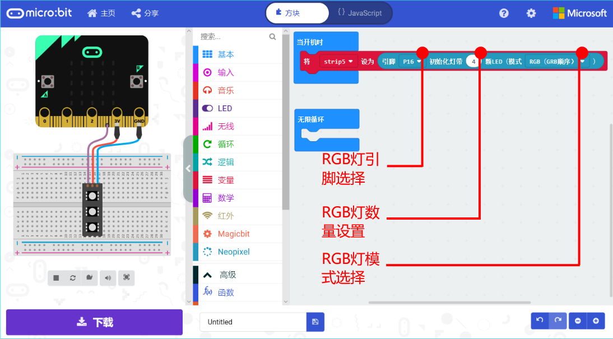

* 在Neopixel功能模块里选择白色箭头指向的程序积木块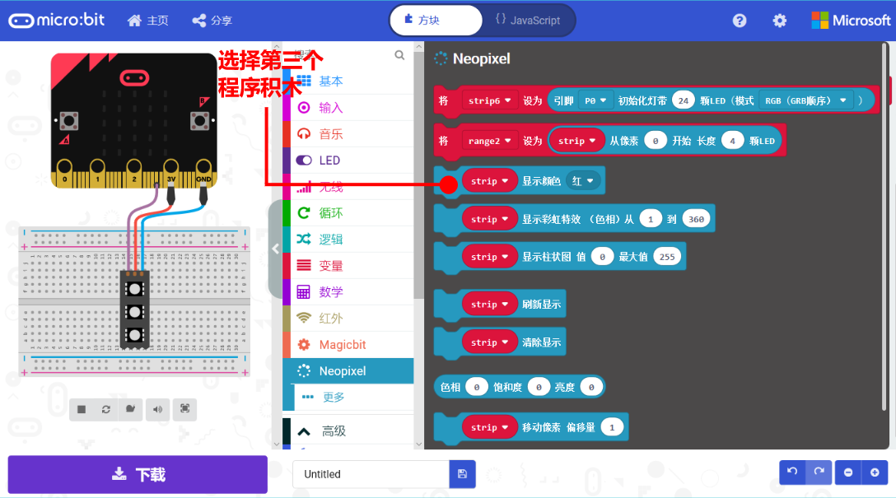

* 拖拽到编程页面的相应位置，通过黑色箭头所指的位置可以选择相应的颜色，**注意两个紫色箭头指向的变量应该一样**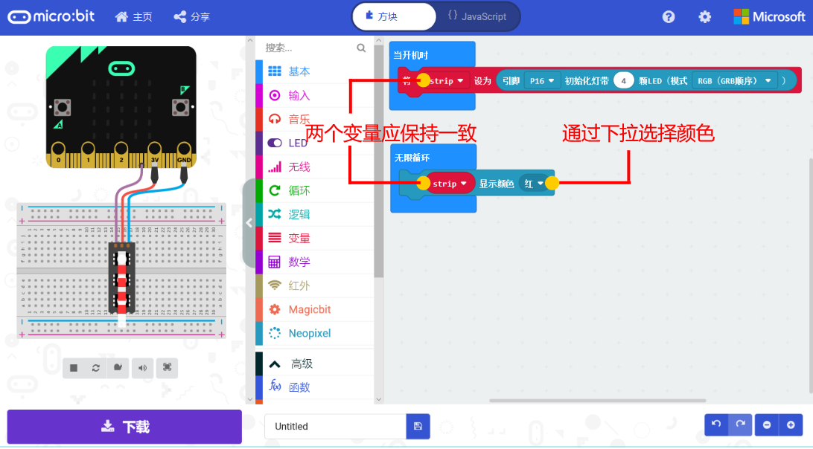

#### 点击下载按钮
* 点击**`下载`**,红色箭头所指的按扭

#### 保存到Microbit的U盘上，在保存过程中micro:bit指示灯会闪烁
* 点击红色箭头所指的地方、选择另存为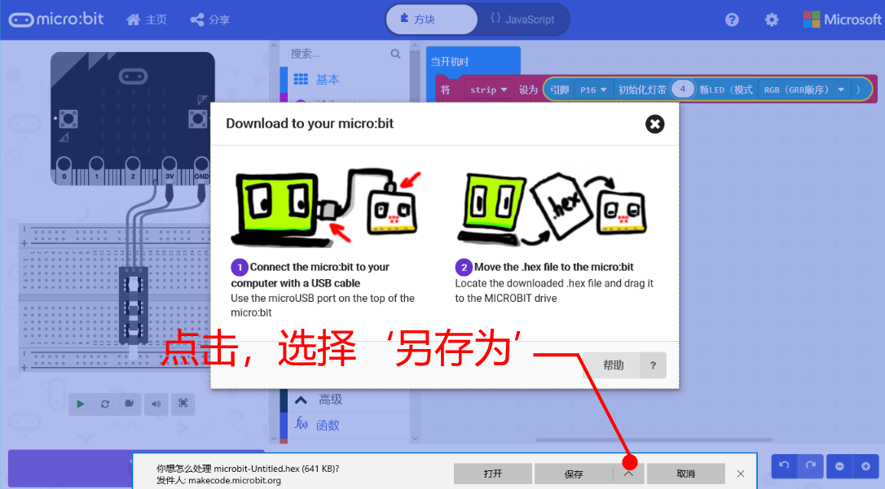

* 选择MICROBIT的内存盘，红色箭头所指，点击保存，程序就开始下载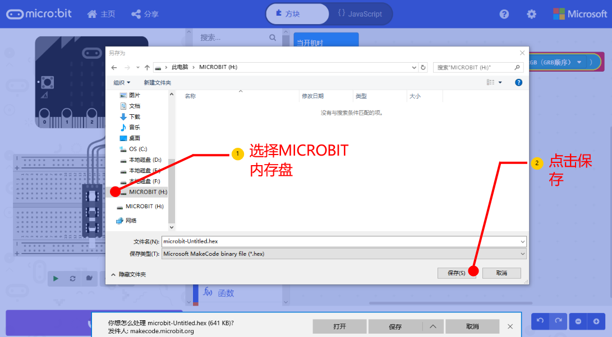

#### 闪烁结束表示下载完成，就可以看到实验效果

## 常用积木块讲解

### Magicbit插件包含三个功能模块，不同功能模块包含有不同的程序积木，用来控制Magicbit
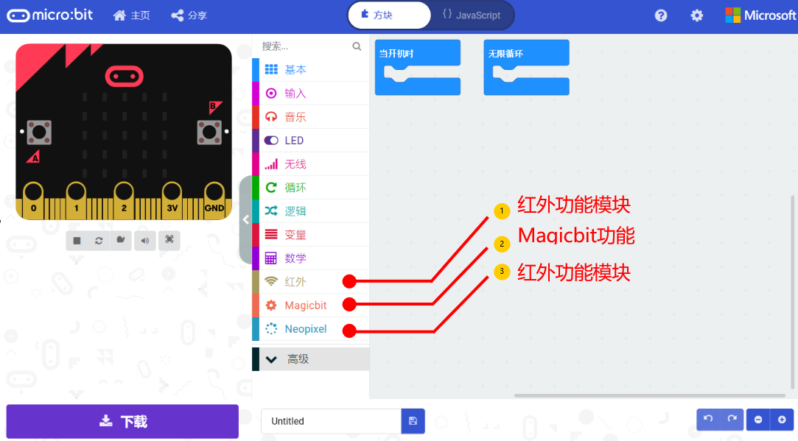

### 红外功能模块
> 红外接收编程图形块

* 红外功能模块包含两个程序积木，第一个程序积木是为了判断红外遥控器的按键是否按下，具体判断哪一个按键是根据程序积木的按键选择来确定的
> 假如选择A，当A按键按下时就会执行该积木程序内的积木程序命令

* 红外功能模块的第二个程序积木是用来选择扩展版上红外接收头与microbit哪一个引脚连接，在使用红外功能时，应先拖拽第二个程序积木来初始化选择引脚为`P1`

### Magicbit功能模块
> magicbit编程图形块
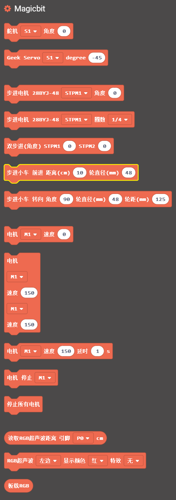

* 1号程序积木是用来实现对舵机进行控制。在进行设计时、根据实际连接扩展版上的接口号选择`S1`或者`S2`等，然后再设置该号舵机的角度。
> 如果舵机接在了扩展版的`S1`接口，并且想让舵机转到45°，那么1号程序积木就通过下拉选项选择`S1`、角度后面的白色小圆框内输入45。这样就设置成功了

* 2号是英文版的1号
* 3号程序积木是用来实现对步进电机的控制。和舵机操作类似，根据实际接线来选择`STPM1`或者`STPM2`，选择好后再通过输入设置想要的角度。
> 如果步进电机接在扩展版上的`Stepper Moto 1`接口，并且想让电机转到20°，那么3号程序积木就通过下拉选择`STPM1`，角度后面的白色小圆框内输入20。

* 4号程序积木和3号类似，不过4号程序积木是用来设置圈数
* 5号积木是用来设置两个步进电机的角度的
> 如果扩展版连接两个步进电机，那么直接使用这个程序积木块，再设置两个步进电机的运动角度就可以实现相应的控制

* 6号程序积木用来控制步进小车的前进距离
* 7号程序积木用来控制步进小车的转向角度
* 8号程序积木是用来控制电机的。根据实际电机与扩展版的连接选择相应的`M1`等选项，通过输入设置白色小圆框内的数值来设置电机转动的速度。
> 如果实物电机连接到扩展版上的`M1`,速度想要设置为50，那么选择程序积木的`M1`,白色圆框输入50。就实现了想要的控制

* 9号积木与8号积木类似，不过9号积木可以同时控制两个电机，在使用9号积木的过程中，根据电机与扩展版连接的接口号，选择对应的`M1`或者`M2`或者`M3`或者`M4`
* 10号程序积木比8号程序积木多了一个延时，可以通过修改延时时间，来控制该程序积木所代表的电机按照设定速度运行的时间。
* 11号程序积木通过选择对应的`M1`或者`M2`或者`M3`或者`M4`，来停止相应电机
* 12号程序积木会停止所有电机

* 13号程序积木是用来读取超声波距离值的，引脚选择`P2`，该程序积木返回一个cm距离值
 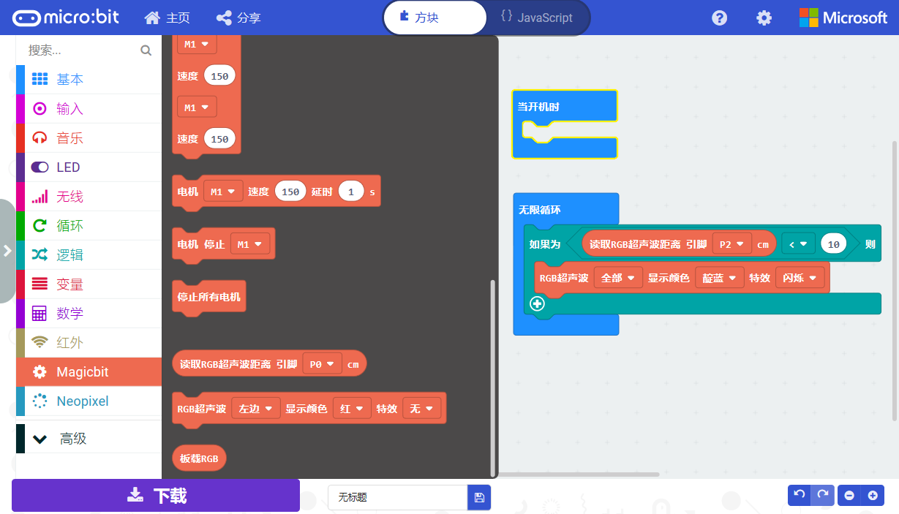

* 14号程序积木是用来设置超声波模块的RGB颜色和状态的，该程序积木有三个选项，第一个选项用来选择控制超声波的哪一个RGB灯，第二个选项用来选择RGB灯的颜色，第三个选项用来选择RGB灯的特效模式

### Neopixel功能模块
> 板载RGB编程图形块

* 1号程序积木对于控制EGB灯是必须的，1号积木的引脚在控制扩展版上RGB灯时、应选择为`P16`。在控制其它的灯带时可以根据需要进行改变。**注意！！！1号程序积木的第一个可选项是一个变量，这个变量代表一些设定的RGB灯**
* 2号程序积木的第一个可选变量**`range`**与1号程序积木的变量应不同，2号程序积木的第二个可选变量与1号程序积木的变量应相同（**`strip`代表一些RGB灯，`range`代表`strip`中的部分灯**）。2号程序积木可以控制不同的RGB灯，通过设置灯的`起始`和`终止`位置的数字量，让2号程序积木的第一个变量代表这些灯。
* 3号程序积木是用来控制**`strip`**的颜色（`strip是一个变量，代表一些设定的RGB灯`），通过下拉选项可以选择这些RGB灯的颜色
* 4号程序积木是用来控制**`strip`**的显示彩虹特效，可以通过调节**`strip`**代表的RGB灯的数目和色相的取值域来控制颜色的变化
* 5号程序积木可以用来做灯光柱状图，通过设定 值的初始和终止数字量、来调整**`strip`**所代表的灯的点亮数目。
* 6号程序积木刷新**`strip`**所代表RGB灯的状态
* 7号程序积木清除**`strip`**所代表RGB灯的状态
* 8号程序积木可以设置**`strip`**所代表的RGB灯的色相、饱和度、亮度

#### Neopixel更多功能模块

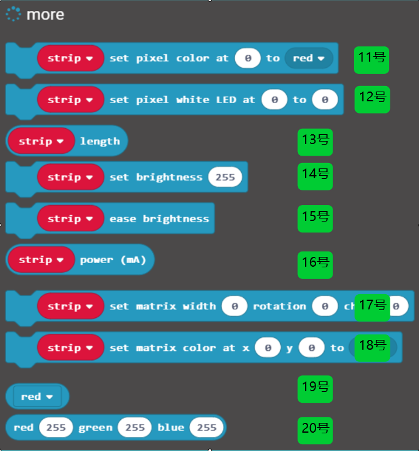

* 11号程序积木可以设置变量**`strip`**所代表的RGB灯中，像素地址为某个值（比如；‘0’，代表第一个RGB灯）的灯的颜色
* 12号程序积木可以设置变量**`strip`**所代表的RGB灯中，像素地址为某个区间（比如；设置前一个白色圆框为’0‘，后一个白色圆框为‘2’，就代表前两个灯）的灯为白色灯。
* 13号程序积木是变量**`strip`**所代表RGB灯的数目
* 通过使用14号程序积木，可以设置**`strip`**所代表的灯的亮度
* 15号程序积木的作用和4号程序积木刚好相反，是降低亮度
* 16号程序积木代表一个数值，该数值是RGB灯的电流值
* 17号程序积木和18号程序积木是用在矩阵RGB灯控制的
* 如果不知道某个颜色具体的三基色数值比例怎么办·？这时19号程序积木的用处就突显出来了，可以拖拉直接把19号程序积木放到相应的白色圆框内，然后再选择19号程序积木的颜色就好了，是不是很方便。
* 对于20号程序积木，可以发现有红绿蓝三个颜色的数值，这三个数值分别代表三种颜色的比例，不同的比例的混合，会产生不同的颜色。把20号程序积木拖拽到3号程序积木的颜色选择那里，发挥你的创造力、发现更多新的色彩吧！
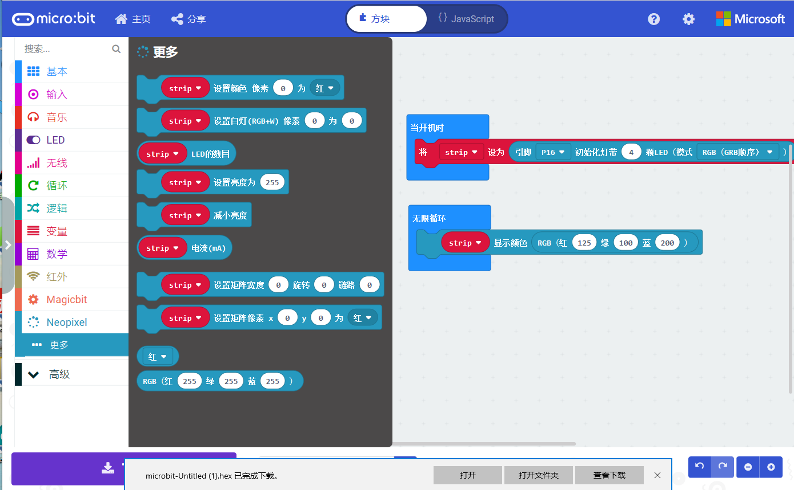

## 拓展学习和难题解答
* 交流群
* [百度贴吧](https://tieba.baidu.com/f?kw=microbit)
* [microbit中文社区](http://www.microbitgo.com/)
* [microbit-arduino中文社区](https://www.arduino.cn/forum-121-1.html)
* [microbit电子发烧友](http://www.elecfans.com/tags/microbit/)
* [microbit创客社区](http://mc.dfrobot.com.cn/thread-38057-1-1.html)
* [BBC microbit官网](https://microbit-micropython.readthedocs.io/en/latest/)