# MicroBit
## 什么是Micro:Bit?
Micro:bit是由英国BBC公司推出的面向青少年编程教育的微型计算机，别看它身材不大，但麻雀虽小五脏俱全，一块小板子上集成了加速度传感器，磁力传感器，两个可编程按钮，25个单色led，蓝牙等常用传感器设备，而尺寸只有信用卡的一半大小，采用micro usb口供电，可外接电池盒，在底部还有多个环孔连接器，可用于控制外接设备。
             

## micro:bit有什么用处？
Micro:bit可以通过鳄鱼夹与各种电子元件互动，支持读取传感器数据，控制舵机与RGB灯带，因此能够轻松胜任各种编程相关的教学与开发场景。此外，micro:bit还可以用于编写电子游戏，声光互动，机器人控制，科学实验，可穿戴装置开发等（点击购买[microbit主板](https://item.taobao.com/item.htm?spm=a230r.1.14.34.34d143dbJxeVYm&id=602180967919&ns=1&abbucket=16#detail),点击购买[microbit扩展板](https://item.taobao.com/item.htm?spm=a1z10.3-c-s.w4002-21556097790.15.2f7832c52Xc4tS&id=602180967919)）
进入micro:bit官网——>[BBC micro:bit](https://microbit.org/)

# MagicBit产品

## 适用人群
micro:bit多功能电机驱动扩展板适用于：小学生智力开发/教育培训机构/中小学实验室/创客教育

## 产品特色
1. 与乐高兼容，通过不同的积木搭建、配合MagicBit实现更好更多更富创造性的功能，充分发挥学生的创造力
2. 板载Micro-usb接口充电器和3.7V锂电池座，为产品提供更好的能量来源
3. 同时支持驱动8路舵机和4路直流电机，为天马行空的想法和复杂的功能实现提供可能
4. 支持驱动2路4线步进电机
5. 板载4个RGB全彩灯，无源蜂鸣器
6. 板载红外接收头，通过红外遥控器实现红外线远程控制
7. 包含一个PH2.0-4Pini2c的接口，接口防反插的设计更加安全方便
8. 1个PH2.0-4PinRGB超声波(RUS-04)模块接口

## 产品参数
* PCB板厚度：1.6mm
* 小圆孔直径：3.7mm
* 大圆孔直径：4.6mm
* 产品的尺寸：86mm×57mm×23mm
* 净重(不含电池)：
* 18650电池电压/容量：3.7V/3000mAh
* USB输入电压：5V

## 购买链接
点击链接进入淘宝购买——>>[Magicbit V2.0](https://item.taobao.com/item.htm?spm=a1z10.3-c-s.w4002-21556097790.16.545832c5PZ3CCi&id=602180967919)

## 发货清单
* 单扩展版：Magicbit裸板
* Micro:bit单主板：Micro:bit主板
* 基础套装：Magicbit裸板、3.7V锂电池、emakefun红外遥控器、220cm杜邦线10pin、扩展版积木底座、micro:bit数据线、PH2.0-4pin单头15cm、硅胶套
* 超值套装：Magicbit裸板、3.7V锂电池、emakefun红外遥控器、220cm杜邦线10pin、扩展版积木底座、micro:bit数据线、PH2.0-4pin单头15cm、硅胶套、RGB超声波模块

## 产品学习资料
Magicbit V2.0含有丰富的学习资料，免费提供在线售后技术支持、解决在调试、组装、学习过程中遇到问题。并且有专门的技术交流群与广大的创客一起交流分享。做智能机器人开发和售后服务我们是认真的。

## 产品实物图
micro:bit多功能电机驱动扩展板与emakefun红外遥控器

## 软件介绍
microbit编程方式：Makecode/python（Mu editor）

### Makecode软件编程

Makecode软件使用方便简介，图形化的编程入门要求低，提高学习者的兴趣，让学习者更加专注于编程逻辑的设计，更好的开发智力。

### Python编程（Mu editor）

对于习惯代码编程的人来说，使用Mu editor这款编程软件是不错的选择。使用Python来学习micro:bit可以提高开发者的代码编程能力，更好的学习Python，为后期发展打下基础。

## 硬件接口介绍

### 正面
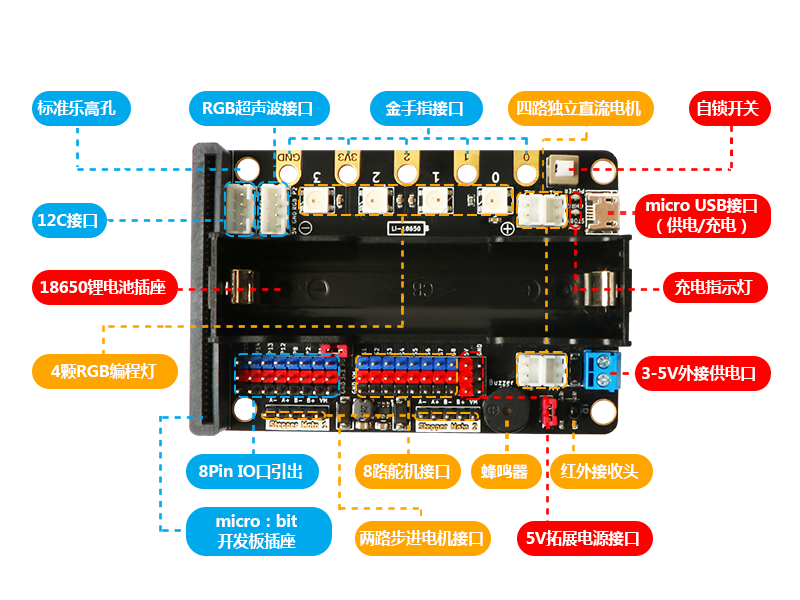

### 背面
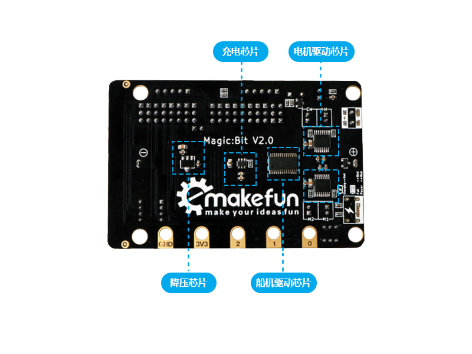

### 扩展版各单元模块详解

#### LEGO底座安装

1. 取一些LEGO底座的乐高积木零部件，安装底座
   
2. 底座安装完成后，和Magicbit进行拼接。
   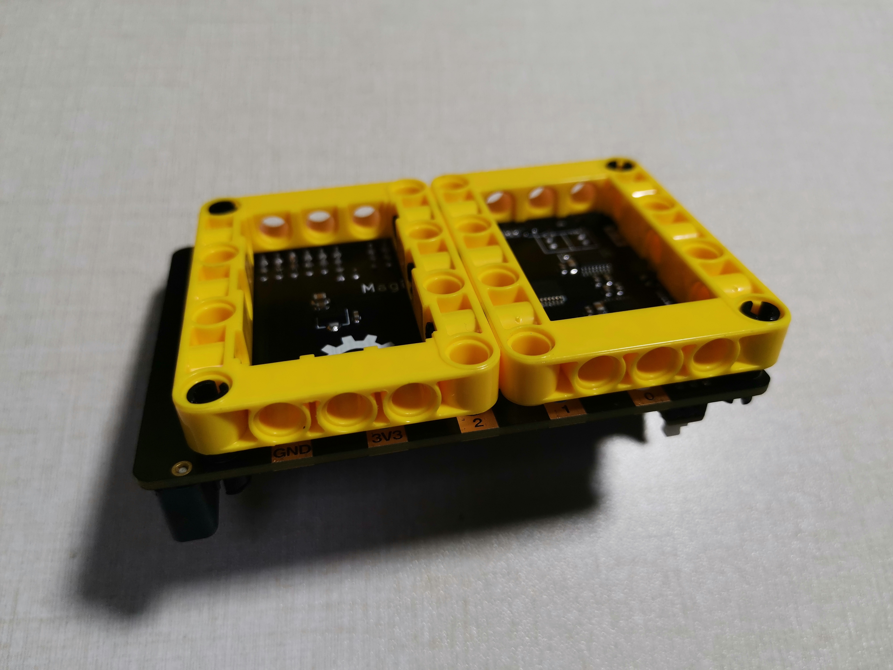

#### 电池座和充电口

- 板载micro-usb接口充电器和3.7V锂电池座，在安装电池时注意电池的正负极，电池凸起的方向对应电池座的’＋‘号，另一端对应’ —‘ 号。
- 在使用扩展版时、安装电池或者连接充电器前，扩展版上的电源开关应处于关闭状态，当电池按要求安装完毕或者使用usb线连接好后，再打开扩展版上的总开关。
- 可以使用usb线连接到扩展版来为电池充电，以及为扩展版供电。
- Magicbit还有一个外接电源接口，可以通过电源正负极导线来对Magicbit供电，供电范围为3~5v

#### 金手指介绍 
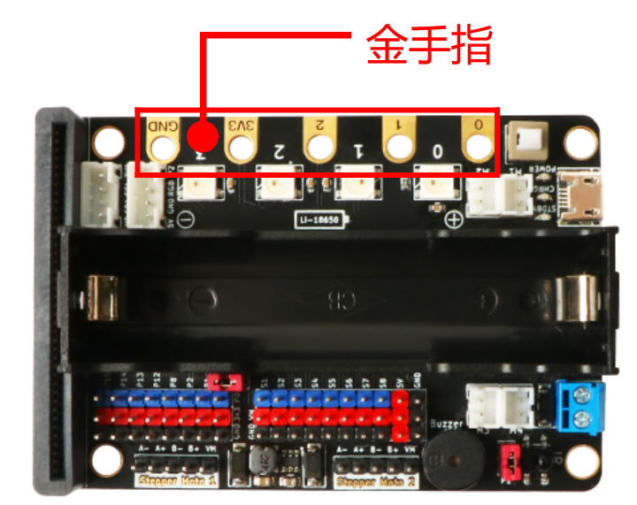

- Magicbit的五个洞是为了RCA香蕉插头而准备的，底下的几个金属引脚是为了鳄鱼夹而准备。
- 5个金手指代表不同的引脚，0号代表P0引脚、1号代表P1引脚、2号代表P2引脚，3号代表3v3，GND代表接地引脚（**注意：在使用0号和1号引脚时，把跳线帽拔掉。如果不拔，0号引脚被板载蜂鸣器占用，1号引脚被红外接收头占用**）
- 在需要使用外部元器件时，可以通过使用鳄鱼夹等来连接金手指的相应家属引脚。程序里设置相应引脚来控制。

#### 导入软件包

##### 打开编程网页
* 点击[makecode](https://makecode.microbit.org/)进入编程官网

##### 新建项目
* 点击黑色箭头指向的**`新建项目`** ，进入到编程界面

##### 添加包
* 点击**`高级`**—>**`扩展`**—>输入网址搜索`https://github.com/emakefun/pxt-magicbit.git`—>点击magicbit包

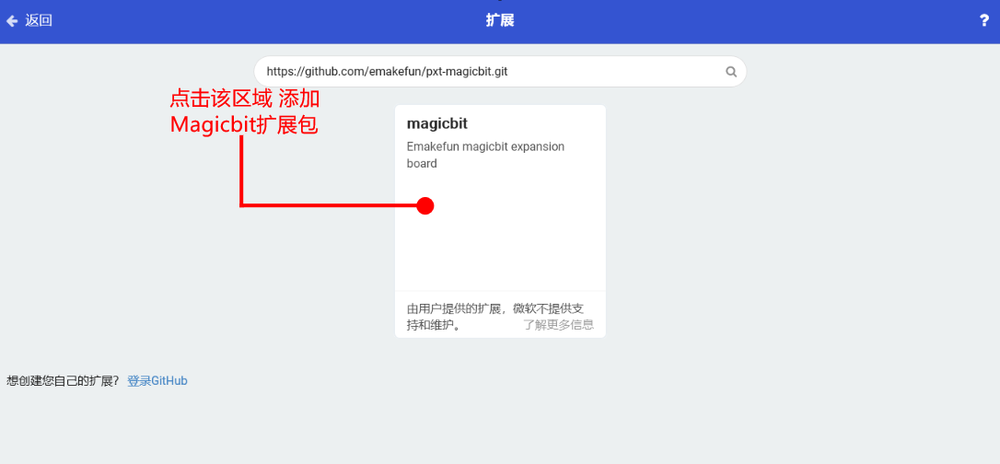

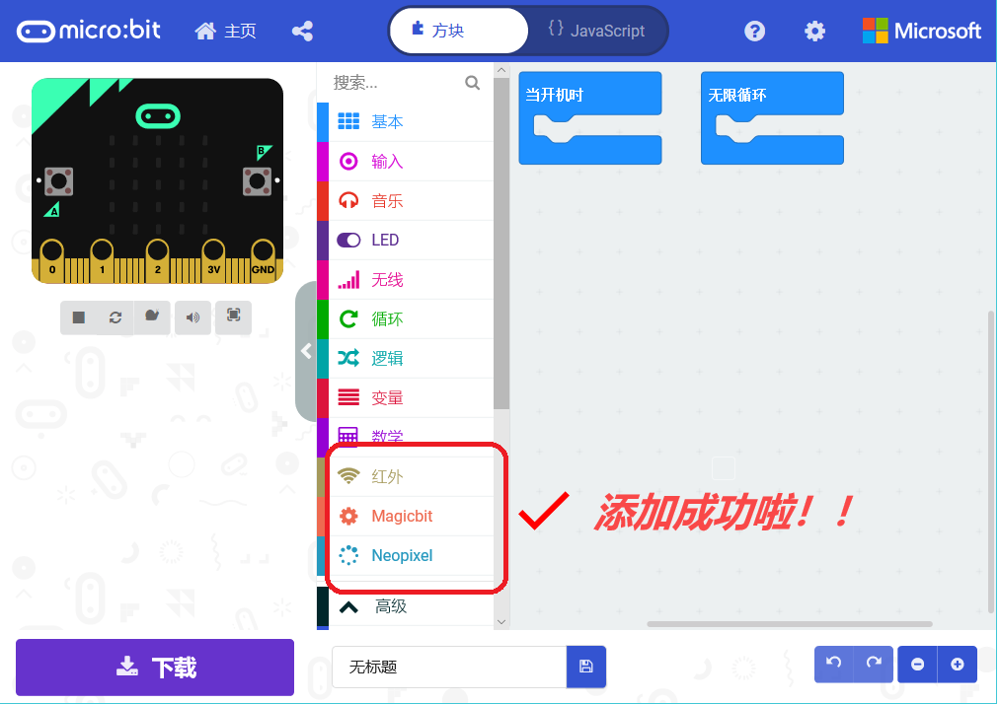

#### 程序下载
##### 点击下载按钮
* 点击**`下载`**,红色箭头所指的按扭

##### 保存到Microbit的U盘上，在保存过程中micro:bit指示灯会闪烁
* 点击红色箭头所指的地方、选择另存为

* 选择MICROBIT的内存盘，红色箭头所指，点击保存，程序就开始下载

#### 蜂鸣器
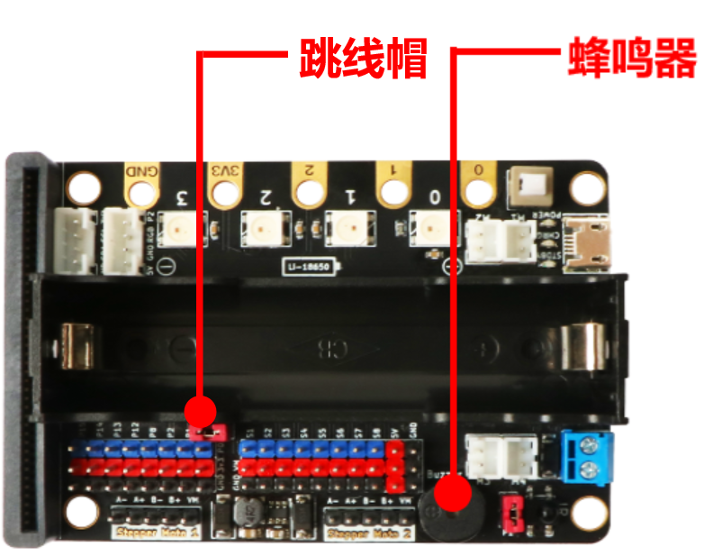

* 板载无源蜂鸣器，Magicbit上的蜂鸣器接线引脚为P0，通过对蜂鸣器输出不同频率的信号，从而控制蜂鸣器播放音乐。
* 当拔掉蜂鸣器的跳线帽时，引脚P0不能控制板载蜂鸣器，此时P0引脚可以作为普通IO引脚使用。跳线帽发货时是默认插上的。

#### 直流电机接口

* MagicBit包含4个PH2.0-2Pin 直流电机接口（也可以连接到排针上）。对于乐高积木的电机，可以接在步进电机的插口上。
> * 控制直流电机历程实验

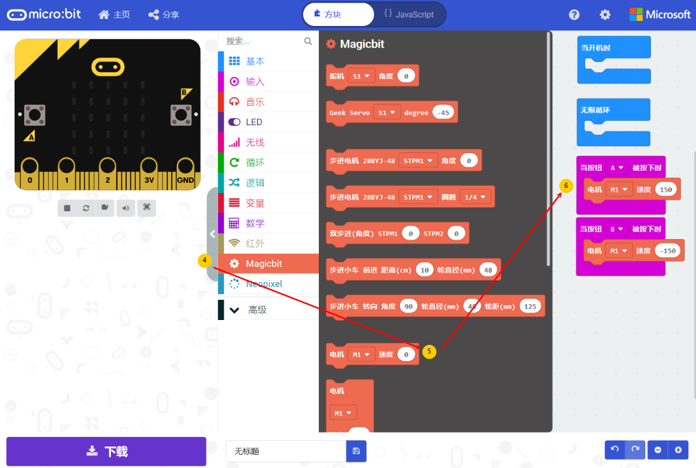

> 实验结果：当microbit主板的A按键被按下、接在M1的电机正转，按键B被按下、电机反转

#### 8路舵机接口
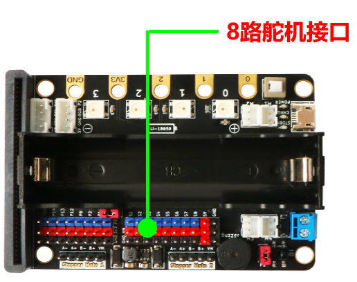

* 同时支持驱动8路舵机，而且扩展版上舵机的接口规格统一，方便接线
* Magicbit舵机接口的蓝色插口代表输出pwm信号的引脚、连接三线舵机的PWM输入信号黄色线，红色插口代表电源正极、连接三线舵机的电源正极橙色线，黑色插口代表电源负极、连接三线舵机的电源负极棕色线。
* 插口为S1~S8，在使用时，根据实际连接的插口，在程序积木中进行选择。

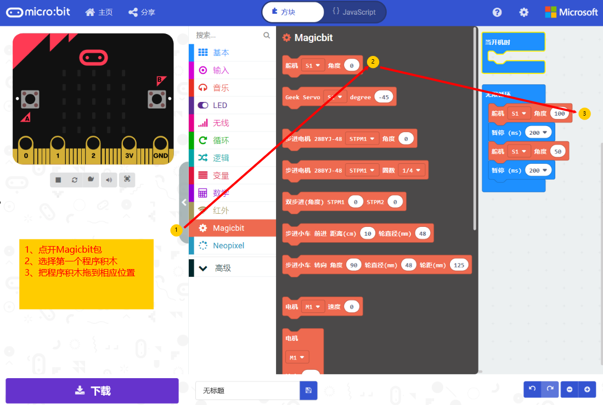
> 控制舵机转动到角度100，过200ms再转动到角度50，如此循环，，，

#### 步进电机接口

> 注意：在使用步进电机接口控制直流电机时，应注意扩展版上的`A-`或`B-`连接直流电机负极,`A+`或`B+`连接直流电机正极

* 包含2路4线步进电机、可以同时连接控制两个步进电机，或者同时连接控制4路TT马达。
* 支持步进电机与TT马达同时使用，例如可以控制一个步进电机和两个直流电机（具体搭配可以根据需要来进行设定）

#### RGB炫彩灯

* 板载4个RGB全彩灯，控制引脚为P16、可以通过编程控制四个RGB灯亮灭和颜色。

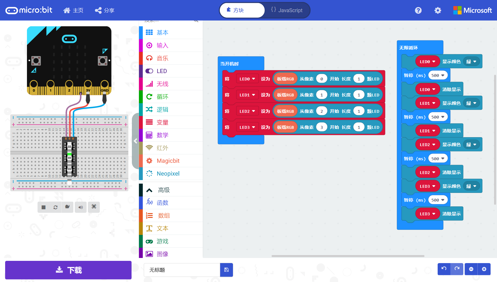
> RGB流水灯实验设计

#### 红外接收头
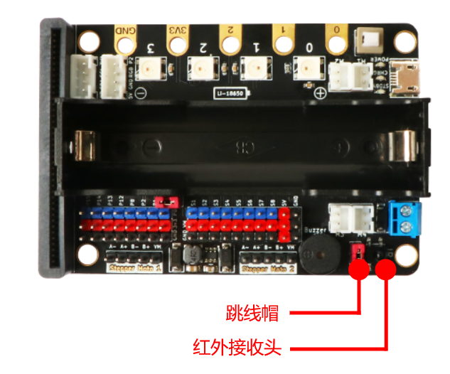

* 板载红外接收头,可以通过拖拉相应的程序积木块设定相应的功能，再使用emakefun红外遥控器来进行控制。
* 红外接收头的引脚为P1，注意红外接收头的跳线帽，在使用红外遥控功能时，红外接收头的跳线帽应当插上（默认是插上），当跳线帽拔下时，P1引脚为普通IO口引脚。
> 红外接收例程

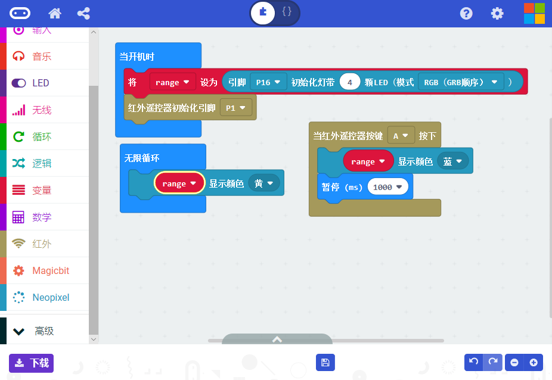

> 实验现象为：每次红外遥控器按键`A`按下时,板载RGB灯显示蓝色，1秒后，又显示黄色

#### RGB超声波
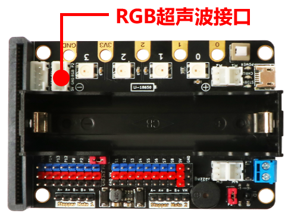

* 1个PH2.0-4Pin Rgb超声波（RUS-04)模块接口，该接口有两个用途，一方面可以作为超声波的TX和RX引脚口，另一方面也可以控制超声波模块的RGB彩灯，让超声波模块更加炫彩灵性。
* RGB超声波的IO引脚接在引脚的P2接口，RGB口与RGB口对应。
* 超声波的RGB彩灯，可以选择控制左右，显示的颜色和显示的特效，其中特效包括呼吸灯、旋转流星、闪烁。

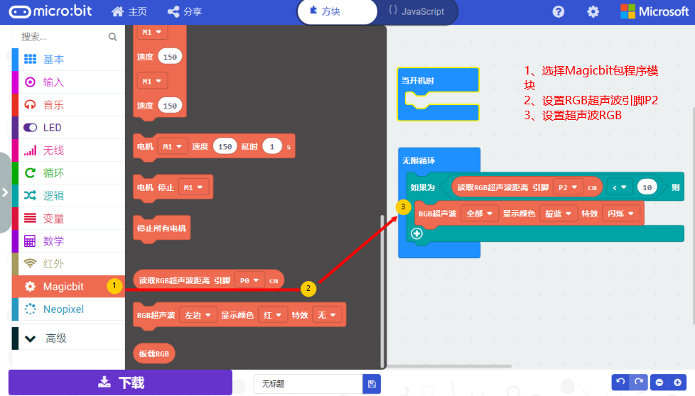
> 当超声波检测到前方距离小于10cm时，超声波的RGB灯 **全部**会显示**靛蓝**，并且有**闪烁**的特效

>超声波数值串口打印显示实验

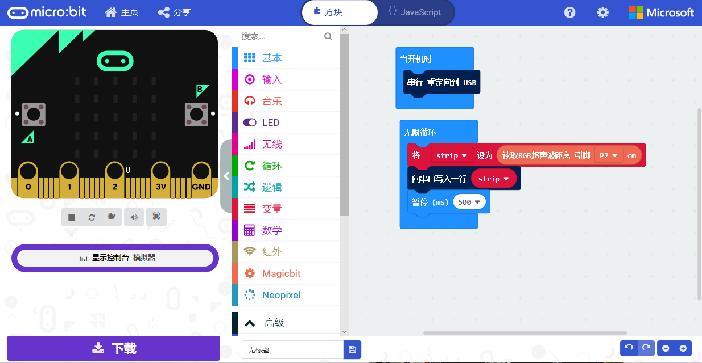
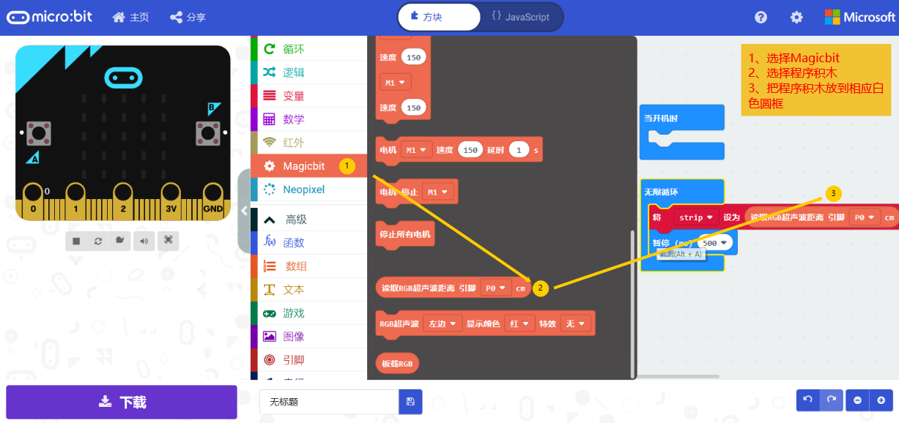
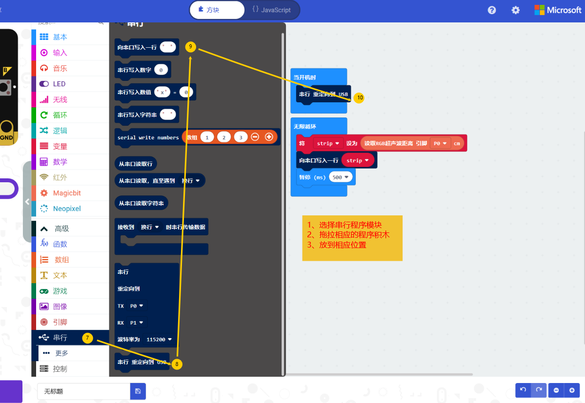

### 8Pin IO口引出

* 8个引出的IO口，黑色插口表示电源负极、红色插口表示电源正极(3V3)，蓝色表示IO信号口
* 引出的引脚是P0\P1\P2\P8\P12\P13\P14\P15

#### I2C接口

* 一块好的扩展版怎么能没有I2C接口？MagicBit扩展版包含1个PH2.0-4Pin i2c接口，可以使用该接口来控制 1602液晶等。在使用I2C通信时，应注意扩展版的数据线SDA引脚连接终端数据线SDA引脚，扩展版的时钟线SCL引脚连接终端的时钟线SCL引脚
> 点击查看控制[1602液晶](https://makecode.microbit.org/v0#)例程
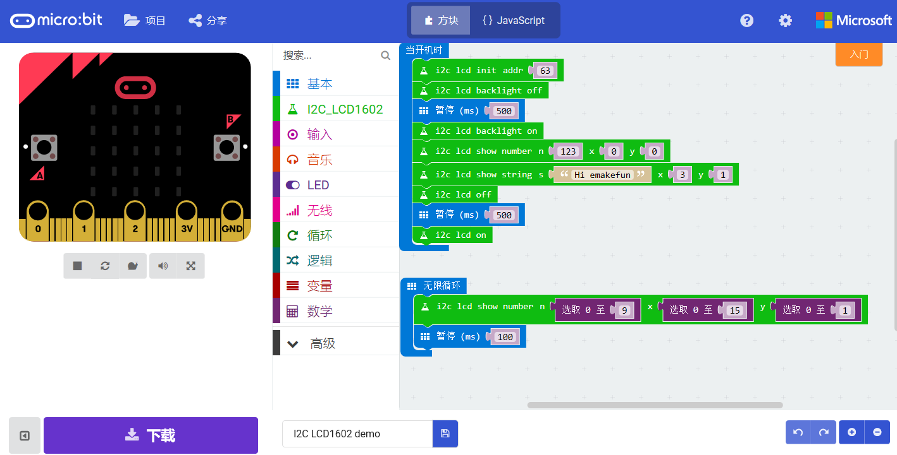

## 拓展学习和难题解答
* 交流群
* [百度贴吧](https://tieba.baidu.com/f?kw=microbit)
* [microbit中文社区](http://www.microbitgo.com/)
* [microbit-arduino中文社区](https://www.arduino.cn/forum-121-1.html)
* [microbit电子发烧友](http://www.elecfans.com/tags/microbit/)
* [microbit创客社区](http://mc.dfrobot.com.cn/thread-38057-1-1.html)
* [BBC microbit官网](https://microbit-micropython.readthedocs.io/en/latest/)