# motor:Bit产品介绍

micro:bit是[易创空间](http://www.emakefun.com/) 专门针对micro:bit而开发的驱动大电流电机，舵机，步进电机的一款多功能电机驱动扩展板。解决了市面上同类驱动板支持单节3.7V电池驱动力严重不够问题。本驱动板采用DC-DC电源方案，支持DC(6~36V)宽电压输入，最大输出3A电流。驱动芯片采用4颗大电流驱动芯片H450,最大驱动电流达3.5A，轻松同时驱动4个24V支流马达或者30暴力高速马达。舵机可以通过外部电源独立供电,同时可以支持8个舵机同时控制。板子采用主板平躺设计，安装孔兼容乐高，可以非常方便安装在自己创意设计中。完善的库支持，配套开发有makecode,scratch3.0,mixly,python库和教程。

## 产品特色
1. 供电方式有接线柱和DC头，可通过开关自由选择，亦可双供电
2. 强力电机和舵机驱动芯片，驱动力强劲
3. 包含多种电压引脚，满足大多数场景需要
4. 与乐高兼容，通过不同的积木搭建、配合motor:Bit实现更好更多更富创造性的功能，充分发挥学生的创造力
5. 同时支持驱动8路舵机和4路直流电机
6. 支持驱动2路5线步进电机
7. 板载4个RGB全彩灯，无源蜂鸣器
8. 板载红外接收头，通过红外遥控器实现红外线远程控制
9. 一个PH2.0-4Pin RGB超声波接口，接口防反插

## 产品参数
* PCB板厚度：1.6mm
* 大圆孔直径：4.6mm
* 产品的尺寸：80mm×57mm×12mm
* 净重：37.2g
* 输入电压：6~36V

## 产品实物图
motor:Bit 多功能扩展板与micro:Bit 主板
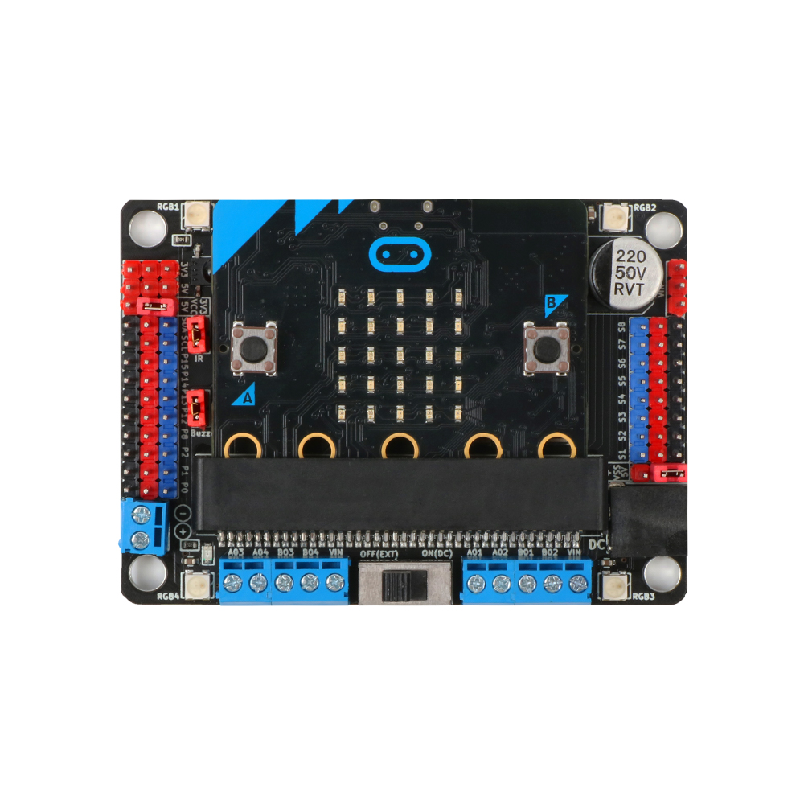

## 硬件接口介绍

### 正面

# 扩展版各单元模块详解

## 电源供电口

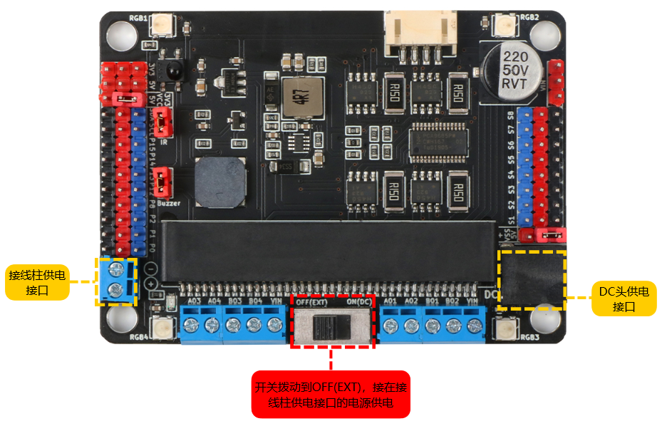

- motor:bit 有两个供电接口，一个接线柱类型( + 表示接电源正极线：— 表示接电源负极线)，一个DC头类型。在使用接线柱供电时，注意电源正负极的连接方向，扩展板接线柱的 + 符号所代表的接线口表示应该连接电源正极线、— 符号所代表的接线口表示应该连接电源负极线
- 拨动开关向右拨动到OFF(EXT)时，motor:bit 扩展板是通过接线柱供电的，此时，DC头供电接口无效：拨动开关向左拨动到ON(DC)时，motor:bit 扩展板是通过DC头接口供电，此时若VSS接线帽接在5V上，接线柱供电接口无效，若VSS接线帽接在 + 上，那么VSS的供电是通过接在接线柱的电源直接供电，从而实现一块板、两个供电源
- motor:bit 扩展板包含3V3，5V电源引脚，此外，还设计有一个VIN引脚，VIN引脚通过开关与供电源直接连接，VIN引脚于开关选择的供电源连接
- motor:bit 扩展板的红色引脚，皆为正极供电引出脚：黑色引脚皆为接地GND引脚

## 蜂鸣器

* motor:bit板载无源蜂鸣器，motor:bit上的蜂鸣器接线引脚为P0，通过对蜂鸣器输出不同频率的信号，从而控制蜂鸣器播放音乐。
* motor:bit 是通过跳线帽于microbit主板的P0引脚进行连接的，当拔掉蜂鸣器的跳线帽时，引脚P0不能控制板载蜂鸣器，此时P0引脚可以作为普通IO引脚使用。
> 无源蜂鸣器播放音乐 例程实验

> 实验现象为：当按下micro:bit 主板的按钮A 播放 生日歌： 当按钮B按下时，播放 铃声[蜂鸣器实验源码](https://makecode.microbit.org/_Rf1MMALz2CK8)

## 红外接收
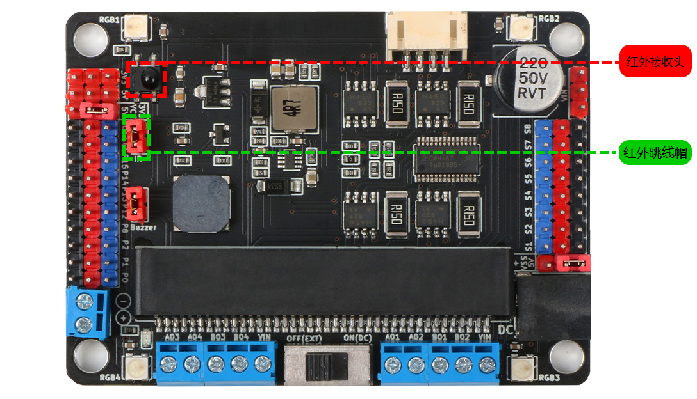

* motor:bit 板载有一颗红外接收头，可以通过拖拉相应的程序积木块设定相应的功能，再使用emakefun红外遥控器来进行控制。
* 红外接收头的引脚为P1，注意、红外接收头的跳线帽，在使用红外遥控功能时，红外接收头的跳线帽应当插上（默认是插上），当跳线帽拔下时，P1引脚为普通IO口引脚。
> 红外接收实验例程

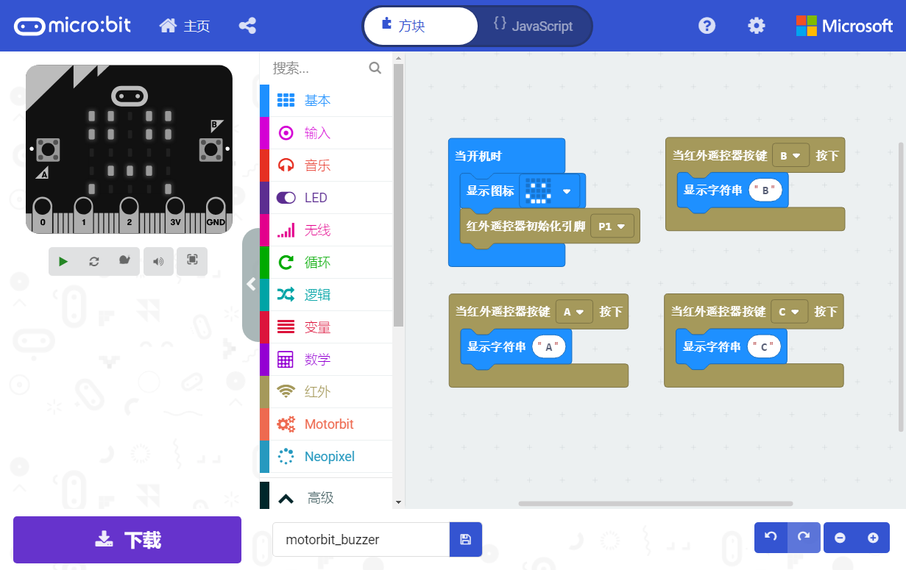

> 实验现象为：红外遥控器按键`A`按下时，micro:bit 主板显示字母 “A”，按键B按下时、micro:bit主板显示字母“B”，按键C按下时、micro:bit 主板显示字母“C”   [红外实验源码](https://makecode.microbit.org/_Czy5x2fuiioa)

## RGB炫彩灯

* motor:bit 板载4个RGB全彩灯，连接在microbit主板的P16引脚，可以通过对P16引脚编程控制四个RGB灯亮灭和颜色。
> 板载RGB实验例程

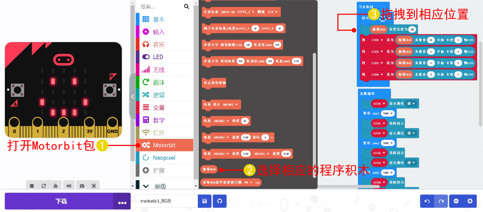

> RGB流水灯实验设计 ，实验结果为：板载RGB灯变为绿色流水灯  [RGB实验源码](https://makecode.microbit.org/_XD8L8u8s77cD) 

## 直流电机接口

* motor:bit扩展板设计有4个直流电机接线柱接口，分别为：A01和A02 ，A03和A04，B01和B02，B03和B04。在进行电机接线时，电机的两条线要和引脚相对应。在使用接线柱接线时，可以使用螺丝刀通过旋转接线柱螺丝压紧或松开电机线。
* 在直流电机接线时，注意两条线的接线相对位置，不同的接线，程序实现的旋转方向不同。假如直流电机的红色线接在A01、黑色线接在A02、刷入程序电机顺时针(和电机正负接线有关)旋转：当电机的红色线接在A02、黑色线接在A01、那么刷入相同的程序，电机是逆时针旋转的
> 控制直流电机例程实验

>实物接线图(DC供电口供电，开关拨动到on(DC))

> 实验结果：当microbit主板的A按键被按下、接在A01和A02引脚的电机顺时针/或逆时针(与接线方向有关)转，按键B被按下、电机反方向转 [直流电机实验源码](https://makecode.microbit.org/_2h2Jb0TeDUug)

## 8路舵机接口
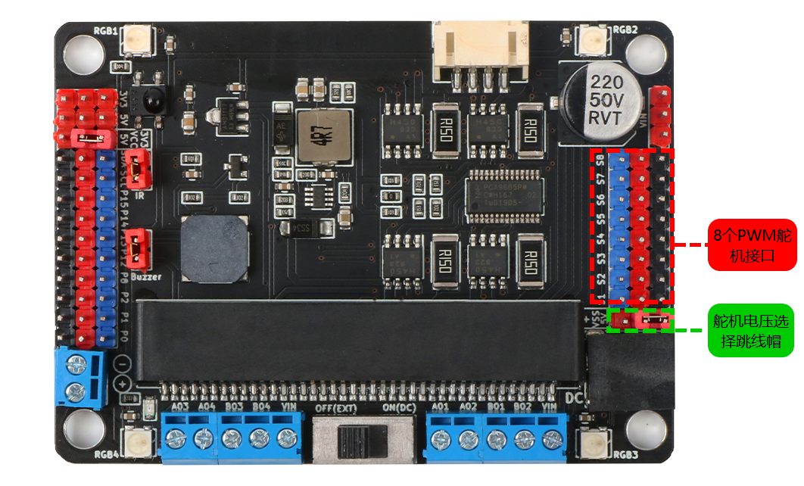

* motor:bit 同时支持驱动8路PWM舵机，扩展版上舵机的接口规格统一，方便接线
* motor:bit 舵机引脚的蓝色插口代表输出pwm信号的引脚、连接三线舵机的PWM输入信号线，红色插口代表电源正极、连接三线舵机的电源正极线，黑色插口代表电源GND极、连接三线舵机的电源负极线。
* 插口为S1~S8，在使用时，根据实际连接的插口，在程序积木中进行选择。
* 在使用motor:bit 驱动舵机时，可以通过跳线帽选择不同的供电方式，当跳线帽选择5V时、舵机接线端的红色引脚提供5V：当跳线帽选择 + 时，舵机接线端的红色引脚与连接在接线柱的电源直接连接，电压与连接在接线柱的电源相同
> 舵机控制实验例程

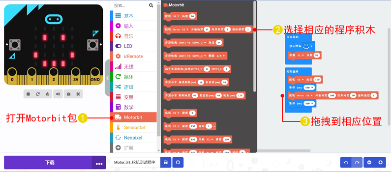

> 实物连接图，例程实验选择S1引脚，实物连接也接在S1引脚

> 控制舵机转动到角度160，延时200ms，以速度3再转动到角度30，延时200ms，如此循环，，， [舵机实验源码](https://makecode.microbit.org/_YtLRRw0jzJcv)

## 步进电机接口

* 包含2路5线步进电机、可以同时连接控制两个步进电机。接线从左到右依次为蓝色线、粉色线、黄色线、橙色线、红色线。
* 支持步进电机与TT马达同时使用，例如可以控制一个步进电机和两个直流电机（具体搭配可以根据需要来进行设定）

> 步进电机实验例程

> 实物连接图，例程实验选择STPM1_2引脚，实物连接也接在相应的引脚，注意不同引脚接线的颜色

> 步进电机驱动实验，实验结果为：接在STPM1_2引脚的步进电机转动50°，停止延时500ms，再转动，如此循环   [步进电机实验源码](https://makecode.microbit.org/_9rV730UKqCsE)

## RGB超声波

* 1个PH2.0-4Pin Rgb超声波（RUS-04)模块接口，该接口有两个用途，一方面可以作为超声波的TX和RX引脚口，另一方面也可以控制超声波模块的RGB彩灯，让超声波模块更加炫彩灵性。
* RGB超声波的IO引脚接在引脚的P2接口，RGB口与RGB口对应：RGB超声波的RGB灯是扩展板灯的延伸，都是通过P16引脚控制，控制原理与控制扩展板RGB灯相同，RGB超声波内含有六个RGB灯，左右探头各三个。
* 超声波的RGB彩灯，可以选择控制左右，显示的颜色和显示的特效，其中特效包括呼吸灯、旋转流星、闪烁。
> 超声波RGB使用例程实验

> 实物连接图，RGB超声波的引脚选择P2

> 当超声波检测到前方距离小于10cm时，超声波的RGB灯 **全部**会显示**靛蓝**，并且有**闪烁**的特效  [RGB超声波实验源码](https://makecode.microbit.org/_iJX8M084m3oJ)

## 8Pin IO口引出
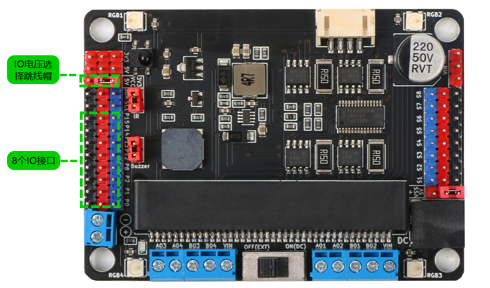

* 8个引出的IO口，黑色引脚表示电源负极、红色引脚表示电源正极(3V3/5V)，蓝色表示IO信号口
* 引出的引脚是P0\P1\P2\P8\P12\P13\P14\P15

## I2C接口
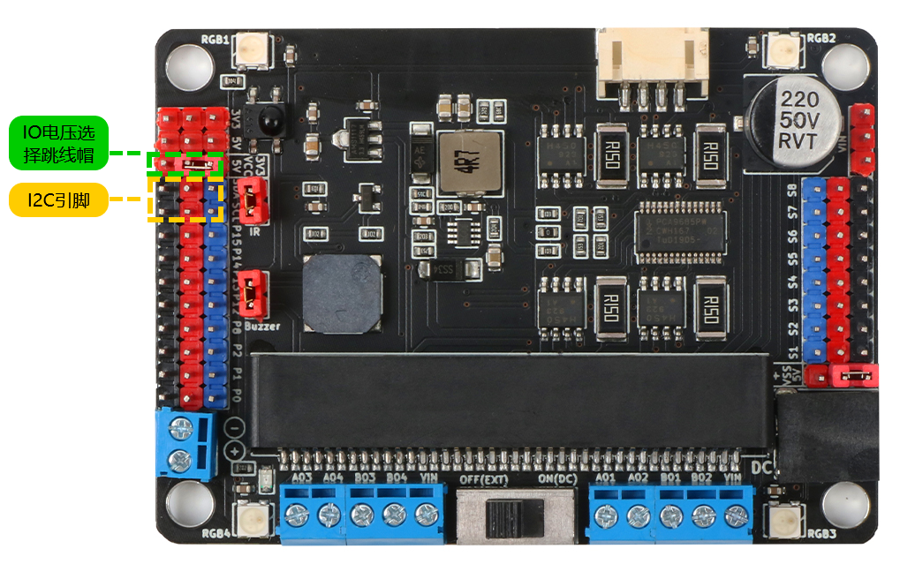

* motor:bit扩展版包含1个PH2.0-4Pin i2c接口，可以使用该接口来控制 1602液晶等。在使用I2C通信时，应注意扩展版的数据线SDA引脚连接终端数据线SDA引脚，扩展版的时钟线SCL引脚连接终端的时钟线SCL引脚
* 不同的I2C模块需要的电压不同，可以通过IO电压选择跳线帽对I2C红色引脚的电压进行调整
> I2C使用例程（控制LCD1602显示）

 

> 实验实物图，在接线时，需要注意LCD1602液晶的SDA引脚接在扩展板的SDA引脚、SCL引脚接在扩展板的SCL引脚、GND引脚接在扩展板的黑色GND引脚、VCC引脚接在扩展板的红色5V引脚，不同的I2C模块需要的电压不同，LCD1602液晶需要5V(注意调节液晶背面的旋钮、以调整显示效果达到最好的显示)

> 实验现象为：LCD1602液晶第一行显示**`Hello! emakefun!`**    ，第二行显示**`2019`** [LCD1602液晶实验源码](https://makecode.microbit.org/_6s8UXUHCo67w)

## 电压引脚

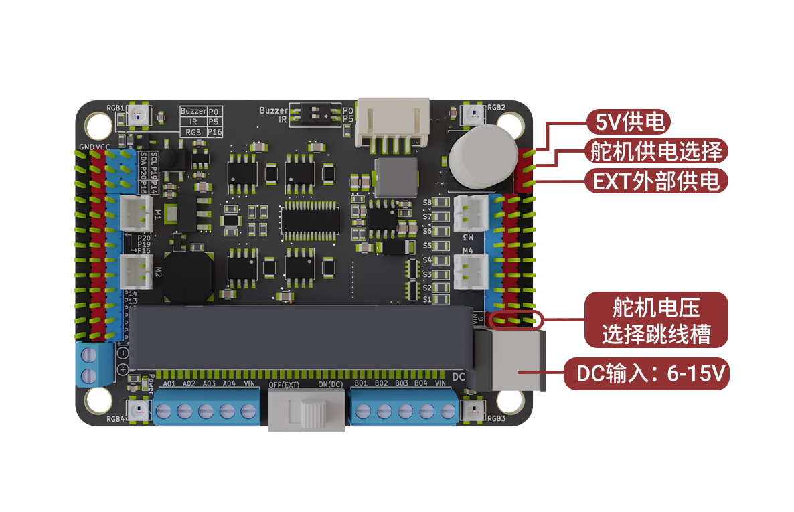

* motor:bit 扩展板设计有三种电压引脚，分别为3V3、5V、VIN(+，没有经过降压的电压接口）
* 对于8个IO口、可以通过IO口跳线帽进行选择不同的电压：对于8个PWM舵机接口，可以通过跳线帽选择不同的电压，需要注意，当选择5V的时候，供电来源于开关选择的电源直接相关，选择‘ +’   的时候，供电来源为接线柱电源，与开关选择无关

## 导入软件包

### 打开编程网页

* [点击makecode](https://makecode.microbit.org/)  进入编程官网

### 新建项目
* 点击黑色箭头指向的**`新建项目`** ，进入到编程界面

### 添加包
* 点击**`高级`**—>**`扩展`**—>输入网址**`https://github.com/emakefun/pxt-motorbit.git`**点击搜索—>点击motorbit包

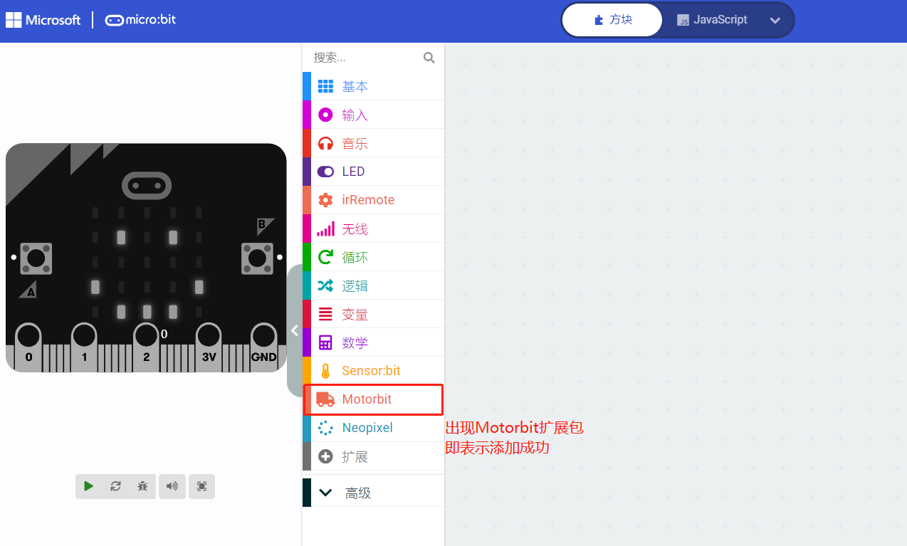

## 程序下载

### 点击下载按钮
* 点击**`下载`**,     红色箭头所指的按扭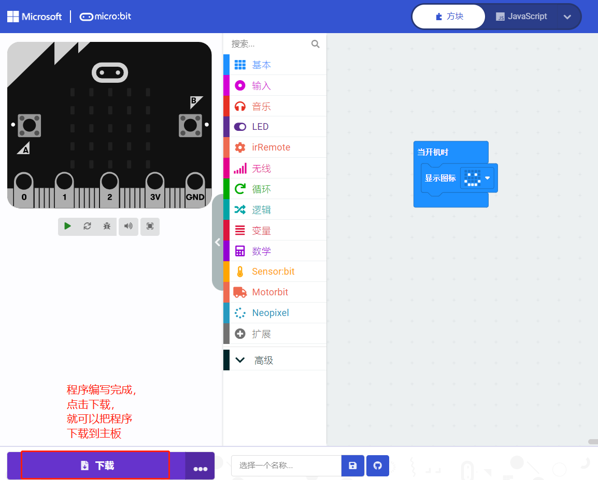

### 保存到Microbit的U盘上，在保存过程中micro:bit指示灯会闪烁
* 选择**`MICROBIT`**，点击确定 (使用的是QQ浏览器进行在线的下载)

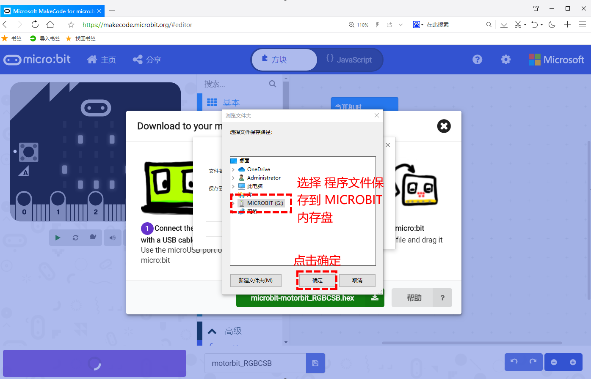

* 点击下载（只要把microbit程序文件下载或保存到microbit主板的名为**`MICROBIT`**的内存盘，程序就会在microbit中运行）

