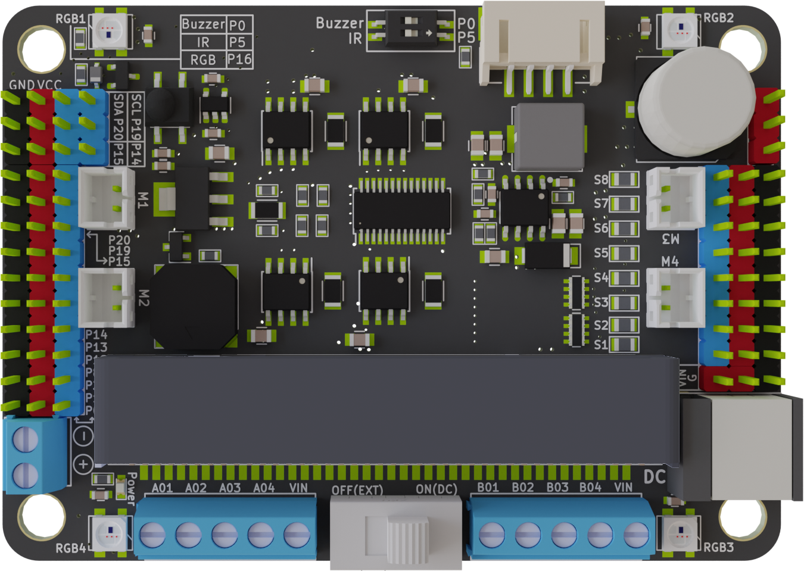
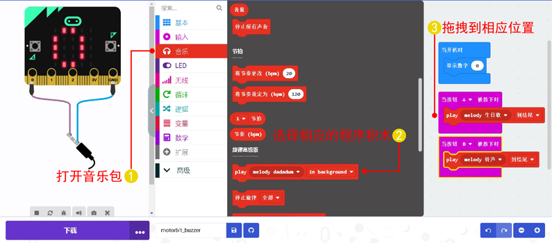
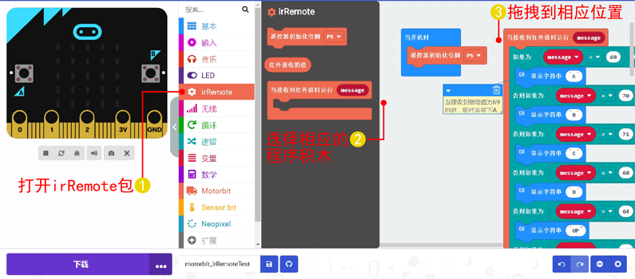
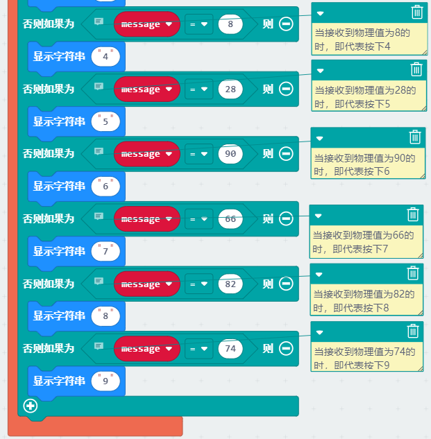
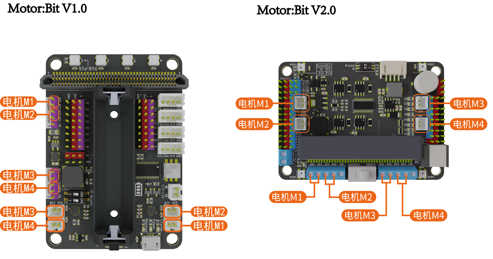
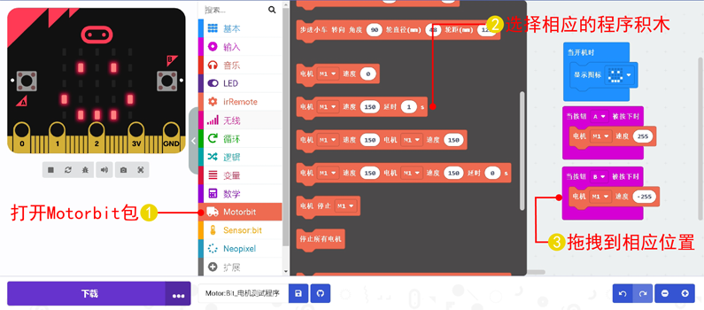
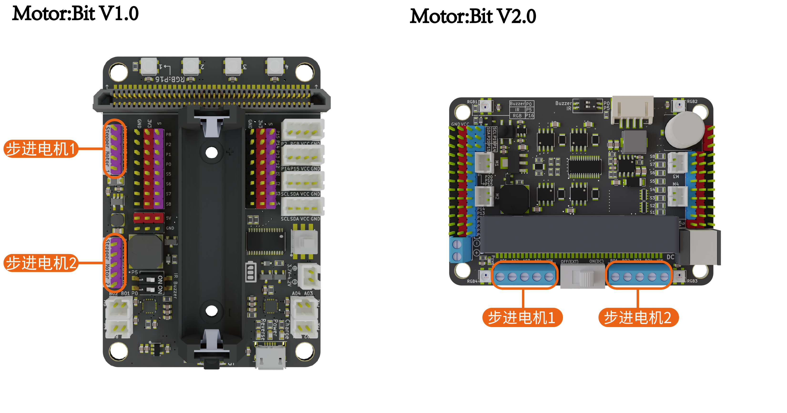
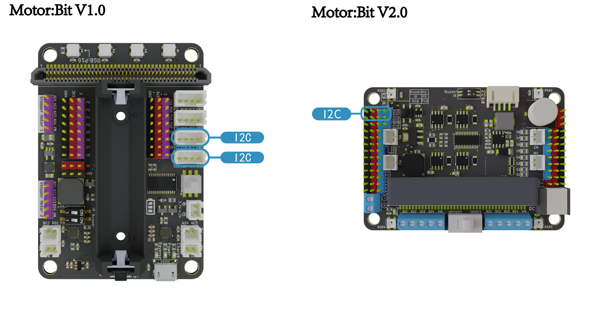
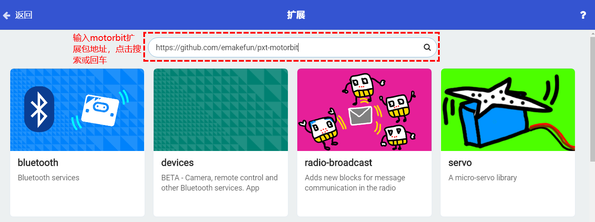
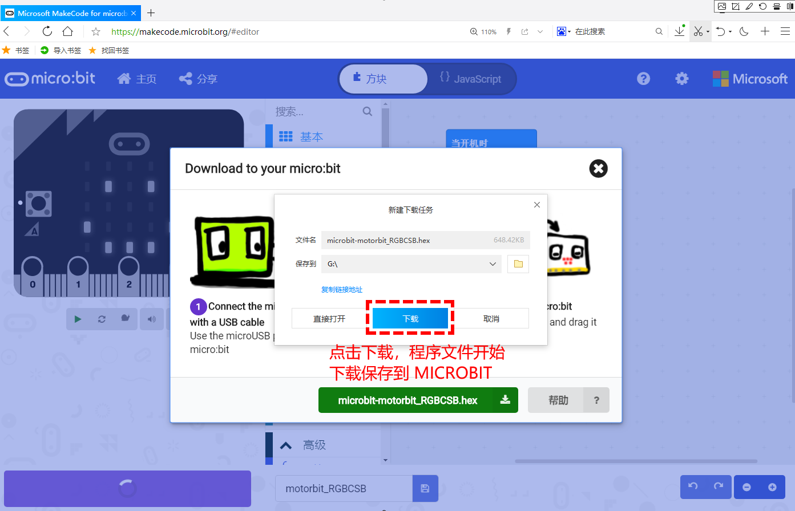

#  Motor:Bit产品介绍

[English](README.md) 中文版

- [产品特色](#产品特色) 

- [产品实物图](#产品实物图) 

- [硬件接口介绍](#硬件接口介绍) 

- [电机功能说明](#电机功能说明) 

扩展板各单元模块详解

- [电源供电口](#电源供电口)
- [蜂鸣器](#蜂鸣器)
- [红外接收](#红外接收)
- [RGB炫彩灯](#RGB炫彩灯)
- [直流电机接口](#直流电机接口)
- [8路舵机接口](#8路舵机接口)
- [步进电机接口](#步进电机接口)
- [RGB超声波](#RGB超声波)
- [8Pin IO口引出](#8Pin IO口引出)
- [I2C接口](#I2C接口)
- [电压引脚](#电压引脚)
- [导入软件包](#导入软件包)
- [程序下载](#程序下载)

Micro:Bit是[易创空间](http://www.emakefun.com/) 专门针对Micro:Bit而开发的驱动电机，舵机，步进电机的一款多功能电机驱动扩展板。Micro:Bit V2.0解决了市面上同类驱动板支持单节3.7V电池驱动力严重不够问题。本驱动板采用控制电路电源和舵机电源分开，单独供电方案，使用大电流输出的电源芯片对舵机独立供电，支持DC(6~15V)电压输入，驱动芯片采用4颗大电流驱动芯片，最大驱动电流达4A，轻松同时驱动4个24V直流马达或者30暴力高速马达。舵机也可以通过外部电源独立供电，同时可以支持8个舵机同时控制。板子采用可选择直插和卧插两种方式，直插可以兼容掌控板。安装孔兼容乐高，可以非常方便安装在自己创意设计中。完善的库支持，配套开发有MakeCode、Scratch3.0、MicroPython库和教程。

## 产品特色
| 特点 | Motor:Bit V1.0|Motor:Bit V2.0|
| ---- | -- | -- |
| 板载4个RGB   | √ | √ |
| 无缘蜂鸣器    | √ | √ |
| 红外接收头    | √ | √ |
| 兼容乐高孔    | √ | √ |
| 板载4个RGB   | √ | √ |
| 无缘蜂鸣器    | √ | √ |
| I2C接口      | √ （两个PH2.0接口） | √（一个PH2.0接口） |
| RGB超声波接口 | √ | √ |
| 4路电机      | √ （最大输出电流1.2A）| √（最大输出电流4A） |
| 8路舵机      | √ | √ |
| 2路4线步进电机      | √ | √ |
| 板载电池盒    | √ | × |
| 板载充电电路    | √ | × |
| 板载电池盒    | √ | × |
| IO口多种电压选择 | × | √  |
| PCB板厚度   | 1.6mm           | 1.6mm           |
| M4定位孔直径 | 4.6mm，兼容乐高   | 4.6mm，兼容乐高 |
| 产品的尺寸   | 80mm×56mm×12mm  | 80mm×57mm×12mm  |
| 净重        | 37.2g          | 37.2g           |
| 供电电压     | 3.7~4.2V        | 6~15V           |
| DC头直径    | 无 | 3.5mm           |


## 产品实物图
### Motor:Bit V1.0

### Motor:Bit V2.0


## 硬件接口介绍

### 正面
### Motor:Bit V1.0


### Motor:Bit V2.0


# 扩展板各单元模块详解

## 电源供电口

- Motor:Bit V1.0 有两个供电接口，一个PH2.0接口( + 表示接电源正极线：— 表示接电源负极线)，一个14500电池盒( + 表示电池正极：— 表示电池负极)。两个接口的输入电压为3.7V~4.2V

- Motor:Bit V1.0  充电指示灯闪烁表示正在充电，常亮表示充满了
                                电池反接指示灯长亮时表示电池接反了

- Motor:Bit V2.0 有两个供电接口，一个接线柱类型( + 表示接电源正极线：— 表示接电源负极线)，一个DC头类型。在使用接线柱供电时，注意电源正负极的连接方向，扩展板接线柱的 + 符号所代表的接线口表示应该连接电源正极线、— 符号所代表的接线口表示应该连接电源负极线

-  Motor:Bit V2.0:拨动开关向右拨动到OFF(EXT)时，motor:bit 扩展板是通过接线柱供电的，此时，DC头供电接口无效：拨动开关向左拨动到ON(DC)时，motor:bit 扩展板是通过DC头接口供电，此时若VSS接线帽接在5V上，接线柱供电接口无效，若VSS接线帽接在 + 上，那么VSS的供电是通过接在接线柱的电源直接供电，从而实现一块板、两个供电源

- Motor:Bit V2.0扩展板包含3V3，5V电源引脚，此外，还设计有一个VIN引脚；VIN引脚通过开关与供电源直接连接，VIN引脚于开关选择的供电源连接
#### 注：Motor:Bit扩展板的红色引脚，皆为正极供电引出脚：黑色引脚皆为接地GND引脚


## 蜂鸣器


* Motor:Bit V1.0/V2.0板载无源蜂鸣器接线引脚为P0
* Motor:Bit V1.0/V2 .0是通过拨码开关与Micro:Bit主板的P0引脚进行连接和断开的，当拨动到关闭时，引脚P0不能控制板载蜂鸣器，此时P0引脚可以作为普通IO引脚使用。
> 无源蜂鸣器播放音乐 例程实验



> 实验现象为：当按下Micro:Bit主板A按键播放 生日歌： 当B按键按下时，播放 铃声[蜂鸣器实验源码](https://makecode.microbit.org/_7T6XPUbgYhcb)

## 红外接收

#### **MakeCode红外扩展库: https://github.com/emakefun/pxt-motorbit


* Motor:Bit V1.0/V2.0 板载红外接收头接线引脚为P5
* 红外接收头，是通过拨码开关与microbit主板的P5引脚进行连接和断开的，当拨动到关闭时，引脚P5不能控制红外接收头，此时P0引脚可以作为普通IO引脚使用。
> 红外接收实验例程






> 实验现象为：红外遥控器按键`A`按下时，Micro:Bit主板显示字母 “A”，按键B按下时、Micro:Bit主板显示字母“B”，按键C按下时、Micro:Bit主板显示字母“C”   [点击查看红外实验源码](https://makecode.microbit.org/_eAv9yiUC2VV3)。当需要通过红外遥控实现其他功能时，可以把显示字符串换成对应的逻辑。


## RGB炫彩灯


* Motor:Bit V1.0/V2.0板载4个RGB全彩灯，连接在Micro:Bit主板的P16引脚，可以通过对P16引脚编程控制四个RGB灯亮灭和颜色。
> 板载RGB实验例程


> RGB流水灯实验设计 ，实验结果为：板载RGB灯红绿蓝三色间隔1s显示  [RGB实验源码](https://makecode.microbit.org/_XD8L8u8s77cD) 


## 直流电机接口



* Motor:Bit V1.0/V2.0扩展板设计有4个PH2.0直流电机接线柱接口，分别为：M1,M2,M3,M4
* Motor:Bit V1.0扩展板也可以从步进电机的排针位置接M1(A01,A02),M2(A03,A04)和M3(B01,B02)M4(B03,B0)
* Motor:Bit V2.0扩展板也可以从步进电机的接线端子位置接M1(A01,A02),M2(A03,A04)和M3(B01,B02)M4(B03,B04)
> 控制直流电机例程实验



>实物接线图(DC供电口供电，开关拨动到on(DC))


> 实验结果：当Micro:Bit主板的按下A键、接在M1(A01A02)的电机顺时针旋转，按下B键，电机反方向旋转 [直流电机实验源码](https://makecode.microbit.org/_6pTH0XCLjYdb)

## 8路舵机接口


* Motor:Bit V1.0/V2.0 同时支持驱动8路PWM舵机
* Motor:Bit V1.0/V2.0  舵机引脚的蓝色插口代表输出pwm信号的引脚、连接三线舵机的PWM输入信号线，红色插口代表电源正极、连接三线舵机的电源正极线，黑色插口代表电源GND极、连接三线舵机的电源负极线
* 插口为S1~S8，在使用时，根据实际连接的插口，在程序积木中进行选择
* Motor:Bit V2.0驱动舵机时，可以通过跳线帽选择不同的供电方式。如果大舵机(例如：MG996等)的数量超过4个时，蓝色接线柱必须接外部电源为舵机供电（外部供电电压和电流需要根据舵机型号需要提供），且DC头也需要接电源为扩展板供电，拨动开关拨向ON端。

> 实物连接图如下

> 

> 舵机控制实验例程


> 实物连接图，例程实验选择S1引脚，实物连接也接在S1引脚


> 控制舵机转动到角度160，延时500ms，以速度3再转动到角度30，延时500ms，如此循环， [舵机实验源码](https://makecode.microbit.org/_Ea1cH3JwmehY)

## 步进电机接口



* 包含2路5线步进电机、可以同时连接控制两个步进电机。接线从左到右依次为蓝色线、粉色线、黄色线、橙色线、红色线。
* 支持步进电机与TT马达同时使用，例如可以控制一个步进电机和两个直流电机（具体搭配可以根据需要来进行设定）

> 步进电机实验例程


> 实物连接图，例程实验选择STPM1_2引脚，实物连接也接在相应的引脚，注意不同引脚接线的颜色


> 步进电机驱动实验，实验结果为：接在STPM1_2引脚的步进电机转动50°，停止延时500ms，再转动，如此循环 ， [步进电机实验源码](https://makecode.microbit.org/_41a2Trhpfe55)


## RGB超声波


* 1个PH2.0-4Pin Rgb超声波（RUS-04)模块接口，该接口有两个用途，一方面可以作为超声波的TX和RX引脚口，另一方面也可以控制超声波模块的RGB彩灯，让超声波模块更加炫彩灵性。
* RGB超声波的IO引脚接在引脚的P2接口，RGB口与RGB灯口对应：RGB超声波的RGB灯是扩展板灯的延伸，都是通过P16引脚控制，控制原理与控制扩展板RGB灯相同，RGB超声波内含有六个RGB灯，左右探头各三个。
* 超声波的RGB彩灯，可以选择控制左右，显示的颜色和显示的特效，其中特效包括呼吸灯、旋转流星、闪烁。
> 超声波RGB使用例程实验


> 实物连接图，RGB超声波的引脚选择P2


> 当超声波检测到前方距离小于10cm时，超声波的RGB灯 **全部**会显示**靛蓝**，并且有**闪烁**的特效  [RGB超声波实验源码](https://makecode.microbit.org/_TUqXfUJ2c19c)

## 8Pin IO口引出


* Motor:Bit V1.0/V2.0 有8个引出的IO口，黑色引脚表示电源负极、红色引脚表示电源正极，蓝色表示IO信号口
* Motor:Bit V1.0/V2.0 引出的引脚是P0\P1\P2\P8\P12\P13\P14\P15
* Motor:Bit V1.0的红色引脚电压为3.3V
* Motor:Bit V2.0的红色引脚电压通过IO电压选择跳线帽选择，跳线帽插在5V与VCC上时红色引脚电压为5V,跳线帽插在3V3与VCC上时红色引脚电压为3.3V。

## I2C接口


* Motor:Bit V1.0包含2个PH2.0-4Pin I2C接口，可以使用该接口来控制LCD 1602液晶屏等。在使用I2C通信时，应注意扩展板的数据线SDA引脚连接终端数据线SDA引脚，扩展版的时钟线SCL引脚连接终端的时钟线SCL引脚
* Motor:Bit V2.0包含1个i2c接口，可以使用该接口来控制LCD 1602液晶屏等。在使用I2C通信时，应注意扩展版的数据线SDA引脚连接终端数据线SDA引脚，扩展版的时钟线SCL引脚连接终端的时钟线SCL引脚
* 不同的I2C模块需要的电压不同，可以通过IO电压选择跳线帽对I2C红色引脚的电压进行调整
> I2C使用例程（控制LCD1602显示）

 

> 实验实物图，在接线时，需要注意LCD1602液晶的SDA引脚接在扩展板的SDA引脚、SCL引脚接在扩展板的SCL引脚、GND引脚接在扩展板的黑色GND引脚、VCC引脚接在扩展板的红色5V引脚，不同的I2C模块需要的电压不同，LCD1602液晶需要5V(注意调节液晶背面的旋钮、以调整显示效果达到最好的显示)


> 实验现象为：LCD1602液晶第一行显示**`Hello! emakefun!`**    ，第二行显示**`2020 2 2`** [LCD1602液晶实验源码](https://makecode.microbit.org/_6s8UXUHCo67w)

## 电压引脚


* Motor:Bit 扩展板设计有三种电压引脚，分别为3V3、5V、VIN(+，没有经过降压的电压接口）
* 对于8个IO口、可以通过IO口跳线帽进行选择不同的电压：对于8个PWM舵机接口，可以通过跳线帽选择不同的电压，需要注意，当选择5V的时候，供电来源于开关选择的电源直接相关，选择‘ +’   的时候，供电来源为接线柱电源，与开关选择无关


## 导入软件包

### 打开编程网页

* [点击makecode](https://makecode.microbit.org/)  进入编程官网

### 新建项目
* 点击黑色箭头指向的**`新建项目`** ，进入到编程界面


### 添加包
* 点击**`高级`**—>**`扩展`**—>输入网址**`https://github.com/emakefun/pxt-motorbit.git`**点击搜索—>点击motorbit包





## 程序下载

### 点击下载按钮
* 点击**`下载`**,     红色箭头所指的按扭

### 保存到Microbit的U盘上，在保存过程中micro:bit指示灯会闪烁
* 选择**`MICROBIT`**，点击确定 (使用的是QQ浏览器进行在线的下载)


* 点击下载（只要把microbit程序文件下载或保存到microbit主板的名为**`MICROBIT`**的内存盘，程序就会在microbit中运行）



## micropython语法
如果需要支持python语法，需要将固件下载到Micro:Bit

[点击下载Micro:Bit V1最新固件](http://www.emakefun.com/firmware/firmware_v2.hex)

[点击下载Micro:Bit V2最新固件](http://www.emakefun.com/firmware/firmware_v2.hex)

- 直流电机控制：
> dcmotor_run(index, speed)    # index: 1/2/3/4（电机序号）, speed: -255~255 (电机速度)
> dcmotor_stop(index)   # 停止直流电机 index: 1/2/3/4 (电机序号)

```
#1号电机以150的速度正转 2号电机以200的速度反转
import motor
motorbit = motor.init()
motorbit.dcmotor_run(1, 150)   # 支流电机M1 正向转动速度150
motorbit.dcmotor_run(2, -200)   # 支流电机M1 反向向转动速度200
sleep(2000)
motorbit.dcmotor_stop(1)
motorbit.dcmotor_stop(2)
```

- 步进电机运动：
> stepper(index, degree)  # index: 1/2 (步进电机序号) , degree: -360~360 (转动角度)
```
# 控制1号步进电机转动150度
import motor
motorbit = motor.init()
motorbit.stepper(1, 150)
```

- PWM舵机控制：
> servo(index, degree, speed=10) inedx: 1/2/3/4/5/6/7/8 (舵机序号，分别对应s1/s2/s3/s4/s5/s6/s7/s8) , degree: 0~180 (角度方位) , speed: 1~10（舵机转动速度, 可以不输入）

```
# 控制连接在S1引脚的舵机转动到90°位置
import motor
motorbit = motor.init()
motorbit.servo(1, 90)
```
```
#控制连接在S1引脚的舵机以 5 速度转动到90°位置
import motor
motorbit = motor.init()
motorbit.servo(1, 90, speed=5)
```