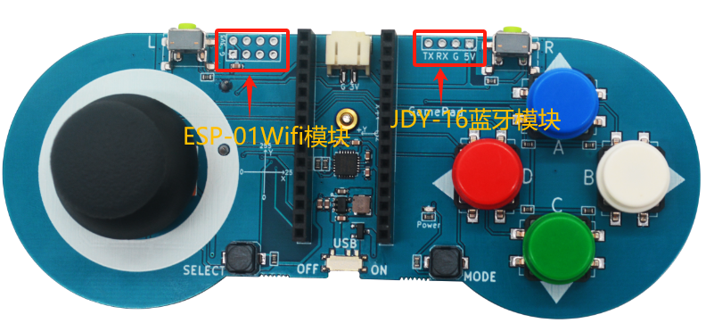
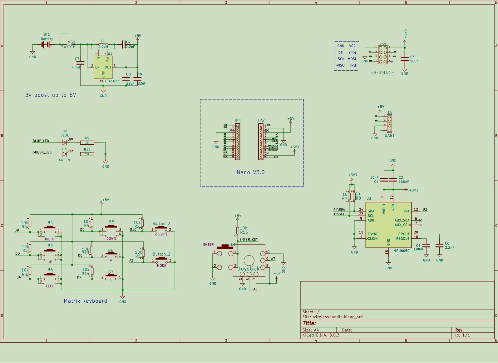

# Arduino可编程手柄使用说明

## 概述


上图为emakefun公司开发的一款Arduino可编程手柄，它可通过蓝牙(BLE)连接手柄2.4G协议连接手柄。

其中中间可插入BLE-Nano或者RF-Nano，插入时记得TypeC接口朝下。其背面可接入俩节7号电池供电。



这俩侧可以焊接JDY-16或者ESP-01Wifi模块。手柄左侧是一个摇杆模块，右侧是个4按键，以及中间上下各有俩个按键可供控制。

## Arduino可编程手柄原理图

[原理图点击此链接进行下载](./Arduino可编程手柄/wirelesshandle.pdf)



在使用这个手柄功能之前我们需要先下载EMakefun Gamepad Arduino 库（以下是该库的具体使用方法）。

## EMakefun Gamepad Arduino 库

### 概述

这个仓库是易创空间手柄(Emakefun Gamepad)的Arduino库，并提供蓝牙(BLE)连接手柄2.4G协议连接手柄的示例:

### 快速开始

#### 安装库Arduino文件

请下载该库安装到Arduino的library目录，下载链接为<https://github.com/emakefun-arduino-library/emakefun_gamepad/archive/refs/tags/latest.zip>，并且同时需要安装**MPU6050库**:<https://github.com/emakefun-arduino-library/emakefun_mpu6050> 和**RF24库**:<https://www.arduino.cc/reference/en/libraries/rf24/>

#### 示例1：在手柄端打印摇杆和按键值

在手柄上安装好Arduino Nano，请注意检查安装方向是否正确，将示例程序`examples/gamepad/gamepad.ino`下载到Arduino Nano，内容如下:

```c++
#include <Arduino.h>

#include "gamepad.h"

emakefun::Gamepad g_gamepad;
emakefun::GamepadModel g_gamepad_model;

void setup() {
  Serial.begin(115200);
  g_gamepad.Initialize();
  g_gamepad.EnableGyroscope(true);
  g_gamepad.AttachModel(&g_gamepad_model);
  Serial.println("setup done");
}

void loop() {
  g_gamepad.Tick();
  if (g_gamepad_model.NewButtonState()) {
    Serial.println(F("new button state"));
  }

  for (uint8_t button_type = emakefun::GamepadModel::kButtonJoystick; button_type < emakefun::GamepadModel::kButtonMax;
       button_type++) {
    if (g_gamepad_model.NewButtonState(button_type)) {
      Serial.print(F("new button state:"));
      Serial.println(button_type);
    }

    if (g_gamepad_model.ButtonPressed(button_type)) {
      Serial.print(F("button pressed: "));
      Serial.println(button_type);
    }

    if (g_gamepad_model.ButtonReleased(button_type)) {
      Serial.print(F("button released: "));
      Serial.println(button_type);
    }

    if (g_gamepad_model.GetButtonState(button_type)) {
      Serial.print(F("button is being held: "));
      Serial.println(button_type);
    }
  }

  if (g_gamepad_model.NewJoystickCoordinate()) {
    Serial.print(F("joystick coordinate: "));
    Serial.print(g_gamepad_model.GetJoystickCoordinate().x);
    Serial.print(F(", "));
    Serial.println(g_gamepad_model.GetJoystickCoordinate().y);
  }

  if (g_gamepad_model.NewGravityAcceleration()) {
    Serial.print(F("gravity acceleration: "));
    Serial.print(g_gamepad_model.GetGravityAcceleration().x);
    Serial.print(F(", "));
    Serial.print(g_gamepad_model.GetGravityAcceleration().y);
    Serial.print(F(", "));
    Serial.println(g_gamepad_model.GetGravityAcceleration().z);
  }
}
```

成功运行程序程序后，按下按键或者拨动摇杆，串口将会打印出按下的按键值和摇杆的坐标对应信息，如下：

```log
new button state:5
button released: 5
new button state
new button state:8
button pressed: 8
new button state
new button state:2
button released: 2
joystick coordinate: 108, 125
joystick coordinate: 108, 127
```

该示例程序可用于检测手柄端软硬件是否正常

#### 示例2：2.4G连接手柄

(手柄)发送端:`手柄 + Arduino RF-NANO` 或者 `手柄 + Arduino Nano + RF2.4G模块`，作为蓝牙主机

接收端:`Arduino RF-NANO` 或者 `Arduino + RF2.4G模块`，作为蓝牙从机

将示例程序`examples/gamepad_publish_rf24/gamepad_publish_rf24.ino`下载到手柄端, 内容如下:

```c++
#include <Arduino.h>

#include "gamepad.h"
#include "gamepad_publisher_rf24.h"

emakefun::Gamepad g_gamepad;
emakefun::GamepadModel g_gamepad_model;
emakefun::GamepadPublisherRf24 g_gamepad_publisher;

void setup() {
  Serial.begin(115200);
  Serial.println("gamepad initialize");
  g_gamepad.Initialize();
  Serial.println("gamepad initialize done");
  g_gamepad.EnableGyroscope(false);

  Serial.println("gamepad publisher initialize");
  g_gamepad_publisher.Initialize(7, 8, 115, 5, 0x0011000011LL);
  Serial.println("gamepad publisher initialize done");
  g_gamepad.AttachModel(&g_gamepad_model);
  g_gamepad_model.AddObserver(&g_gamepad_publisher);
  Serial.println("setup done");
}

void loop() {
  g_gamepad.Tick();
  if (g_gamepad_model.NewButtonState()) {
    Serial.println(F("new button state"));
  }

  for (uint8_t button_type = emakefun::GamepadModel::kButtonJoystick; button_type < emakefun::GamepadModel::kButtonMax;
       button_type++) {
    if (g_gamepad_model.NewButtonState(button_type)) {
      Serial.print(F("new button state:"));
      Serial.println(button_type);
    }

    if (g_gamepad_model.ButtonPressed(button_type)) {
      Serial.print(F("button pressed: "));
      Serial.println(button_type);
    }

    if (g_gamepad_model.ButtonReleased(button_type)) {
      Serial.print(F("button released: "));
      Serial.println(button_type);
    }

    if (g_gamepad_model.GetButtonState(button_type)) {
      Serial.print(F("button is being held: "));
      Serial.println(button_type);
    }
  }

  if (g_gamepad_model.NewJoystickCoordinate()) {
    Serial.print(F("joystick coordinate: "));
    Serial.print(g_gamepad_model.GetJoystickCoordinate().x);
    Serial.print(F(", "));
    Serial.println(g_gamepad_model.GetJoystickCoordinate().y);
  }

  if (g_gamepad_model.NewGravityAcceleration()) {
    Serial.print(F("gravity acceleration: "));
    Serial.print(g_gamepad_model.GetGravityAcceleration().x);
    Serial.print(F(", "));
    Serial.print(g_gamepad_model.GetGravityAcceleration().y);
    Serial.print(F(", "));
    Serial.println(g_gamepad_model.GetGravityAcceleration().z);
  }
}
```

将示例程序`examples/gamepad_subscribe_rf24/gamepad_subscribe_rf24.ino`下载到接收端, 内容如下:

```c++
#include <Arduino.h>

#include "gamepad.h"
#include "gamepad_subscriber_rf24.h"

emakefun::GamepadSubscriberRf24 g_gamepad_subscriber;
emakefun::GamepadModel g_gamepad_model;

void setup() {
  Serial.begin(115200);
  g_gamepad_subscriber.Initialize(7, 8, 115, 5, 0x0011000011LL);
  g_gamepad_subscriber.AttachModel(&g_gamepad_model);
  Serial.println("setup done");
}

void loop() {
  g_gamepad_subscriber.Tick();
  if (g_gamepad_model.NewButtonState()) {
    Serial.println(F("new button state"));
  }

  for (uint8_t button_type = emakefun::GamepadModel::kButtonJoystick; button_type < emakefun::GamepadModel::kButtonMax;
       button_type++) {
    if (g_gamepad_model.NewButtonState(button_type)) {
      Serial.print(F("new button state:"));
      Serial.println(button_type);
    }

    if (g_gamepad_model.ButtonPressed(button_type)) {
      Serial.print(F("button pressed: "));
      Serial.println(button_type);
    }

    if (g_gamepad_model.ButtonReleased(button_type)) {
      Serial.print(F("button released: "));
      Serial.println(button_type);
    }

    if (g_gamepad_model.GetButtonState(button_type)) {
      Serial.print(F("button is being held: "));
      Serial.println(button_type);
    }
  }

  if (g_gamepad_model.NewJoystickCoordinate()) {
    Serial.print(F("joystick coordinate: "));
    Serial.print(g_gamepad_model.GetJoystickCoordinate().x);
    Serial.print(F(", "));
    Serial.println(g_gamepad_model.GetJoystickCoordinate().y);
  }

  if (g_gamepad_model.NewGravityAcceleration()) {
    Serial.print(F("gravity acceleration: "));
    Serial.print(g_gamepad_model.GetGravityAcceleration().x);
    Serial.print(F(", "));
    Serial.print(g_gamepad_model.GetGravityAcceleration().y);
    Serial.print(F(", "));
    Serial.println(g_gamepad_model.GetGravityAcceleration().z);
  }
}
```

两端成功运行后会自动相连，接收端的串口会打印手柄端的按键值和摇杆坐标值

#### 示例3: BLE蓝牙连接手柄

(手柄)发送端:`手柄 + Arduino BLE-NANO` 或者 `手柄 + Arduino Nano + BLE模块`

接收端:`Arduino BLE-NANO` 或者 `Arduino + BLE模块`

开始前先确保接收端的蓝牙配置成从机模式，并处于未连接状态

将示例程序`examples/gamepad_publish_ble/gamepad_publish_ble.ino`下载手柄端, 内容如下:

```c++
#include <Arduino.h>

#include "gamepad.h"
#include "gamepad_publisher_ble.h"

emakefun::Gamepad g_gamepad;
emakefun::GamepadModel g_gamepad_model;
emakefun::GamepadPublisherBle g_gamepad_publisher;

void setup() {
  Serial.begin(115200);
  Serial.println("AT+ROLE=0");
  delay(100);
  Serial.println("AT+CON=75:8B:8C:E4:C2:84");
  delay(100);
  g_gamepad.Initialize();
  g_gamepad.EnableGyroscope(false);
  g_gamepad_publisher.Initialize(Serial);
  g_gamepad.AttachModel(&g_gamepad_model);
  g_gamepad_model.AddObserver(&g_gamepad_publisher);
}

void loop() { g_gamepad.Tick(); }
```

示例代码中`Serial.println("AT+CON=75:8B:8C:E4:C2:84");`中的`75:8B:8C:E4:C2:84`是接收端(从机)的蓝牙MAC地址, 请自行替换。

将示例程序`examples/gamepad_subscibe_ble/gamepad_subscibe_ble.ino`下载到接收端, 内容如下:

```c++
#include <Arduino.h>

#include "gamepad.h"
#include "gamepad_subscriber_ble.h"

emakefun::GamepadSubscriberBle g_gamepad_subscriber;
emakefun::GamepadModel g_gamepad_model;

void setup() {
  Serial.begin(115200);
  g_gamepad_subscriber.Initialize(Serial);
  g_gamepad_subscriber.AttachModel(&g_gamepad_model);
  Serial.println("setup done");
}

void loop() {
  g_gamepad_subscriber.Tick();
  if (g_gamepad_model.NewButtonState()) {
    Serial.println(F("new button state"));
  }

  for (uint8_t button_type = emakefun::GamepadModel::kButtonJoystick; button_type < emakefun::GamepadModel::kButtonMax;
       button_type++) {
    if (g_gamepad_model.NewButtonState(button_type)) {
      Serial.print(F("new button state:"));
      Serial.println(button_type);
    }

    if (g_gamepad_model.ButtonPressed(button_type)) {
      Serial.print(F("button pressed: "));
      Serial.println(button_type);
    }

    if (g_gamepad_model.ButtonReleased(button_type)) {
      Serial.print(F("button released: "));
      Serial.println(button_type);
    }

    if (g_gamepad_model.GetButtonState(button_type)) {
      // Serial.print(F("button is being held: "));
      // Serial.println(button_type);
    }
  }

  if (g_gamepad_model.NewJoystickCoordinate()) {
    Serial.print(F("joystick coordinate: "));
    Serial.print(g_gamepad_model.GetJoystickCoordinate().x);
    Serial.print(F(", "));
    Serial.println(g_gamepad_model.GetJoystickCoordinate().y);
  }

  if (g_gamepad_model.NewGravityAcceleration()) {
    Serial.print(F("gravity acceleration: "));
    Serial.print(g_gamepad_model.GetGravityAcceleration().x);
    Serial.print(F(", "));
    Serial.print(g_gamepad_model.GetGravityAcceleration().y);
    Serial.print(F(", "));
    Serial.println(g_gamepad_model.GetGravityAcceleration().z);
  }
}
```

先上电启动接收端，再上电启动发送端，发送端在启动程序中会连接指定的从机设备，所以需要从机先上电启动，从机蓝牙要配置成BLE从机，且是未连接状态，发送端上电连接成功后，蓝牙指示灯会常亮，接下来接收端的串口会打印手柄端的按键值和摇杆坐标值。接收端不能频繁使用串口打印信息，否则会造成蓝牙数据收发异常，所以接收端的示例中并未打印按住的键值，如下所示。

```c++
if (g_gamepad_model.GetButtonState(button_type)) {
  // Serial.print(F("button is being held: "));
  // Serial.println(button_type);
}
```

## EMakefun Gamepad Arduino 库常用函数以及API介绍

以示例3为例，其中手柄端的

```c
void setup() {
  Serial.begin(115200);
  Serial.println("AT+ROLE=0");
  delay(100);
  Serial.println("AT+CON=B0:64:AC:A7:14:54");
  delay(100);
  g_gamepad.Initialize();
  g_gamepad.EnableGyroscope(false);
  g_gamepad_publisher.Initialize(Serial);
  g_gamepad.AttachModel(&g_gamepad_model);
  g_gamepad_model.AddObserver(&g_gamepad_publisher);
}

void loop() { g_gamepad.Tick(); }
```

这里面setup函数里面时设置蓝牙的主从模式以及蓝牙的配对码，这里我们只需要对里面的蓝牙配对码进行修改即可。其中`g_gamepad.Tick();`这个函数是用来按键软件消抖的，我们需要在loop里面不断调用这个函数，这里也是不需要修改的。

对于从机端，setup函数里面不需要修改，其中有一些常用的API需要大家去了解。比如说

#### g_gamepad_model.NewButtonState()

查询按键状态是否改变

```c
bool NewButtonState() const {
    return (button_state_ ^ last_button_state_) != 0;
  }

bool NewButtonState(const ButtonType button_type) const {
    return ((button_state_ ^ last_button_state_) & (static_cast<uint16_t>(1) << button_type)) != 0;
  }

参数：none或者ButtonType类型的参数
填写参数示例 emakefun::GamepadModel::ButtonType
返回值：按键状态发生改变就返回1，反之返回0.
```

```c
ButtonType类型的参数有
enum ButtonType : uint8_t {
    kButtonJoystick = 0,
    kButtonL = 1,
    kButtonR = 2,
    kButtonSelect = 3,
    kButtonMode = 4,
    kButtonA = 5,
    kButtonB = 6,
    kButtonC = 7,
    kButtonD = 8,
    kButtonMax,
  };
//这里只用直接调用你需要判断的按键类型，即可。比如说判断手柄端的A键是否按下，就只用输入emakefun::GamepadModel::kButtonA就行，其他按键的判断按照这样的参数修改ButtonType类型即可。
```

#### g_gamepad_model.Tick()

刷新按键，摇杆以及重力加速度的状态值，这个要放在loop函数里面不断刷新。

```c
void Tick() {
    last_button_state_ = button_state_;
    last_joystick_coordinate_ = joystick_coordinate_;
    last_gravity_acceleration_ = gravity_acceleration_;
  }

参数：none
返回值：none
```

#### g_gamepad_model.ButtonPressed()

判断某个按键是否被按下

```c
bool ButtonPressed(const ButtonType button_type) const {
    return NewButtonState(button_type) && GetButtonState(button_type);
  }

调用函数示例：g_gamepad_model.ButtonPressed(emakefun::GamepadModel::kButtonA)
参数：ButtonType类型的参数
返回值：按键按下返回1，否则为0
```

#### g_gamepad_model.ButtonReleased()

判断某个按键是否被释放

```c
bool ButtonReleased(const ButtonType button_type) const {
    return NewButtonState(button_type) && !GetButtonState(button_type);
  }

调用函数示例：g_gamepad_model.ButtonReleased(emakefun::GamepadModel::kButtonA)
参数：ButtonType类型的参数
返回值：按键释放返回1，否则为0
```

#### 获取摇杆和重力加速度的值

**摇杆**：

获取X轴上的摇杆值：

`GetJoystickCoordinate().x`

获取Y轴上的摇杆值：

`GetJoystickCoordinate().y`

**重力加速度**：

获取X轴上重力加速度值：

`g_gamepad_model.GetGravityAcceleration().x`

获取Y轴上重力加速度值：

`g_gamepad_model.GetGravityAcceleration().y`

获取Z轴上重力加速度值：

`g_gamepad_model.GetGravityAcceleration().z`


以上函数直接调用即可

若遇上解决不了的问题

## 联系我们

**技术 + 合作：WX号:  EmakefunService**