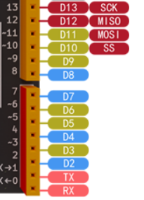
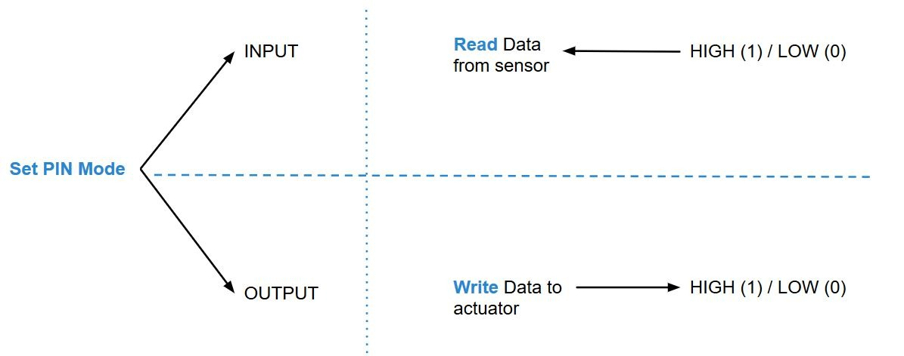
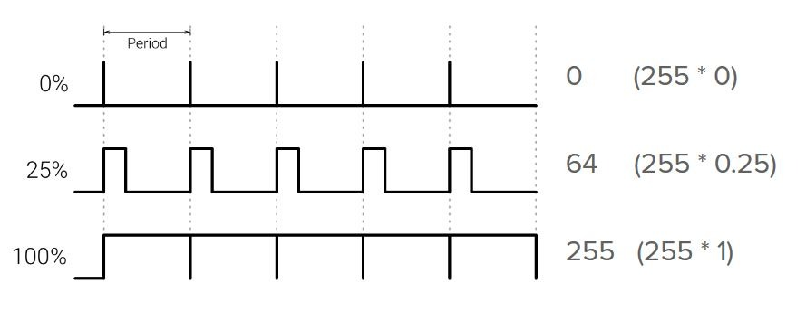
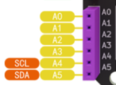
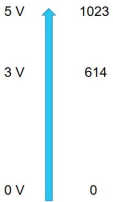
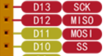

# Maker Uno主板介绍

Maker-Uno是基于Arduino Uno R3基础上开发的一款适用于创客的标志性产品， 功能和引脚完全兼容传统Arduino Uno主板 ,板载2路电机驱动芯片最大驱动电流2A，所有IO口用排针引出，串口芯片为CH340G。

**产品参数**

|        功能         |     Arduino Uno      |      Maker-Uno       |
| :-----------------: | :------------------: | :------------------: |
|      微控制器       |      ATmega328P      |      ATmega328P      |
|      串口芯片       |      Atmega16u2      |        CH340G        |
|      输入电压       |        7-12 V        |        7-16V         |
| 工作电压 (输出电流) |      5V(500mA)       |      5V(1000mA)      |
|  3.3V最大输出电流   |        150mA         |        500mA         |
|        主频         |     外部晶振 16M     |     外部晶振 16M     |
|      输入电压       |        7-12 V        |        7-16V         |
|        Flash        |   32K(引导占0.5k)    |   32K(引导占0.5k)    |
|        SRAM         |          2K          |          2K          |
|        ERROM        |          1K          |          1K          |
|    电机驱动芯片     |          无          |     TC78H660FTG      |
|       IO接口        |         排母         |      排针+排母       |
|      尺寸/重量      | 68.6 x 53.4 mm / 25g | 68.6 x 53.4 mm / 25g |

## 一丶Maker Uno引脚图

以下是您可以在 Maker Uno 板上找到的所有引脚的全局视觉描述。


一开始你可能会发现这很难理解。那么，让我们一一分解每种引脚。

### 1.1 接地引脚

如果关于接地有一件事（而且只有一件事）您应该记住，那就是：始终将电路的所有接地连接在一起，并确保所有组件都正确连接到地面。原理图上接地引脚通常用 GND 表示。

接地对于 Arduino 板测量和设置任何电压至关重要。基本上，电压是两点之间的电势差：这里取接地点和另一点。

因此，如果电路中的所有部件都连接到同一接地，则可以比较所有电压并且它们的值是相关的。如果没有共同点，那么3.3V是什么意思？是否大于您从电路另一点测量的 5V 值？

这就像测量两个人之间的身高差：如果其中一个人站在一个盒子上，那么地面参考就不一样。如果您不将两个人放在同一水平面上，您就无法获得有价值的测量结果。

好吧，我不会讲更多细节，但你明白这一点。

### 1.2 Arduino 电源引脚


电源有两种形式：

- 通过外部电源为 Maker Uno 板供电
- 为插入主板的一些组件供电

#### 1.2.1 为 Maker Uno 板供电

要为 Arduino Uno 板供电，您有不同的选择。第一种方法是使用 USB 电缆将 Arduino 板连接到计算机 - 通常您在订购 Arduino 板时会得到一根 USB 电缆。

您还可以使用直流电源插孔为 Arduino 板提供 7-12V 电源。如果您使用的是由 Arduino 供电的一些业余爱好伺服电机，您可能需要使用直流电源插孔。来自 USB 电缆的功率较低。它非常适合您的板和计算机（或其他 Arduino 板）之间的通信，但可能不足以为某些实际电机提供动力。

因此，您已经有 2 种为 Arduino Uno 板供电的方法。现在，如果您查看电路上的电源引脚，您会看到 Vin 引脚。

您可以使用此引脚为您的主板提供 7-12V 电压。当您需要使用外部电源并将其直接连接到您的主板时非常实用。而且，正如您所猜测的，如果您使用 Vin，您还需要正确使用接地，将其连接到外部电源的接地。

请注意，USB 和 DC 电源插孔已集成接地，可连接到您插入的任何设备。事实上，USB连接器周围你可以触摸到的金属部分是直接接地的！

#### 1.2.2 通过 Maker Uno 电源引脚为组件供电

正如您所猜测的，每当您将外部组件连接到 Arduino Uno 板时，您都需要先将其接地。

然后您可以使用多个不同的引脚来为其供电。其中有3.3V和5V电源引脚。

注意 – 这很重要 – Arduino Uno 在 5V 下运行。因此，对于我们将在本文下面看到的每个输出引脚，请务必记住这一点。如果将 3.3V 组件插入 5V 电源，可能会损坏该组件。

有 2 种替代方案：使用 Arduino（集成电压桥）的 3.3V 电源，或使用带有电压电平转换器的 5V 电源。您可以轻松地将 3.3V 组件连接到 5V 组件，前提是您使用电阻器或直接使用电平转换器组件在它们之间转换电压。

### 1.3 Arduino 数字引脚



您可以在 Arduino Uno 板上找到 14 个数字引脚。它们很容易识别，电路板上有从 0 到 13 的数字

#### 1.3.1 在数字引脚上读/写

您将使用数字引脚从某些组件（传感器）读取数据并将数据写入其他组件（执行器）。

数字引脚只能有 2 种状态：低电平或高电平。您可以将它们视为二进制引脚。

低电平表示该引脚上的电压为 0V。HIGH 表示 Vcc，对于 Maker Uno 来说是 5V。



在实际使用数字引脚之前，您需要配置其模式。数字引脚可以处于输入模式或输出模式。当处于输入模式时，您将使用它来读取数据。当处于输出模式时，您将使用它来写入数据。

设置引脚模式后（通常在 Arduino 程序的 setup() 函数中使用 pinMode()），您将能够使用 digitalRead()/digitalWrite() 读取/写入引脚的状态。

如果您已将引脚设置为输入模式，则可以读取其状态，即高电平或低电平。

读取时，任何施加到该引脚的电压低于 0.8V 将被视为低电平，任何大于 2V 的电压将被视为高电平。因此，我再次强调，你应该正确地将电路中的所有接地连接在一起，否则Maker Uno将无法读取有价值的信息！如果您没有获得可靠且稳定的数据，请务必先检查地面，问题很可能来自那里。

**引脚配置为INPUT**

Arduino引脚默认配置为输入，因此在使用它们作为输入时，不需要使用 pinMode()显式声明为输入。以这种方式配置的引脚被称为处于高阻抗状态。输入引脚对采样电路的要求非常小，相当于引脚前面的100兆欧的串联电阻。

这意味着将输入引脚从一个状态切换到另一个状态所需的电流非常小。这使得引脚可用于诸如实现电容式触摸传感器或读取LED作为光电二极管的任务。

被配置为pinMode(pin,INPUT)的引脚（没有任何东西连接到它们，或者有连接到它们而未连接到其他电路的导线），报告引脚状态看似随机的变化，从环境中拾取电子噪音或电容耦合附近引脚的状态。

**上拉电阻**

如果没有输入，上拉电阻通常用于将输入引脚引导到已知状态。这可以通过在输入端添加上拉电阻（到5V）或下拉电阻（接地电阻）来实现。10K电阻对于上拉或下拉电阻来说是一个很好的值。

**使用内置上拉电阻，引脚配置为输入**

Atmega芯片内置了2万个上拉电阻，可通过软件访问。通过将pinMode()设置为INPUT_PULLUP可访问这些内置上拉电阻。这有效地反转了INPUT模式的行为，其中HIGH表示传感器关闭，LOW表示传感器开启。此上拉的值取决于所使用的微控制器。在大多数基于AVR的板上，该值保证在20kΩ和50kΩ之间。在Arduino Due上，它介于50kΩ和150kΩ之间。有关确切的值，请参考板上微控制器的数据表。

当将传感器连接到配置为INPUT_PULLUP的引脚时，另一端应接地。在简单开关的情况下，这会导致当开关打开时引脚变为高电平，当按下开关时引脚为低电平。上拉电阻提供足够的电流来点亮连接到被配置为输入的引脚的LED。如果项目中的LED似乎在工作，但很昏暗，这可能是发生了什么。

控制引脚是高电平还是低电平的相同寄存器（内部芯片存储器单元）控制上拉电阻。因此，当引脚处于INPUT模式时，配置为有上拉电阻导通的引脚将被开启；如果引脚通过pinMode()切换到OUTPUT模式，引脚将配置为高电平。这也适用于另一个方向，如果通过pinMode()切换到输入，则处于高电平状态的输出引脚将设置上拉电阻。

示例

```c
pinMode(3,INPUT) ; // set pin to input without using built in pull up resistor
pinMode(5,INPUT_PULLUP) ; // set pin to input using built in pull up resistor
```

**引脚配置为OUTPUT**

通过pinMode()配置为OUTPUT的引脚被认为处于低阻抗状态。这意味着它们可以向其他电路提供大量的电流。Atmega引脚可以向其他器件/电路提供（提供正电流）或吸收（提供负电流）高达40mA（毫安）的电流。这是足以点亮LED或者运行许多传感器的电流（不要忘记串联电阻），但不足以运行继电器，螺线管或电机。

试图从输出引脚运行高电流器件，可能损坏或破坏引脚中的输出晶体管，或损坏整个Atmega芯片。通常，这会导致微控制器中出现“死”引脚，但是剩余的芯片仍然可以正常工作。因此，最好通过470Ω或1k电阻将OUTPUT引脚连接到其他器件，除非特定应用需要从引脚吸取最大电流。

#### 1.3.2脉宽调制

一些数字引脚可用于写入 PWM。

PWM（脉冲宽度调制）基本上是一种仅具有高/低 (5V/0V) 状态的特定电压（例如：4.1V）的方法。PWM 产生一个以给定频率运行的脉冲——Arduino Uno 为 500Hz。然后，占空比参数将告知每个脉冲处于高状态或低状态的百分比。



高/低状态的频繁变化产生平均电压输出。例如，在 50% 占空比（50% 的时间为高电平，50% 的时间为低电平）时，输出电压将为 2.5V。

当然，这个解释确实很简单，但这就是开始使用 Arduino PWM 所需了解的全部内容。

现在，您只能在某些数字引脚上使用 PWM，这些引脚的编号旁边有一个“~”。与 PWM 兼容的 Arduino Uno 引脚为引脚 3、5、6、9、10 和 11。因此您有 6 个引脚，您可以使用 AnalogWrite() 函数创建 PWM。

这对于控制一些需要精细电压调节的执行器非常有用，而不仅仅是打开或关闭。

如果我们以LED为例，您可以使用analogWrite()函数来修改LED的亮度。

### 1.4 中断引脚

而且……数字引脚还有另一个可用的功能！您可以将其中一些用作 Arduino 程序中的中断引脚。

对于 Maker Uno，这些引脚的选择非常有限。只有数字引脚 2 和 3 可以用作中断引脚。

那么，它是如何运作的呢？

当您创建 Arduino 程序时，您必须知道您的代码是逐行运行的，不可能存在多线程。

假设您将按钮连接到中断引脚（并接地！）。在您的 Arduino 程序中，您可以附加一个特定的功能，以便在按下按钮时触发。因此，您可以直接使用中断行为来启动您的函数，而不必连续读取按钮状态。将其视为推送通知，就像在手机上一样。它会告诉您何时有新内容或需要执行特定操作。

但是，这并不意味着您已经解决了多线程问题。当程序的执行切换到中断调用的函数时，它也会停止当前程序的执行，只有在中断函数完成后才返回到当前程序。

### 1.5 Arduino 模拟引脚



您可以在 Maker Uno 板上找到 6 个模拟引脚。您会在电源引脚附近找到它们，并且它们很容易识别，从 A0 到 A5。

#### 1.5.1 从模拟引脚读取值

模拟引脚对于读取不能只是 0 或 1 的值非常有用。假设您有一个电位计并且想要获取电位计值的百分比。使用数字引脚，您可以知道电位计何时处于最小和最大位置，但除此之外什么也没有。使用模拟引脚，您可以获得介于两者之间的所有值。

请注意，这些引脚上的模拟功能仅用于读取。通常它们甚至被称为“模拟输入引脚”。您无法通过这些引脚写入模拟值，请不要忘记！

那么，模拟输入引脚如何工作？

首先，它将接收输入电压并读取该电压。假设引脚读数为 2.5V。然后，ADC（模拟数字转换器）会将模拟值转换为 Arduino 程序可以理解的数字值。



Maker Uno 板有一个 10 位 ADC。如果您使用其他 Arduino 板，分辨率可能会有所不同。那么，10 位是什么意思呢？简而言之，分辨率为 2^10 = 1024。因此，从模拟输入引脚读取数据时获得的值在 0 到 1024 之间。

回到我们的 2.5V 示例：2.5V 是 5V (Vcc) 的 50%。在您的 Arduino 程序中，您将获得值 512。根据该值，您可以轻松地反转计算并获取有关所施加电压的信息。

另外，一开始可能会很令人困惑，请记住 PWM 的 AnalogWrite() 函数仅适用于某些数字引脚，根本不适用于模拟引脚。

#### 1.5.2 使用模拟引脚作为数字引脚

即使您只能从模拟引脚读取，您也可以选择将其用作“简单”数字引脚。（但事实并非相反）

如果引脚可以读取 0 到 5V 之间的任何值，那么它将只能读取低于 0.8V（低）的值和高于 2V（高）的值。

要将模拟引脚用作数字引脚，您只需设置该引脚的模式，就像在 Arduino 程序的 setup() 函数中设置数字引脚一样。然后，您可以使用 digitalWrite() 和 digitalRead() 函数，它将完美运行。

### 1.6 通过 Arduino 引脚的通信协议

这就是事情开始变得有趣的地方。通过 Maker Uno 引脚的通信协议将允许您使用更先进的传感器和执行器。您将创建更复杂和有用的应用程序。

Maker Uno 板可通过电路引脚使用 3 种主要通信协议：UART、I2C 和 SPI。

但是……电路上什么也没有显示！

不要惊慌，通信协议正在使用电路上现有的引脚。

事实上，大多数引脚都可配置为使用备用功能，有时仅一个引脚就有多达 4 个备用功能。但让我们让事情变得简单。

#### 1.6.1 UART 引脚 – 串行

UART 是 Arduino 最常用的协议——至少在您开始使用时是这样。

当您将 Maker Uno 板连接到计算机并通过串行库进行通信时，嗯……您正在使用 UART！

您还可以直接在 Maker Uno 板上找到 UART 所需的 2 个引脚，即引脚 0 和 1：RX 和 TX。R代表“接收”，T代表“发送”。这是双向通信。


请注意，USB 使用的串行与引脚 0 和 1 使用的串行相同。因此，如果您想将另一个设备连接到主板的 RX/TX 引脚，请记住不要通过 USB 使用串行。

在其他一些 Arduino 板（例如 Mega）中，有几种不同的可用 UART。但对于 Maker Uno，你只有一个。

但是，如果您想使用更多 UART，则始终可以使用SoftwareSerial 库来实现。该库允许您将任何其他数字引脚用于 UART 目的。虽然这里有一个很大的区别：“真正的”串行使用 Maker Uno 板的硬件功能，速度非常快并且不消耗太多计算能力。SoftwareSerial 则相反：它用计算能力来补偿硬件。因此，首先从标准硬件 UART 开始，然后您将看到您的应用程序是否需要更多串行端口（在这种情况下，我建议您切换到 Arduino Mega 以获得许多硬件 UART）。

要将组件连接到 Maker Uno 引脚并使用串行通信，您需要 4 根电缆：

- 组件的 RX 和 Arduino 的 TX 之间的一根
- 组件的 TX 和 Arduino 的 RX 之间的一根
- 如果组件没有外部供电，则使用一根电缆从 Arduino 的电源引脚为其供电
- 还有……一个用于连接地线

#### 1.6.2 I2C 引脚

I2C是一种总线协议，具有多主/多从架构。但为了简单起见（大多数应用程序都需要这一点），我们只讨论架构的单主/多从部分。

基本上，想象一下所有数据都经过的数据总线。巴士的车头就是主人。现在，您可以将任何新组件添加到总线，并将其配置为从属组件。此外，每个组件都有自己的 ID。

主设备将通过总线上的通信并提供从设备的 ID 来向从设备发送数据和请求。如果主机需要响应，从机会将响应发送回总线。一旦主机收到响应，它就可以发送下一个指令/请求。

通常，您将使用 Maker Uno 板作为主控板，并将一个或多个组件（通常是传感器）连接到 I2C 总线，每个组件都有不同的 ID。在软件方面，您将使用开源 Arduino Wire 库。

但是，您应该将所有这些组件连接到 Maker Uno 的哪个引脚？

对于 I2C，您无法直接在电路板上看到任何指示。


您需要 4 根电缆才能使用 I2C 总线：

- 1个连接SCL引脚（时钟）
- 另一根用于 SDA 引脚（数据）
- 为总线上的组件供电
- 并达成共识

I2C 兼容组件的一些示例：

- MPL3115A2温度传感器
- MPU6050陀螺仪+加速度传感器
- TCS34725 颜色传感器

#### 1.6.3 SPI 引脚

SPI 是另一种基于主从架构的协议。

您可以使用它将 Arduino 板连接到多个设备。请注意，通信速度比 I2C 和 UART 快，但不适合中长距离通信（电缆超过几厘米）。至于其他通信协议，您可以直接在Arduino程序上使用开源SPI库。

当您使用 SPI 设备并希望将其连接到 Arduino 板上的某些引脚时，以下是您需要使用的引脚：



用于连接具有 SPI 引脚的设备的电缆系统稍微复杂一些。您至少需要 6 根电缆：

- SCK 引脚（时钟）
- MISO 引脚（主输入，从输出）
- MOSI 引脚（主输出、从输入）
- 每个CS/SS（片选/从机选择）一个。对于每一个额外的从属设备，您都需要再添加一个与 Arduino 引脚的连接。
- 一个为组件供电
- 以及一个共同点

SPI 兼容设备的一些示例：

- AS5047D磁性位置传感器
- MAX31855 热电偶转数字传感器

### 1.7 电机功能说明

 电机驱动芯片为TC78H660FTG，最大驱动电流为2A。只需要2路PWM和2路普通io就可以驱动2路电机，减少PWM口占用，不能驱动大功率电机，只能驱动常规的TT电机与积木电机。


DIR1：控制 M1电机方向		DIR2：控制M2电机方向		PWM1：控制M1电机转		PWM2：控制M2电机转速

| DIR1(D4) | PWM1(D5) | DIR2(D7) | PWM2(D6) | OUT1+ | OUT1- | OUT2+ | OUT2- |    Mode     |
| :------: | :------: | :------: | :------: | :---: | :---: | :---: | :---: | :---------: |
|    H     |    H     |    —     |    —     |   H   |   L   |   —   |   —   |  `M1正转`   |
|    L     |    H     |    —     |    —     |   L   |   H   |   —   |   —   |  `M1反转`   |
|    —     |    —     |    H     |    H     |   —   |   —   |   H   |   L   |  `M2正转`   |
|    —     |    —     |    L     |    H     |   —   |   —   |   L   |   H   |  `M2反转`   |
|    —     |    L     |    —     |    L     |   L   |   L   |   L   |   L   | `M1,M2停止` |

**注：** L :低电平 		H：高电平		—：无

**Arduino 电机测试案例**	

```c
#define DIR1 4  // define direction 4 port
#define PWM1 5  // define pwm1 5 port
#define DIR2 7  // define direction 7 port
#define PWM2 6  // define pwm2 6 port

void setup() {
  Serial.begin(9600);
  pinMode(DIR1, OUTPUT);
  pinMode(PWM1, OUTPUT);
  pinMode(DIR2, OUTPUT);
  pinMode(PWM2, OUTPUT);
}

void loop() {
  Serial.println("M1,M2 Forward");
  digitalWrite(DIR1, HIGH);
  analogWrite(PWM1, 255);
  digitalWrite(DIR2, HIGH);
  analogWrite(PWM2, 255);
  delay(1000);
  // reversal speed 255
  Serial.println("M1,M2 Reversal");
  digitalWrite(DIR1, LOW);
  analogWrite(PWM1, 255);
  digitalWrite(DIR2, LOW);
  analogWrite(PWM2, 255);
  delay(1000);
  // Stop speed 255
  Serial.println("M1,M2 Stop");
  analogWrite(PWM1, 0);
  analogWrite(PWM2, 0);
  delay(1000); 
}
```

## 指示灯说明

- ON标识的红色等为电源指示灯，供电后会常亮
- L 标识的黄色灯为BootLoader识别指示灯，当通过USB连接电脑后，端口识别到板子的时候该LED灯会快速闪烁。
- RX 标识的LED灯为串口接收指示灯，当串口接收到数据，LED灯会闪烁。
- TX 标识的LED灯为串口发送指示灯，当串口发送数据时，LED灯会闪烁。

## CH340G驱动安装

[CH340G驱动下载链接](https://www.wch.cn/downloads/CH341SER_ZIP.html)

安装方法请自行百度

## FAQ:

1. 板子能驱动那些电机？

 答：支持驱动TT塑料电机与积木电机，支持12V 2A内的电机，不支持大功率电机。

2. 为什么电机不动？

答：请先检查是否接上外接了6~16V以内的DC头电源，如果没有接外接电源请接上外接电源。若外接电源接上了，请检查程序是否上传成功。

3. 如何确认bootloader是否掉了？

答：按下复位键后，L指示灯连续闪烁3三次表示bootloader没有掉，如果按下复位键L指示灯没有闪烁那就表明bootloader掉了，需要重新烧录bootloader。

  4.如何确定板子损坏

a、先确定板子上的ON灯是否亮起，如果供电正确，ON不亮代表，主板有地方短路，可能芯片或者电源烧了

b、检查bootloard是否正常，如不正常请重新上传或者返厂维修。

## 联系我们

**技术 + 合作：WX号:  EmakefunService**

## 二丶开始使用 Maker Uno 

正如您在这篇文章中看到的，在使用 Maker Uno 引脚时，您有多种选择。

如果您刚刚开始使用 Arduino，请先尝试使用数字和模拟基本功能。

然后，您可以开始进一步使用中断、PWM 输出等。

最后，您可以将无限数量的传感器/执行器连接到 Maker Uno 板来创建您的下一个项目！

您还可以将多个 Arduino 板甚至Raspberry Pi 板连接在一起。

好了，现在您已经对 Maker Uno 引脚有了更好的了解，是时候动手实践了！

如果您不知道如何处理所有这些引脚，请查看我在本文中作为示例介绍的不同设备，这可能是开始并获得更多想法的好方法。