# MotorDriverBoard的图形化编程

## 概述

MotorDriverBoard驱动板可驱动4路直流电机,2路编码电机，2路步进电机，8路舵机（可以外接电源），驱动电流达2A。该驱动板专门针对arduino uno R3与Arduino mega 2560主板设计，可以直接插接到Arduino Uno与Arduino mega 2560上使用，主板集成了1个无源蜂鸣器，2个RGB LED灯，1个红外接收头。还预留上PS2插口，Uart接口，I2C接口，超声波避障模块插口等传感器接口，非常方便外接各种传感器模块。

## 驱动板介绍

.png)

## 用MagicBlock为MotorDriverBoard编写、上传程序  [进入MagicBlock使用教程](https://emakefun-docs.readthedocs.io/zh_CN/latest/open_source_software/magicblock/)

### 在MagicBlock上打开MotorDriverBoard扩展

首先，我们需要把模式切换为Arduino模式，因为打开MagicBlock时默认为Scratch模式，我们点击右上角的Arduino按钮就可以了，然后点击界面左下角的蓝色按钮添加扩展

.jpg)

出现选择扩展界面，鼠标左键选择MotorDriverBoard扩展

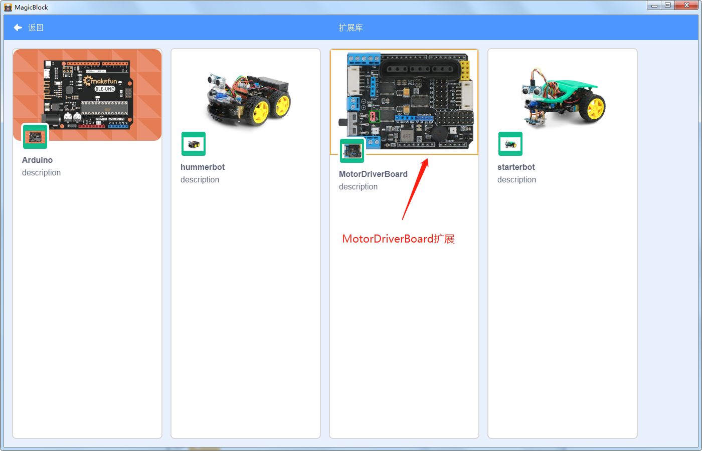

选择好MotorDriverBoard扩展后，我们的图形块区域就会出现MotorDriverBoard这个扩展了，它包含了MotorDriverBoard所有的用来编程的图形块

.jpg)

### 如何使用MotorDriverBoard图形块

MotorDriverBoard的第一个图形块是setup/loop图形块，这个图形块是主图形块，MotorDriverBoard的每个程序都要第一个用到它，而且MotorDriverBoard的其他图形块都要放进这个图形块的setup或loop中，setup中都是放初始化的图形块，如直流电机初始化，RGB初始化等，它们都只执行一次,而且搭建任何程序都需要把MotorDriverBoard初始化图形块放在setup里的第一位，由于MotorDriverBoard有3.0,4.0和5.0三个版本，所以在使用MotorDriverBoard初始化图形块的时候需要在下拉框选择对应的版本，loop中需要放一些可能多次执行的图形块，比如直流电机正转，反转，设置RGB灯的颜色，设置蜂鸣器播放的声音等

.jpg)

## MotorDriverBoard可驱动的模块介绍和MagicBlock示例程序

### 直流电机

#### 驱动直流电机

MotorDriverBoard有4个直流电机接口，分别是直流电机接口M1，直流电机接口M2，以及直流电机接口M3，直流电机接口M4，可通过端子直接将直流电机连接到驱动器上

.jpg)

#### MagicBlock示例程序

用MagicBlock搭建这样一个程序上传到MotorDriverBoard的主控板上，连接好电机，开通电源后，可以看到电机1和电机2不停的正转5秒再反转5秒

### 步进电机

#### 驱动步进电机

MotorDriverBoard有两个步进电机的端口，步进电机的工作电压在5~12V之间，如果步进电机的工作电压太低或者太高，会出现烧毁电机或者驱动板崩溃的现象，而且在驱动电机的时候还应该保证电池的电量充足

.jpg)

#### MagicBlock示例程序

用MagicBlock搭建这样一个程序上传到MotorDriverBoard的主控板上，连接好步进电机，开通电源后，可以看到步进电机1和步进电机2正转一圈停止两秒后两个电机再反转一圈，重复执行这个过程

### 编码电机

#### 驱动编码电机

MotorDriverBoard有两个编码电机的接口，编码电机的工作电压在5~12V之间

.jpg)

#### MagicBlock示例程序

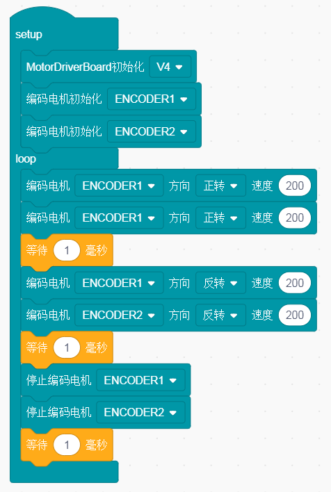

用MagicBlock搭建这样一个程序上传到MotorDriverBoard的主控板上，连接好编码电机，开通电源后，可以看到编码电机1正转，编码电机2反转

### RGB

#### RGB WS2812 简介

WS2812 RGB LED灯是三通道带驱动控制，其内部包含了智能数字接口数据锁存信号整形放大驱动电路，还包含有高精度的内部振荡器和15V高压可编程定电流输出驱动器。同时，为了降低电源纹波， 3个通道有一定的延时导通功能，这样在帧刷新时，可降低电路纹波安装更加简便。WS2812 RGB LED灯与传统灯不同，灯内部集成了驱动控制专用芯片，只需一条信号线即可控制一颗灯珠或多个模组

#### MagicBlock示例程序

用MagicBlock搭建这样一个程序上传到MotorDriverBoard的主控板上，打开电源，可以看到两个RGB灯颜色以及亮度的变化

### 蜂鸣器

#### 驱动蜂鸣器

MotorDriverBoard驱动板上面有一个无源蜂鸣器，可以通过编写程序控制蜂鸣器播放提示音或者播放音乐

.jpg)

#### MagicBlock示例程序

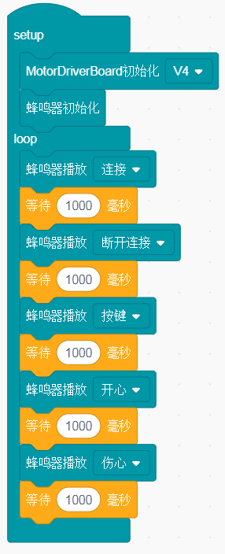

用MagicBlock搭建这样一个程序上传到MotorDriverBoard的主控板上，打开电源，可以听到蜂鸣器播放“连接”和“断开连接”等音效

### 舵机

#### 驱动舵机

MotorDriverBoard驱动板可以驱动8路舵机，驱动板上的舵机引脚位置（红外接收头上方排针），设地线引脚（G）,电源引脚（V）和信号引脚（S），三个引脚分别与舵机的相应引脚,也可以通过I2C通讯控制舵机

.jpg)

.jpg)

#### MagicBlock示例程序

用MagicBlock搭建这样一个程序上传到MotorDriverBoard的主控板上，连接好舵机，开通电源后，可以看到舵机1,2,3,4号舵机都以0度，90度和180度的角度每秒转动一次

### 超声波模块

#### 驱动超声波模块

MotorDriverBoard驱动板上留有四线超声波模块接口，四个引脚分别是电源引脚（vcc）,超声波信号发射引脚（A2），超声波信号接收引脚（A3），地线（GND）, 四个引脚分别和超声波模块的相应引脚连接

.jpg)

#### MagicBlock示例程序

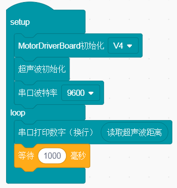

用MagicBlock搭建这样一个程序上传到MotorDriverBoard的主控板上，连接好超声波，开通电源和串口监视器后，可以在串口监视器中看到超声波测到的距离（cm）

### 红外遥控

#### 驱动红外遥控

MotorDriverBoard驱动板上有一个红外遥控接收探头，使用时只需将扩展板插到Arduino上，有红外编码信号发射时，经红外接头处理后，输出为检波整形后的方波信号，并直接提供给单片机，执行相应的操作来达到控制电机的目的

.jpg)

.jpg)

#### MagicBlock示例程序

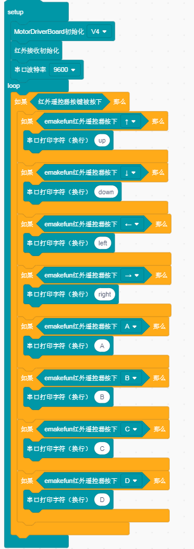

用MagicBlock搭建这样一个程序上传到MotorDriverBoard的主控板上，开通电源和串口监视器后，红外遥控器按下上，下，左，右，串口就会打印出对应的字符

### PS2

#### 驱动PS2遥控

MotorDriverBoard驱动板上有一个PS2端口，可将PS2红外接收头直接插到PS2端口，PS2手柄由手柄和接收器两个部分组成，手柄需要两节7号1.5V供电，接收器的电源和arduino使用同一电源，电源范围为3~5V,不能接反，不能超电压，过压和反接，都会使接收器烧坏。手柄上有个电源开关，ON开/OFF关，将手柄开关打到ON上，在未搜索到接收器的状况下，手柄上的灯会不停的闪，在一定时间内，还未搜索到接收器，手柄将进入待机模式，手柄上的灯将灭掉，这时，按下“START”键，唤醒手柄

.jpg)

#### MagicBlock示例程序

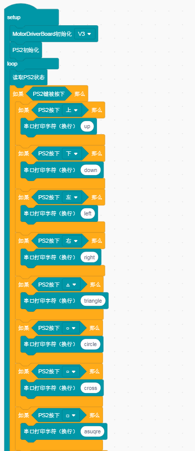

用MagicBlock搭建这样一个PS2控制RGB等颜色的程序上传到MotorDriverBoard的主控板上，连接好PS2，打开电源和串口监视器，按下PS2的上下左右键，串口会打印对应的字符，按下摇杆并转动，可以看到串口打印出左右摇杆的值

### Nrf24L01

#### 驱动Nrf24L01

nRF24L01+模块是Nordic公司基于nRF24L01芯片开发成的2.4G无线通讯模块。采用 FSK 调制，内部集成Nordic自己的 Enhanced Short Burst 协议。可以实现点对点或是 1 对 6 的无线通信。无线通信速度最高可达2M（bps），NRF24L01有收发模式，配置模式，空闲模式，关机模式四个工作模式，MotorDriverBoard驱动板上有一个Nrf24L01接口

.jpg)

.jpg)

#### MagicBlock示例程序

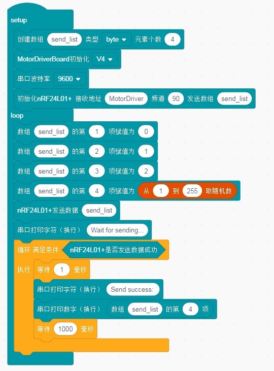

​                                                                                      发送程序

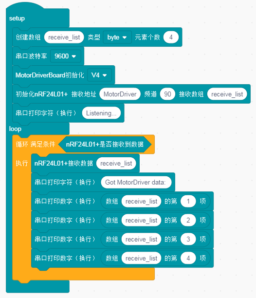

​                                                                                     接收程序

给两块都搭载MotorDriverBoard驱动板的主板分别上传发送和接收程序，接好Nrf24L01模块，打开电源和串口监视器，就可以看见串口正在打印Nrf24L01接收到的值

.jpg)

.jpg)

## 经典应用程序

​	为了方便大家用MagicBlock为自己制作的四驱车编程，我们在MagicBlock加入了初始化四驱车的图形块以及PS2操控四驱车、nRF24L01+操控四驱车、红外遥控四驱车和蓝牙操控四驱车的示例程序，有这方面爱好和需求的朋友可以参考下面的经典应用程序

### PS2操控四驱车

​	前面已经通过串口打印PS2按键的方式介绍过MotorDriverBoardD的 PS2图形化编程，现在我们扩展一下PS2的功能，让它来操控一辆有MoterDriverBoard驱动的四驱小车，这里的示例程序供参考，此程序是通过PS2的八个按键来操控四驱车的方向和速度

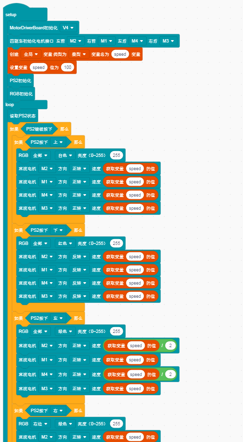

### PS2操控机械臂四驱车

 MotorDriverBoard支持8路舵机，我们为MotorDriverBoard搭配的机械臂用到了4个舵机，PS2操控机械臂四驱车的程序原理是在PS2操控四驱车的程序上添加了用摇杆控制舵机的程序，实现了8个按键控制四驱车行驶方向和速度，左边摇杆控制机械臂的左右移动，右边摇杆控制机械臂的上下移动，左边第一个侧键是合上机械臂的钳子，右边第一个侧键是打开钳子

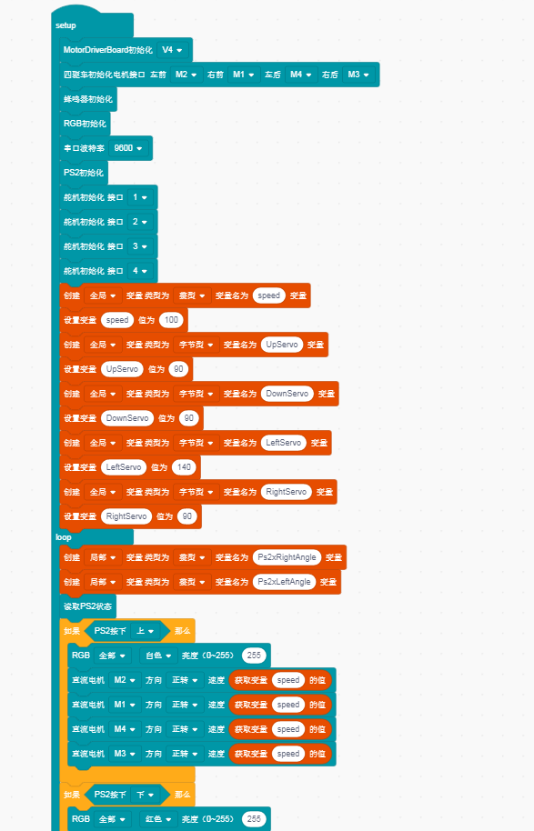

.jpg)

.jpg)

.jpg)

.jpg)

### nRF24L01+操控四驱车

​	nRF24L01+操控MotorDriverBoard四驱车需要用到我们的无线手柄，通过无线手柄的按键来操控四驱车，这与PS2按键操控四驱车原理类似，不同的是无线手柄的右边四个按钮控制前后左右，左边的遥控来获取角度值，让四驱车按照获取的角度转弯。

.jpg)

.jpg)

.jpg)

### 红外遥控器操控四驱车

​	红外遥控的测试程序我们已经写过，现在我们可以做一个红外遥控操控四驱车的程序，上下左右操控四驱车方向，A左自旋，C右自旋，+加速，-减速

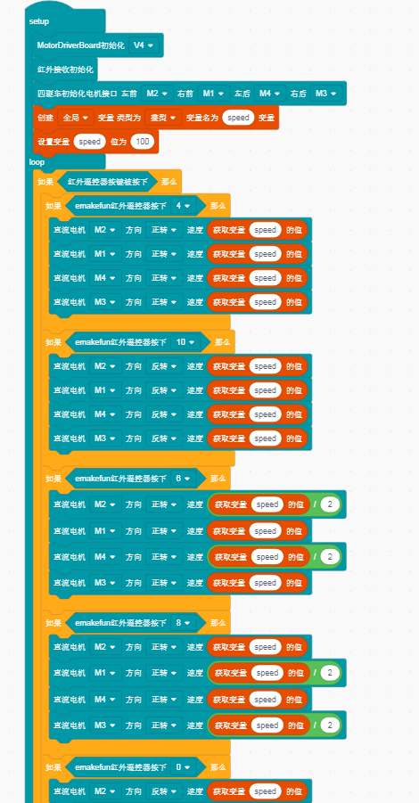

.jpg)

### 蓝牙操控四驱车

​	MotorDriverBoard电机驱动板上搭载了蓝牙插口，将蓝牙模块插入插口中，就可以用手机的蓝牙连接了，首先我们先下载emakefun 手机APP，打开APP后，选择一辆四驱小车如Hummerbot进行蓝牙连接，我们需要给驱动板编写一个蓝牙操控程序后，就可以进入APP蓝牙操控界面控制四驱车了

.jpg)

.jpg)

.jpg)

