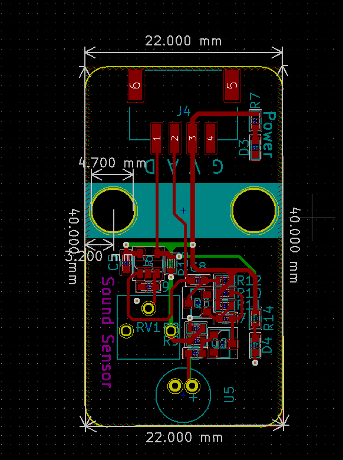

## 声音输出模块


## 概述

新款带功放喇叭模块，基于高保真8002功放芯片制作，在输出音乐的同时，能够确保输出音频不失真。支持音量调节功能，可通过电位器调解输出音量大小。支持宽电压输入，模块可以工作在2~5.5V电压环境下，兼容3.3V和5V Arduino主控器。配合Arduino Tone()函数还可以让你的Arduino一瞬间变成播放音乐播放器。体积小巧，使用方便，是你DIY的时候一个必不可少的小模块。

## 原理图


## 模块参数

1.供电电压:5V
2.连接方式:3PIN防反接杜邦线
3.模块尺寸:4*2.1cm
4.安装方式:M4螺钉兼容乐高插孔固定

| 引脚名称 | 描述       |
| -------- | ---------- |
| V        | 5V电源引脚 |
| G        | GND 地线   |
| S        | 信号引脚   |


## 机械尺寸



## 示例程序

```c++
	

#define AnalogPin A1//定义声音传感器模拟接口引脚
#define DigitalPin 8//定义声音传感器数字接口引脚
int AnalogValue=0;
byte DigitalValue=0;

void setup()
{
  Serial.begin(9600);//设置串口波特率
  pinMode(AnalogPin, INPUT);//将声音传感器模拟接口引脚设置为输入
  pinMode(DigitalPin,INPUT);//将声传感器音数字接口引脚设置为输入
}

void loop() {
    AnalogValue= analogRead(AnalogPin);//读取声音传感器模拟值
    DigitalValue=digitalRead(DigitalPin);//读取声音传感器数字值
    Serial.print("Analog Data:");
    Serial.println(AnalogValue);//打印声音传感器模拟值
    Serial.print("Digital Data:");
    Serial.println(DigitalValue);//打印声音传感器数字值
    delay(200);
}


```

