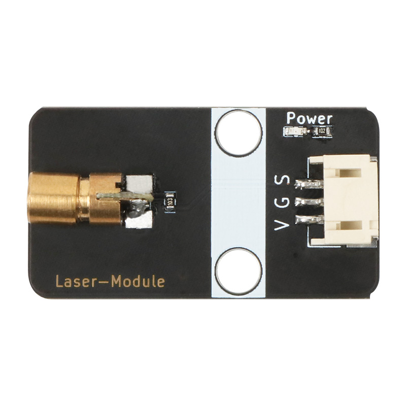
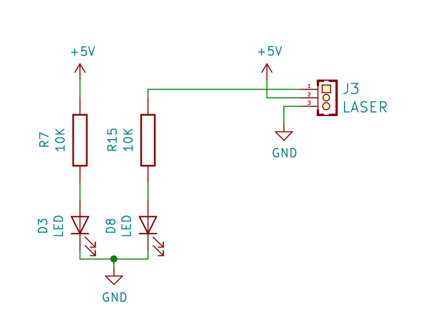
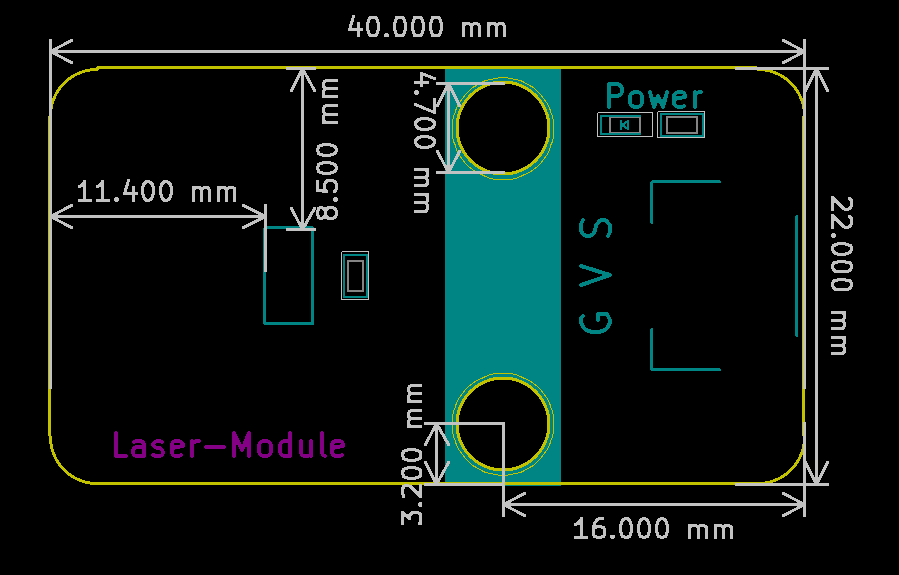

# 激光发射模块规格书

## 模块图



## 概述

激光是20世纪以来继核能、电脑、半导体之后，人类的又一重大发明，被称为“最快的刀”、“最准的尺”、“最亮的光”。英文名Light Amplification by Stimulated Emission of Radiation，意思是“通过受激辐射光扩大”。激光的英文全名已经完全表达了制造激光的主要过程。激光的原理早在 1916年已被著名的美国物理学家爱因斯坦发现。原子受激辐射的光，故名“激光”：原子中的电子吸收能量后从低能级跃迁到高能级，再从高能级回落到低能级的时候，所释放的能量以光子的形式放出。被引诱（激发）出来的光子束（激光），其中的光子光学特性高度一致。这使得激光比起普通光源，激光的单色性好，亮度高，方向性好。 激光发射模块上板载了一个激光头，当给信号脚一个高电平则触发激光发射头发出激光。

## 原理图



## 模块参数

* 1.供电电压:5V
* 2.连接方式:3PIN防反接杜邦线
* 3.模块尺寸:4*2.1cm
* 4.安装方式:M4螺钉兼容乐高插孔固定

| 引脚名称 | 描述       |
| -------- | ---------- |
| V        | 5V电源引脚 |
| G        | GND 地线   |
| S        | 信号引脚   |

## 详细原理图

 [laser.pdf](Laser emission module/laser.pdf) 

##  机械尺寸




## 示例程序


```c
#define laser_pin A3  // Set the laser port to A3
void setup(){
  pinMode(laser_pin, OUTPUT);  // Set the laser port to output mode
}

void loop(){
  digitalWrite(laser_pin,HIGH); // Set the laser port to high level
}
```

## microbit示例程序

<a href="https://makecode.microbit.org/_ga6b3rE3f0i9" target="_blank">动手试一试</a>