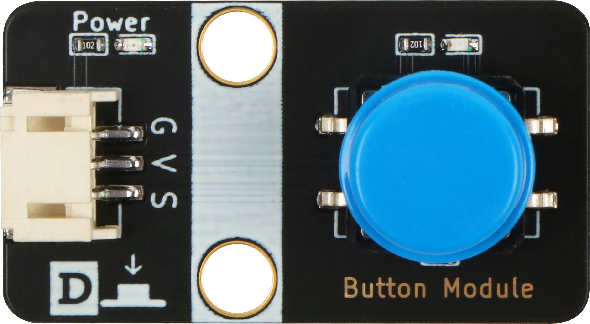
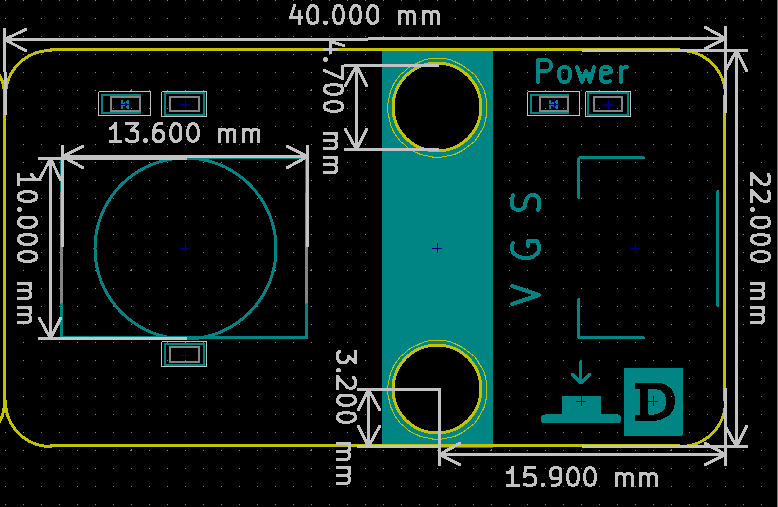

# 按键模块

## 按键模块实物图



## 按键物理机械图


##  概述

​        按键开关主要是指轻触式按键开关，也称之为轻触开关。按键开关是一种电子开关，属于电子元器件类，最早出现在日本[称之为：敏感型开关]，使用时以满足操作力的条件向开关操作方向施压开关功能闭合接通，当撤销压力时开关即断开，其内部结构是靠金属弹片受力变化来实现通断的。
​        本按键模块已经模块化，接电后，模块的红色power灯亮起，当按键按下时，模块输出低电平，并且信号蓝色灯亮起。

## 原理图


## 详细原理图和规格书

 [查看原理图](button/schematic.pdf) 
 
 [查看数据手册](button/button_datasheet.pdf) 

## 模块参数

* G:GND
* V:5V/3.3V电源
* S:信号输出引脚，按下时输出低电平，板子蓝色信号灯亮起

## 模块装配图



## Arduino示例程序

```c
int led_out = 13 ;   //GPIO 13  LED pin
int keypad_pin = A3; //GPIO A3 key pin
int value;
void setup()
{
    pinMode(led_out,OUTPUT);            // init led pin output
    pinMode(keypad_pin,INPUT);          // init key pin input
}
void loop()
{
        value = digitalRead(keypad_pin);    // read key pad pin vaule
        if (value == LOW)
        {
            digitalWrite(led_out,LOW);      // if key value is down  turn on LED
        }
        else
        {
            digitalWrite(led_out,HIGH);     // if key value is down  turn off LED
        }
}
```
## microbit示例程序
请直接参考microbit图形化编程[makecode库链接](https://github.com/emakefun/pxt-sensorbit)里面的基础输入模块的按键模块介绍

