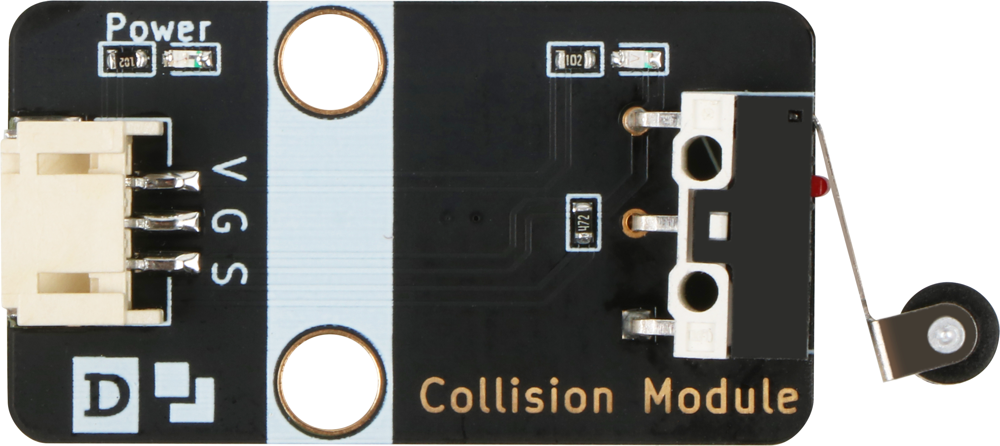
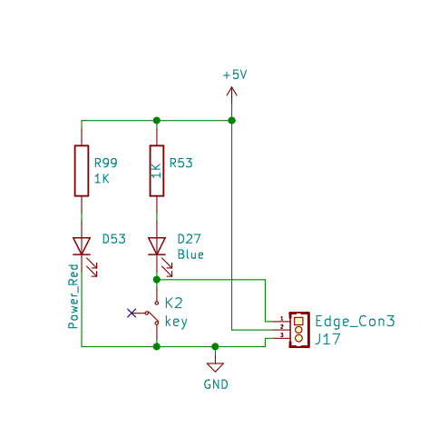
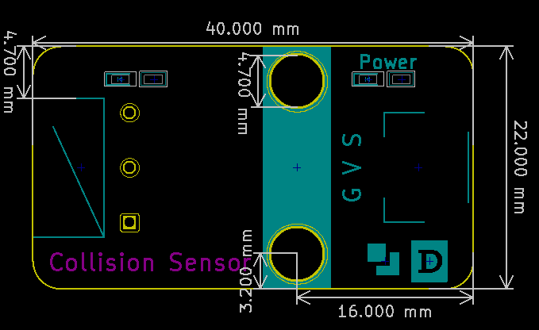

# 触碰开关

## 模块图



## 概述

​	碰撞开关模块实质为一个微型快动开关，即广为人知的微型开关，是一种由很小的物理力启动的电子开关。它能够直接连在单片机上。它将负载电阻同LED指示灯整合在一起。这使得对他进行测试更为简单。当有物理压力触发开关闭合时，板上的LED指示灯会亮起。碰撞开关的原理比较简单，如下原理图，当被外力触发闭合时，开关闭合，模块输出低电平；当撤销外力时，开关被打开，模块输出高电平。

## 原理图



## 模块参数

* 1.供电电压:5V
  2.连接方式:3PIN防反接杜邦线
  3.模块尺寸:4*2.1cm
  4.安装方式:M4螺钉兼容乐高插孔固定

## 详细原理图

 [触碰开关.pdf](collision sensor/触碰开关.pdf) 

## 机械尺寸




## 示例程序

```c
int led_out = A3 ;  //GPIO A3  LED pin
int collision_pin = 3; //GPIO 3 key pin
int value;
void setup()
{
    pinMode(led_out,OUTPUT);               // init led pin output
    pinMode(collision_pin,INPUT);          // init collision pin input
}
void loop()
{
        value = digitalRead(collision_pin);    // read collision pin vaule
        if( value == LOW)
        {
            digitalWrite(led_out,HIGH);      // if collision value is down  turn on LED
        }
        else
        {
            digitalWrite(led_out,LOW);     // if collision value is down  turn off LED
        }
}
```

