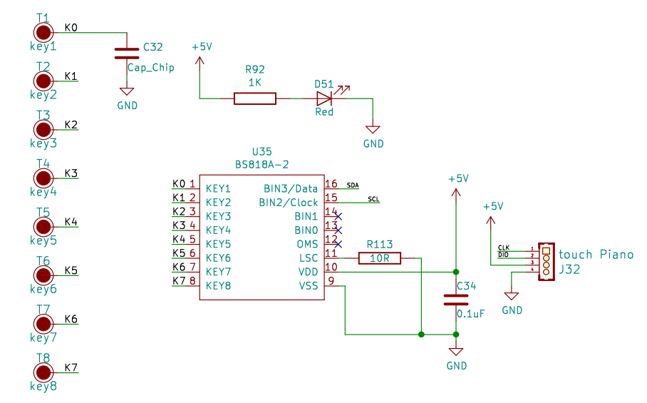
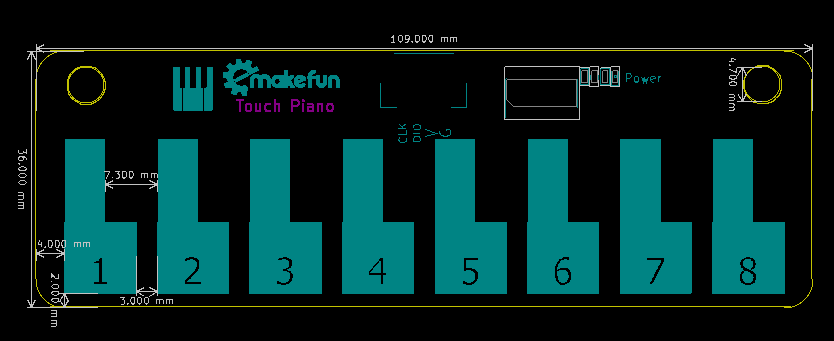

# 触摸钢琴模块

## 模块图


## 概述

​        触摸钢琴模块原理是通过分布在芯片端口的电容因为手指的接触，使电容发生了改变，经芯片处理后能将微小的电容变化转化成电压信号的变化，再通过软件AD采集端口电压，根据电压的变化实现触摸的识别。实际上MCU去获取的只是具体的键值，而要真正的模拟钢琴的声音，需要MCU在做进一步的处理，例如驱动蜂鸣器以不同的频率响。

## 原理图



## 模块参数

* V:工作电压5V
* G：GND
* CLK:时钟信号
* DIO:数字输入输出电路

## 详细原理图

​    [touch Piano.pdf](touch piano/touch Piano.pdf) 

## 机械图



## 示例程序

```c
#include"BS818A.h"
BS818A BS;  //init BS818A piano driver
void setup()
{
  Serial.begin(9600);  //set serial bps
  BS.InitBS818A(A4, A5);  // init  A4 DIO A5 CLK port
}

void loop()
{
  if (BS.PressBsButton(BS_KEYCODE_1))    
    Serial.println("1");          
  if (BS.PressBsButton(BS_KEYCODE_2))    
    Serial.println("2");
  if (BS.PressBsButton(BS_KEYCODE_3))   
    Serial.println("3");
  if (BS.PressBsButton(BS_KEYCODE_4))
    Serial.println("4");
  if (BS.PressBsButton(BS_KEYCODE_5))
    Serial.println("5");
  if (BS.PressBsButton(BS_KEYCODE_6))
    Serial.println("6");
  if (BS.PressBsButton(BS_KEYCODE_7))
    Serial.println("7");
  if (BS.PressBsButton(BS_KEYCODE_8))
    Serial.println("8");
 
}
```

