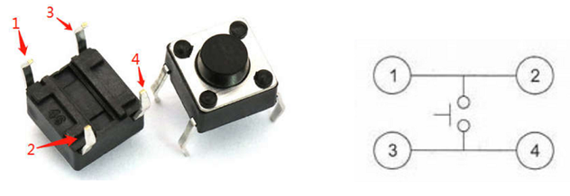
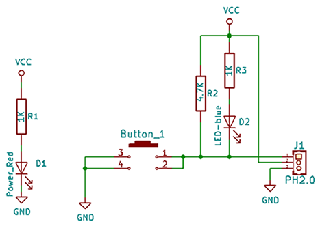

# 按键模块

## 实物图


## 按键机械结构图



##  概述

​        按键也称之为轻触开关，使用时以满足操作力的条件向开关操作方向施压，开关闭合接通；当撤销压力时开关即断开，其内部结构是靠金属弹片受力变化来实现通断的。如图，正常情况下，按键的 1和2、3和4 脚是相连的；当我们按下按键时，四个脚相互接通；松开按键时，恢复正常状态。
​        我们的模块正常连接上后，模块的红色power灯亮起，当按键按下时，模块输出低电平，并且信号蓝色灯亮起，松开后蓝色灯熄灭，输出高电平。

## 原理图



## 详细原理图和数据手册

[查看原理图](button_module/button_module_schematic.pdf)

[查看数据手册](button_module/button_datasheet.pdf)

## 模块参数

| 引脚名称 |                       描述                       |
| :------: | :----------------------------------------------: |
|    G     |                       GND                        |
|    V     |                      5V电源                      |
|    S     | 信号输出引脚，按下时输出低电平，松开时输出高电平 |

- 供电电压：5V

- 连接方式：PH2.0 3PIN防反接线

- 模块尺寸：40x22.5mm

- 安装方式：M4螺钉兼容乐高插孔固定

## 机械尺寸图


## Arduino示例程序

[下载示例程序](button_module/button_module.zip)

```c
int led_out = A2;//定义LED引脚
int keypad_pin = A3; //定义按键引脚
int value;
void setup()
{
  pinMode(led_out,OUTPUT); //初始化LED连接的引脚为输出引脚
  pinMode(keypad_pin,INPUT); //初始化按键连接的引脚为输入
}
void loop()
{
  value = digitalRead(keypad_pin); //读取按键输入引脚的值
  if (value == LOW) 
  {
      digitalWrite(led_out,HIGH); //如果读取值为低即按键按下去了，LED亮
  }
  else
  {
      digitalWrite(led_out,LOW); //如果读取值为低即按键没有按下，LED灭
  }
}
```
## microbit示例程序
请直接参考microbit图形化编程[makecode库链接](https://github.com/emakefun/pxt-sensorbit)里面的基础输入模块的按键模块。

