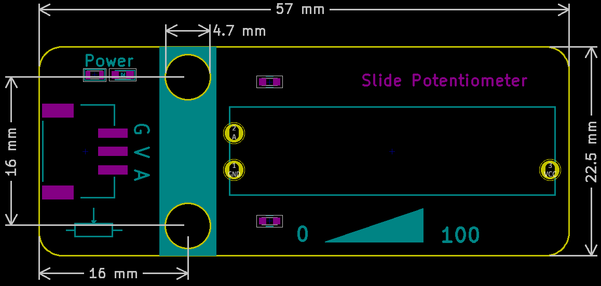

# 滑动变阻器

## 实物图


## 概述

​        滑动变阻器是电路中的一个重要元件，它可以通过移动滑片的位置来改变自身的电阻，从而起到控制电路的作用。在电路分析中，滑动变阻器既可以作为一个定值电阻，也可以作为一个变值电阻。

## 原理图


## 模块参数
| 引脚名称 |     描述     |
| :------: | :----------: |
|    G     |     GND      |
|    V     |    5V电源    |
|    A     | 信号输出引脚 |

- 供电电压：5V

- 连接方式：PH2.0 3PIN防反接线

- 模块尺寸：67.4*22.5cm

- 安装方式：M4螺钉兼容乐高插孔固定

## 详细原理图和数据手册

 [查看原理图](slide_potentiometer/slide_potentiometer_schematic.pdf)

 [查看数据手册](slide_potentiometer/slide_potentiometer.pdf)

## 机械尺寸图



## Arduino示例程序

[下载示例程序](slide_potentiometer/slide_potentiometer.zip)

``` 
float i=0,data; //定义刚获取的模拟值 data 模数转化后的数值 i 实际的电阻大小 j
int r=0;
int analogPin = A0; //定义滑动变阻器接口
void setup()
{
 pinMode(analogPin, INPUT); //设置端口输入
 Serial.begin(9600); // 设置串口波特率
}
void loop() {
 data=analogRead(analogPin); // 获取端口的模拟值
 i=data/1023; //模拟值转数字值
r=(1-i)*100; // 获取滑杆位置
Serial.print("Slider position(0~100): ");
 Serial.println(r); //打印电阻值
 delay(200);
}
```

## microbit示例程序

请直接参考microbit图形化编程[makecode库链接](https://github.com/emakefun/pxt-sensorbit)里面的基础输入模块的滑动变阻器。