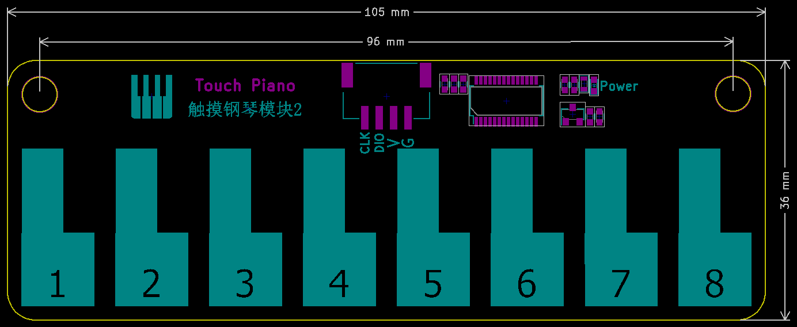

# 触摸钢琴

## 实物图


## 概述

​        触摸钢琴模块原理是通过分布在芯片端口的电容因为手指的接触，使电容发生了改变，经芯片处理后能将微小的电容变化转化成电压信号的变化，再通过软件AD采集端口电压，根据电压的变化实现触摸的识别。实际上MCU去获取的只是具体的键值，而要真正的模拟钢琴的声音，需要MCU在做进一步的处理，例如驱动蜂鸣器以不同的频率响。当钢琴的按键被触碰时，按照钢琴按键键值对应 表输出对应的十六进制值。

| 按键值 | 十六进制值 |
| :----: | :--------: |
|   1    |    0x01    |
|   2    |    0x02    |
|   3    |    0x04    |
|   4    |    0x08    |
|   5    |    0x10    |
|   6    |    0x20    |
|   7    |    0x40    |
|   8    |    0x80    |

## 原理图


## 模块参数

| 引脚名称 |       描述       |
| :------: | :--------------: |
|    G     |       GND        |
|    V     |      5V电源      |
|   CLK    |     时钟信号     |
|   DIO    | 数据输入输出引脚 |

- 供电电压：5V

- 连接方式：4PIN防反接杜邦线

- 模块尺寸：109x36mm

- 安装方式：M4螺钉兼容乐高插孔固定
## 详细原理图

[查看原理图](touch_piano/touch_piano_schematic.pdf) 

[查看数据手册1](touch_piano/bs818a.pdf)

[查看数据手册2](touch_piano/ttp229.pdf)

## 机械尺寸图



## Arduino示例程序

[下载示例程序](touch_piano/touch_piano.zip)

```c
#include "Buzzer.h"
#include "BS818A.h"

BS818A BS;
Buzzer buzzer(A3);

void setup() {
  Serial.begin(9600);
  BS.InitBS818A(A4, A5);
}

void loop()  {
   if (BS.PressBsButton(BS_KEYCODE_1)) {
    buzzer.tone(A3, 262, 100);
  } else if (BS.PressBsButton(BS_KEYCODE_2)) {
    buzzer.tone(A3, 294, 100);
  } else if (BS.PressBsButton(BS_KEYCODE_3)) {
    buzzer.tone(A3, 330, 100);
  } else if (BS.PressBsButton(BS_KEYCODE_4)) {
    buzzer.tone(A3, 349, 100);
  } else if (BS.PressBsButton(BS_KEYCODE_5)) {
    buzzer.tone(A3, 392, 100);
  } else if (BS.PressBsButton(BS_KEYCODE_6)) {
    buzzer.tone(A3, 440, 100);
  } else if (BS.PressBsButton(BS_KEYCODE_7)) {
    buzzer.tone(A3, 494, 100);
  } else if (BS.PressBsButton(BS_KEYCODE_8)) {
    buzzer.tone(A3, 523, 100);
  }
  delay(200);
}
```

## microbit示例程序

请直接参考microbit图形化编程[makecode库链接](https://github.com/emakefun/pxt-sensorbit)里面的基础输入部分触摸钢琴。