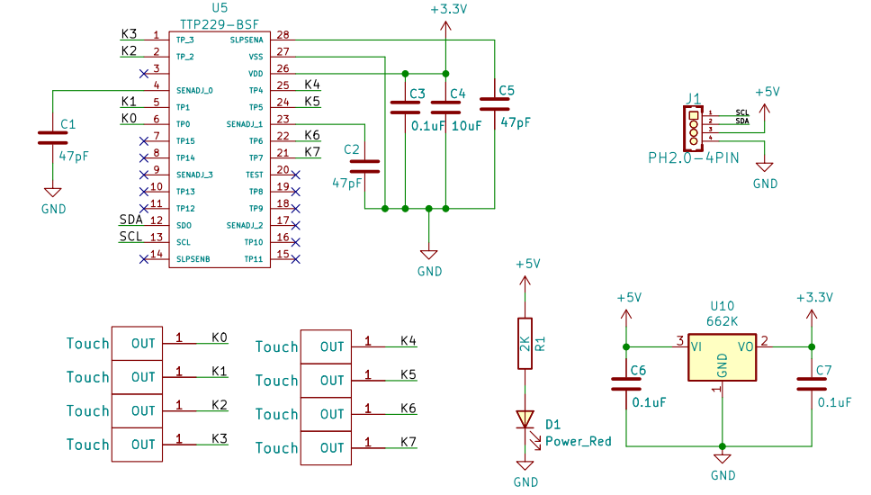

# 触摸钢琴

## 实物图


## 概述

​        触摸钢琴模块原理是通过分布在芯片端口的电容因为手指的接触，使电容发生了改变，经芯片处理后能将微小的电容变化转化成电压信号的变化，再通过软件AD采集端口电压，根据电压的变化实现触摸的识别。实际上MCU去获取的只是具体的键值，而要真正的模拟钢琴的声音，需要MCU在做进一步的处理，例如驱动蜂鸣器以不同的频率响。

当钢琴的按键被触碰时，按照钢琴按键键值对应表输出对应的十六进制值：

| 按键值 | 十六进制值 |
| :----: | :--------: |
|   1    |    0x01    |
|   2    |    0x02    |
|   3    |    0x04    |
|   4    |    0x08    |
|   5    |    0x10    |
|   6    |    0x20    |
|   7    |    0x40    |
|   8    |    0x80    |

## 原理图

[下载原理图](touch_piano/touch_piano_schematic.pdf) 



## 模块参数

| 引脚名称 |       描述       |
| :------: | :--------------: |
|    G     |       GND        |
|    V     |      5V电源      |
|   CLK    |     时钟信号     |
|   DIO    | 数据输入输出引脚 |

- 供电电压：5V

- 连接方式：PH2.0 4PIN防反接线

- 模块尺寸：109x36mm

- 安装方式：M4螺钉兼容乐高插孔固定

## 机械尺寸图


## Arduino示例程序

[下载示例程序](touch_piano/touch_piano.zip)

```c
#include"EM_Piano.h"
#include "Buzzer.h"

Buzzer buzzer(A3);

int SCLPin = A5, SDOPin = A4;   // Define SCL clock and SDO data port
unsigned int h = 0, oldh = 0;
Piano mPiano;
char str[128];
void setup()
{
  Serial.begin(9600);  // Set the serial port baud rate to 9600
  mPiano.initPiano(SCLPin, SDOPin); //初始话钢琴模块
}

void loop()
{
  uint16_t keycode = mPiano.GetKeyCode(); //获取钢琴模块键值
  if (keycode != 0xFFFF) {   // 判断按键是否按下
    String key_name = mPiano.GetKeyMap();
    if (key_name == "1") {   //判断按键1是否按下
      buzzer.tone(A3, 262, 100);
    }else if (key_name == "2") {  //判断按键2是否按下
      buzzer.tone(A3, 294, 100);
    }else if (key_name == "3") {  //判断按键3是否按下
       buzzer.tone(A3, 330, 100);
    }else if (key_name == "4") {  //判断按键4是否按下
       buzzer.tone(A3, 349, 100);
    }else if (key_name == "5") {  //判断按键5是否按下
       buzzer.tone(A3, 392, 100);
    }else if (key_name == "6") {  //判断按键6是否按下
       buzzer.tone(A3, 440, 100);
    }else if (key_name == "7") {  //判断按键7是否按下
       buzzer.tone(A3, 494, 100);
    }else if (key_name == "8") {  //判断按键8是否按下
       buzzer.tone(A3, 523, 100);
    }
  }
}
```

## Mixly示例程序

[下载示例程序](touch_piano/touch_piano_Mixly_demo.zip)


## microbit示例程序

请直接参考microbit图形化编程[makecode库链接](https://github.com/emakefun/pxt-sensorbit)里面的基础输入部分触摸钢琴。