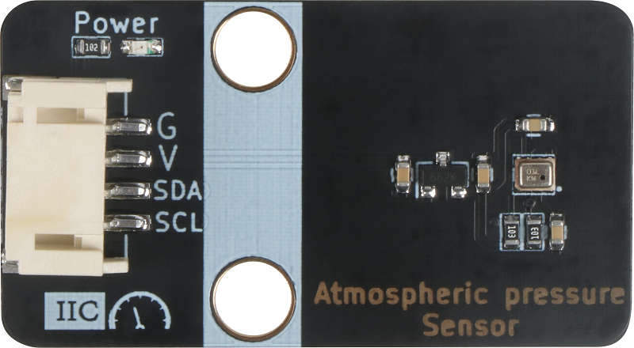
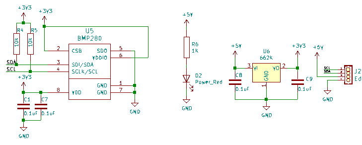
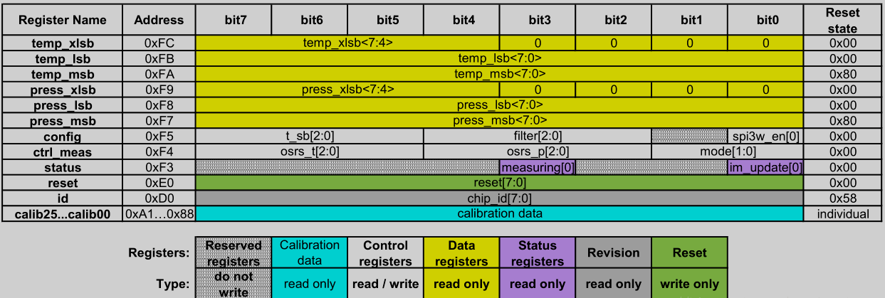

# 气压传感器

## 实物图



## 概述

BMP280是专为移动应用设计的绝对气压传感器。传感器模块安装在一个非常紧凑的8针金属盖LGA封装中，封装面积仅为2.0×2.5 mm 2，封装高度为0.95 mm。它体积小，耗电量低，为2.7μA@1Hz，可用于手机、[GPS](http://www.elecfans.com/book/story.php?id=404)模块或手表等[电池](http://www.elecfans.com/dianyuan/603907.html)驱动设备，传感器都具有良好的相对精度为±0.12 hpa，相当于高度差±1 m。极低的偏移，温度系数（TCO）为1.5 pa/k时，温度漂移仅为12.6 cm/k。

### 应用

* GPS准确导航（行位推算，上下桥检测等）；

* 室内室外导航

* 休闲体育和医疗等检测

* 天气预报

* 垂直速度指示

* 风扇功率控制。

## 原理图

  

##  模块参数

| 引脚名称 |   描述   |
| :------: | :------: |
|    G     |   GND    |
|    V     |  5V电源  |
|   SCL    | 时钟引脚 |
|   SDA    | 数据引脚 |

- 工作电压：3.3V
- 工作电流：2.5mA
- CSB：SPI通信模式下用到的引脚
- SDO：传感器地址控制位，接GND的时候I2C中器件地址为0xEC，接高电平为0xEC+ 1，本次接GND
- 温度：-45℃~+85℃
- 大气压强：0~20000hPa（百帕）
- 模块尺寸：40 * 21mm
- 连接方式：PH23.0 4PIN防反接线
- 安装方式：M4螺钉兼容乐高插孔固定

## 详细原理图和数据手册

[查看原理图](atmospheric_pressure_sensor/atmospheric_pressure_sensor_schematic.pdf) 

[查看数据手册](atmospheric_pressure_sensor/bmp280.pdf) 

## 机械尺寸图


## 相关寄存器说明



* **测量控制寄存器（ctrl_meas）（0xF4）：**
  Bit7~Bit5：osrs_t[2:0] 控制温度采样模式，主要是采样数据的位数（位数越大，精度越高），具体配置如下（本次三位都配置为1，最大采样位数20Bit）
* Bit4~Bit2：osrs_p[2:0] 控制大气压强采样模式，主要是采样数据的位数（位数越大，精度越高），具体配置如下（本次三位都配置为1，最大采样位数20Bit）Bit1~Bit0：mode[1:0] 传感器工作模式控制，00为Sleep Mode，01/10为Forced Mode。
* **身份编号寄存器（id）（0xD0）：**
  寄存器内固定值为0x58，读取0xD0数据的时候，传感器返回0x58，代表身份辨认完毕。
* **复位寄存器（reset）（0xE0）：**
  写入0xB6时，所有寄存器（除身份编号寄存器）数据全部清零。

## 示例程序

[下载示例程序](atmospheric_pressure_sensor/bmp280.zip)

```c
#include "BMP280.h"
#include "Wire.h"

typedef DFRobot_BMP280_IIC    BMP;    // ******** use abbreviations instead of full names ********

BMP   bmp(&Wire, BMP::eSdo_low);

#define SEA_LEVEL_PRESSURE    1015.0f   // sea level pressure

// show last sensor operate status
void printLastOperateStatus(BMP::eStatus_t eStatus)
{
  switch(eStatus) {
  case BMP::eStatusOK:    Serial.println("everything ok"); break;
  case BMP::eStatusErr:   Serial.println("unknow error"); break;
  case BMP::eStatusErrDeviceNotDetected:    Serial.println("device not detected"); break;
  case BMP::eStatusErrParameter:    Serial.println("parameter error"); break;
  default: Serial.println("unknow status"); break;
  }
}

void setup()
{
  Serial.begin(115200);
  bmp.reset();
  Serial.println("bmp read data test");
  while(bmp.begin() != BMP::eStatusOK) {
    Serial.println("bmp begin faild");
    printLastOperateStatus(bmp.lastOperateStatus);
    delay(2000);
  }
  Serial.println("bmp begin success");
  delay(100);
}

void loop()
{
  float   temp = bmp.getTemperature();
  uint32_t    press = bmp.getPressure();
  float   alti = bmp.calAltitude(SEA_LEVEL_PRESSURE, press);

  Serial.println();
  Serial.println("======== start print ========");
  Serial.print("temperature (unit Celsius): "); Serial.println(temp);
  Serial.print("pressure (unit pa):         "); Serial.println(press);
  Serial.print("altitude (unit meter):      "); Serial.println(alti);
  Serial.println("========  end print  ========");

  delay(1000);
}
```

## microbit示例程序

<a href="https://makecode.microbit.org/_b7fLPi2myAEa" target="_blank">动手试一试</a>
