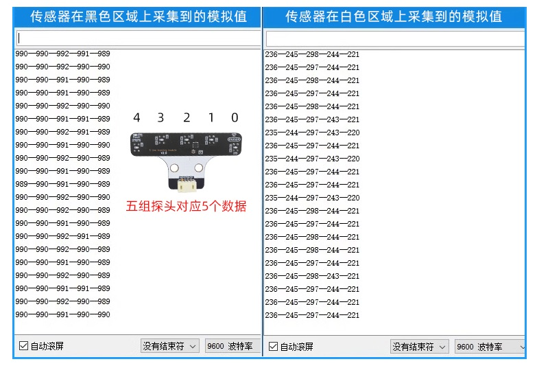

# 五路循迹模块V2.0

## 概述

五路循迹是一款基于红外感光原理的数字模拟一体的传感器模块，它包含五组高品质红外对管ITR9909。为了解决开发过程IO口不够的问题，本模块采用独立MCU处理五路红外传感器反射信号，通过I2C协议返回检测结果。通过优化硬件DMA ADC，采样滤波算法使得红外循迹抗干扰性强，无延时，检测灵敏高。

检测原理：

红外发射二极管不断发射红外线，当检测到黑线时，红外线被吸收，红外接收二极管处于关断状态，输出电压值大，对应的LED灯熄灭。当检测到白色时，红外线被反射，红外接收二极管处于导通状态，输出电压值低，对应的LED灯亮起。

本模块支持五路数字输出，识别到黑线输出0，未识别到黑线输出1，我们可以通过设置红外反射模拟阈值，来调节循迹检测高度。

本模块也可以直接读取五路红外接收传感器上的模拟电压值， 当检测到黑线或者越靠近黑线时数值越大，反之越小。

使用该传感器模块，你可以通过读取传感器的数字输出或模拟电压值来实现循迹或避障等功能。具体的使用方法，请参考本库的示例代码和API文档。

## 黑白采集结果

下图为串口打印I2C获取五个探讨的模拟值，左边是黑色底面，右边是白色底面。

## 产品参数

- 工作电压：3~5V
- 通信方式：IIC
- 接口类型：PH2.0-4Pin (G V SDA SCL)
- 检测高度：0.5cm ~ 4 cm
- 输出值：模拟值和数字值

## 寄存器地址

| 地址   | 描述 |
|:-----|:-----|
| 0x50 | 模块的 IIC地址，地址可通过电阻配置 |
| 0x00 | 红外线反射检测灵敏度配置寄存器，范围0~1000（当传感器读取到的值大于此值时，传感器对应的灯灭，代表识别到黑线）|
| 0x02 | 传感器模拟数据的起始地址，使用时请求10字节数据   每两字节表示一路输出0~1023（高8位在前，低8位在后）|
| 0x0c | 传感器状态位地址，读取一字节数据   bit0 bit1 bit2 bit3 bit4   inf1 inf2 inf3 inf4 inf5   分别对用五路循迹状态，0代表识别到黑线，1代表未识别到黑线 |

## 引脚定义

| 引脚名称 | 描述 |
|------|---------|
| V    | 3~5V电源引脚 |
| G    | GND 地线  |
| SDA  | IIC数据引脚 |
| SCL  | IIC时钟引脚 |

## 模块尺寸

## Arduino应用场景

### Arduino 示例程序

[下载Arduino库](https://github.com/emakefun-arduino-library/emakefun_five_line_tracker/archive/refs/tags/release.zip)，包含Arduino库文件和示例代码

### Arduino 库使用文档

[说明文档](https://github.com/emakefun-arduino-library/emakefun_five_line_tracker#linetracker-library-v20)

### Arduino 库示例程序

[示例程序](https://github.com/emakefun-arduino-library/emakefun_five_line_tracker#%E7%A4%BA%E4%BE%8B%E4%BB%A3%E7%A0%81)

## Micropython(ESP32系列)

[点击此处下载Micropython库和示例程序](five_way_tracking_sensor/micropython_library.zip)

### MagicBlock图形化编程块

### Mixly图形化块

[点击下载示例程序](five_way_tracking_sensor/five_line_tracker_analog_test.zip)

### Mind+图形化

[点击下载Mind+库](five_way_tracking_sensor/emakefun-five-tracker-V0.0.1.mpext)

[点击下载Mind+示例程序](five_way_tracking_sensor/five_line_tracker_test.zip)

### Microbit示例程序

MakeCode用户库链接: <https://github.com/emakefun-makecode-extensions/emakefun_five_line_tracker>

- 示例程序: 打印传感器每个探头的数字值和模拟值 [点击此处链接查看](https://makecode.microbit.org/_2pgLPc6Ks7gD)

### microbit micropython支持

敬请期待
