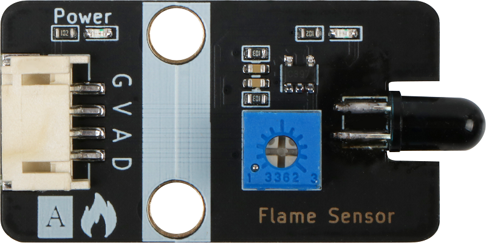
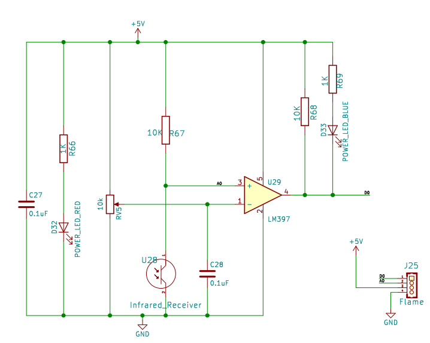
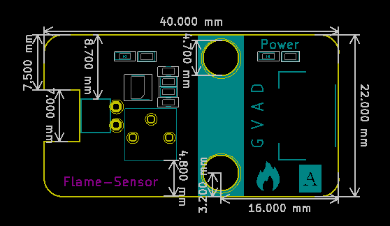

# 火焰传感器

## 实物图



## 概述

​        在公共场所，比如酒店，建筑物和其他地方都配备了火灾报警器，那么它如何感知火灾？ 众所周知，当火灾爆发时，会有特别强烈的红外线，该设备可以通过红外线探测火灾。

火焰传感器是机器人专门用来搜寻火源的传感器，当然火焰传感器也可以用来检测光线的亮度，只是本传感器对火焰特别灵敏。火焰传感器利用红外线对对火焰非常敏感的特点，使用特制的红外线接受管来检测火焰，然后把火焰的亮度转化为高低变化的电平信号，输入到中央处理器中，中央处理器根据信号的变化做出相应的程序处理。

## 原理图



## 模块参数

| 引脚名称 | 描述         |
| -------- | ------------ |
| V        | 5V电源引脚   |
| G        | GND 地线     |
| A        | 模拟信号引脚 |
| D        | 数字信号引脚 |

- 供电电压:5V

- 连接方式:4PIN防反接杜邦线

- 模块尺寸:4*2.1cm

- 安装方式:M4螺钉兼容乐高插孔固定

## 详细原理图和数据手册

 [查看原理图](flame_sensor/flame.pdf) 

 [查看数据手册](flame_sensor/flame.pdf) 

## 机械尺寸



## 示例程序

[下载示例程序](flame_sensor/flame.pdf) 

```c
#include "Buzzer.h"

#define FlamelDigitalPin  7//定义火焰传感器数字引脚
#define FlamelAnalogPin   A0//定义火焰传感器模拟引脚
#define BuzzerPin A3//定义无源蜂鸣器块引脚

Buzzer buzzer(BuzzerPin) ;
int  FlamelAnalogValue = 0 ;//定义数字变量,读取火焰模拟值
int  FlamelDigitalValue = 0 ;//定义数字变量,读取火焰数字值
void setup()
{
  Serial.begin(9600);//设置串口波特率
  pinMode(FlamelDigitalPin, INPUT);//设置火焰传感器数字引脚为输入
  pinMode(FlamelAnalogPin, INPUT);//设置火焰传感器模拟引脚为输入
  pinMode(BuzzerPin, OUTPUT);//设置无源蜂鸣器模块引脚为输出
}
void loop()
{
  buzzer.noTone();//蜂鸣器停止
  FlamelAnalogValue = analogRead(FlamelAnalogPin);//读取火焰传感器模拟值
  FlamelDigitalValue = digitalRead(FlamelDigitalPin);//读取火焰传感器数字值
  Serial.print("FlamelAnalog Data:  ");
  Serial.print(FlamelAnalogValue);//打印火焰传感器模拟值
  Serial.print("       FlamelDigital Data:  ");
  Serial.println(FlamelDigitalValue);//打印火焰传感器数字值
  if (FlamelDigitalValue == 0) {//判断火焰传感器是否检测到火焰  检测到火焰  蜂鸣器报警 
     for(int i = 200; i <= 800; i++)
     {
       buzzer.tone(i, 10);
     }
     for(int i= 800; i >= 200; i--)
     {
        buzzer.tone(i, 10);
     }
  }
  delay(200);
}
```

