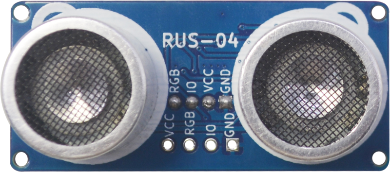

#  概述

|RUS-04(黑色款)|RUS-04蓝色款|
| :-: | :-: |
|  |  |

## 产品简介

​		RUS-04是一款内置rgb彩灯，单总线超声波测距模块。 每个探头内部集成3颗WS2812彩灯，可通程序控制 rgb彩灯，模块在测距的同时，探头也能显示各种颜色。特别应用于玩具超声测距，机器人等应用。 2CM 超小盲区，4M 典型最远测距。采用自研超声波测距解调芯片，单总线，外围更加简洁，芯片内置高精度振荡器，无需额外晶振。驱动采用扫频技术，减少探头本身一致性对模块灵敏度的影响。

## 模块参数对比

|型号|HC-04|RUS-04（蓝色）|US-04|RUS-04（黑色）|
| :-: | :-: | :-: | :-: | --- |
|图片|||||
| 工作电压 | 3~5.5V | 4.5V~5.5V | 3.5V~5.5V |4.5V~5.5V|
| 工作电流 | 3mA | 不开灯珠2mA 开灯珠180mA | 3mA |不开灯珠2mA 开灯珠180mA|
| 是否带彩灯 | 否 | 是 | 否 |是|
| 谐振频率 | 40K | 40K | 40K |40K|
| 探测距离范围 | 3.5cm~6m | 2cm～5米 | 2cm～6米 |2cm～4米|
| 探测精度 | 1cm±2% | 1cm±2% |        1cm±2%        |1cm±2%|
| 盲区 | 2~4cm | 2~3cm | 2~3cm |2~3cm|
| 分辨率 | 1mm | 1mm | 1mm |1mm|
| 探测角度 | ±15°~±20° | ±15°~±20° | ±15°~±20° |±15°~±20°|
| 测量周期时间 | 200ms | 50ms | 50ms |60ms|
| 工作温度范围 | -10℃~60℃ | -10℃~80℃ |       -10℃~80℃       |-10℃~80℃|
| 外形尺寸 | 20.4x45.2mm | 20.4x45.2mm | 45.2mm x 20.4mm |45.2mm x 20.4mm|
| 接口 | 插针接口 | 4Pin PH2.0/Grove/插针接口 | 4Pin PH2.0/Grove/RJ25接口 |PH2.0/Grove/RJ25接口|
| 通讯引脚 | VCC/Trig/Echo/GND | G/V/IO/RGB                  |       G/V/Trig/Echo       |G/V/RGB/IO|

## 接口定义

## 模块结构图

### RUS-04（蓝色款）尺寸图

​													 
### RUS-04（黑色款）尺寸图

# 模块原理介绍

## 超声波部分测量操作

​		外部 MCU 初始设置为输出，给模块 I/O 脚一个大于 10uS 的高电平脉冲；输出脉冲信号后，MCU 设置 为输入模式，等待模块给出的一个与距离等比的高电平脉冲信号；测量结束后 MCU 设置为输出模式，进行下次测量。声速可根据脉宽时间“T”算出：

#### 距离=T（从发送信号至接收到信号的时间）*340/2 （ 340m/s是声音在空气中的传播速度） 

# RGB灯珠介绍

##  RGB LED灯介绍
​		RUS-04为了使用方便采用了直接集成了LED驱动控制芯片的WS2812B-2020RGB灯珠，控制芯片内部包含了智能数字接口，数据锁存信号，整形放大驱动电路，还包含有高精度的内部振荡器和15V高压可编程定电流输出驱动器。

​		RUS-04收发探头分别各集成了3个RGB灯珠。只需一条信号线来控制各个RGB灯发光
Arduino需要控制探头的发光，需要专门的RGB库支持。

####  详情可以看 [WS2812B规格书](./RGB_ultrasonic_Module/WS2812B.PDF)

## 应用注意

## microbit示例程序

<a href="https://makecode.microbit.org/_PtqVy7dDj4PJ" target="_blank">动手试一试</a>