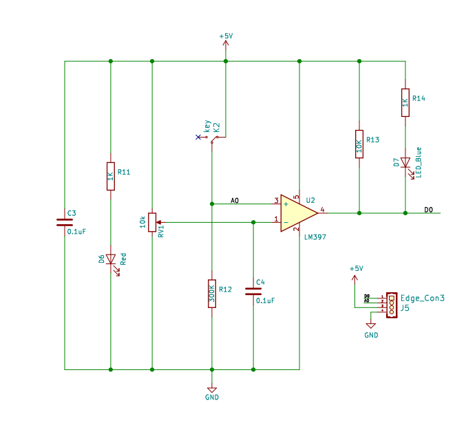

# 震动传感器

## 模块图

## 概述

​        震动传感器模块实质是一个开关,其内部是一个金属片和一个弹簧, 产品不震动时，震动开关呈断开状态，输出端输出高电平；产品震动时，震动开关由于弹簧和金属片瞬间导通，输出端输出低电平；输出端可以与单片机直接相连，通过单片机来检测高低电平，由此来检测环境是否有震动，起到报警作用。

## 原理图

## 模块参数

| 引脚名称 | 描述         |
| -------- | ------------ |
| V        | 5V电源引脚   |
| G        | GND 地线     |
| A        | 模拟信号引脚 |
| D        | 数字信号脚   |

* 1.供电电压:5V
* 2.连接方式:4PIN防反接杜邦线
* 3.模块尺寸:4*2.1cm
* 4.安装方式:M4螺钉兼容乐高插孔固定

## 详细原理图

 [震动传感器.pdf](shock_sensor/震动传感器.pdf) 

## 模块尺寸

