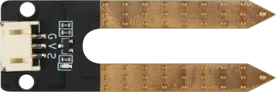
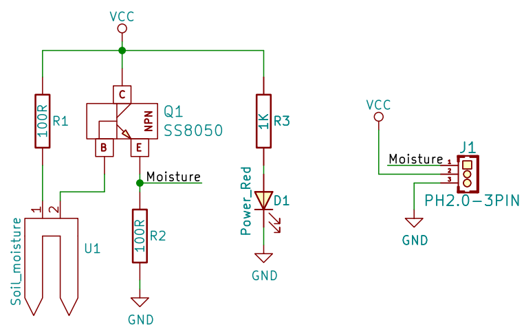
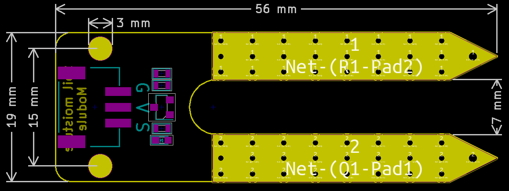

# 土壤湿度传感器规格书

## 实物图



## 概述

土壤湿度传感器模块有两个铜条是传感器探头。 将它们插入土壤时，它们可以检测到水分。 土壤湿润，导电性越好，反映出它们之间的电阻越低。土壤干燥,导电性就相对差一点,因此他们之间的电阻越高。 它是模拟传感器，因此我们通过模拟输入获得电压值。因为土壤的湿度可以分为几个等级，当我们使用土壤湿度传感器做一个自动浇花系统的时候，将方便的使用。

## 原理图



## 模块参数

| 引脚名称 | 描述       |
| -------- | ---------- |
| V        | 5V电源引脚 |
| G        | GND 地线   |
| S        | 信号引脚   |

## 详细原理图

 [查看原理图](soil_moisture_sensor/soil_moisture_schematic.pdf) 

## 机械尺寸图



## Arduino示例程序

[下载示例程序](soil_moisture_sensor/soil_moisture.zip) 

```c++
#include <Wire.h> 
#include "LCD.h" 
#include "LiquidCrystal_I2C.h"
#define SoilMosturePin  A3//define soil sensor pin

LiquidCrystal_I2C lcd(0x27,2,1,0,4,5,6,7); // 0x27 is the I2C bus address for an unmodified backpack 
void setup() 
{ // activate LCD module 
  lcd.begin (16,2); // for 16 x 2 LCD module 
  lcd.setBacklightPin(3,POSITIVE); 
  lcd.setBacklight(HIGH); 
  pinMode(SoilMosturePin,INPUT);
  Serial.begin(9600);
} 

void loop() {
  lcd.setCursor(1-1, 1-1);
  lcd.print("Soil moisture:");
  lcd.setCursor(1-1, 2-1);
  lcd.println(analogRead(SoilMosturePin));//print value
  delay(1000);

}
```

## microbit示例程序

<a href="https://makecode.microbit.org/_8MceUJPKWUaq" target="_blank">动手试一试</a>