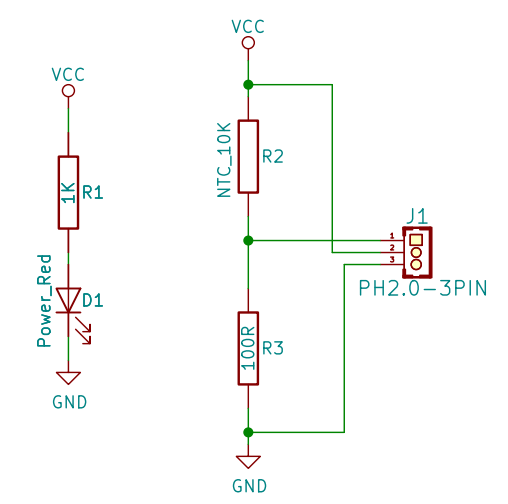

# 热敏传感器

## 实物图


## 概述

热敏电阻器是敏感元件的一类，按照温度系数不同分为正温度系数热敏电阻器(PTC)和负温度系数热敏电阻器(NTC)。热敏电阻器的典型特点是对温度敏感，不同的温度下表现出不同的电阻值。正温度系数热敏电阻器(PTC)在温度越高时电阻值越大，负温度系数热敏电阻器(NTC)在温度越高时电阻值越低，它们同属于半导体器件。  

## 原理图



## 模块参数

| 引脚名称 | 描述       |
| :------- | ---------- |
| V        | 5V电源引脚 |
| G        | GND 地线   |
| S        | 信号引脚   |

- 供电电压:5V

- 连接方式:3PIN防反接杜邦线

- 模块尺寸:4*2.1cm

- 安装方式:M4螺钉兼容乐高插孔固定

## 详细原理图

 [查看原理图](thermal_sensor/thermal_sensor_schematic.pdf) 

## 机械尺寸图


## Arduino示例程序

 [下载示例程序](thermal_sensor/thermal_sensor.zip) 

```c++
#include "Buzzer.h"

#define ThermalePin  A3//定义热敏传感器模块引脚
#define buzzerPin 3//蜂鸣器模块引脚
Buzzer buzzer(BuzzerPin) ;

int  ThermalValue = 0 ;//定义数字变量,读取热敏值
void setup()
{
  Serial.begin(9600);//设置串口波特率
  pinMode(ThermalePin, INPUT);//设置热敏传感器模块引脚为输入
  pinMode(buzzerPin, OUTPUT);//设置LED模块引脚为输出
}
void loop()
{
buzzer.noTone();//蜂鸣器停止
  ThermalValue = analogRead(ThermalePin);//读取热敏值，并赋值给ThermalValue
  Serial.print("Thermal Data:  ");
  Serial.println(ThermalValue);//打印热敏值
  if (ThermalValue > 100) {//判断热敏值是否小于300
     for(int i = 200; i <= 800; i++)
     {
       buzzer.tone(i, 10);
     }
     for(int i= 800; i >= 200; i--)
     {
        buzzer.tone(i, 10);
     }
  } 
  delay(200);
}
```

## microbit示例程序

<a href="https://makecode.microbit.org/_56L5cVTJ5hU4" target="_blank">动手试一试</a>

