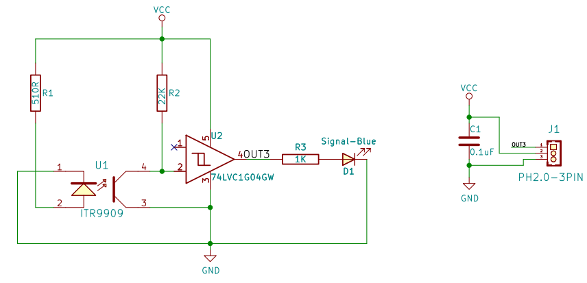

# 红外循迹传感器

## 实物图


## 概述

​        红外循迹模块本质上是一个红外线收发装置，是具有一对红外线发射与接收管，发射管发射出一定频率的红外线，当检测方向遇到反射面时，红外线反射回来被接收管接收，经过比较器电路处理之后，指示灯会亮起，同时信号输出接口输出数字信号（一个低电平信号）。

## 原理图

[查看原理图](tracking_sensor/infrared_tracking_schematic.pdf) 


## 模块参数

| 引脚名称 |                       描述                       |
| :------: | :----------------------------------------------: |
|    G     |                       GND                        |
|    V     |                       VCC                        |
|    S     | 当遇到黑色时输出高电平当没有遇到黑色时输出低电平 |

- 供电电压:3v3/5V

- 连接方式:3PIN防反接杜邦线

- 模块尺寸:40 x 22.5 mm

- 安装方式: M4螺钉兼容乐高插孔固定 


## 机械尺寸图


## Arduino示例程序

[下载示例程序](tracking_sensor/infrared_tracking.zip)

```c++
void setup(){
  Serial.begin(9600);  // Set the serial port baud rate to 9600
  pinMode(A3, INPUT);   // Set A3 port as input mode
}

void loop(){
  if (digitalRead(A3) == 1) {  // Determine whether a black line is detected
    Serial.println("No black line detected");
    delay(300);
     // print information No black line detected
  } else {
    Serial.println("Black line detected");
// print information Black line detected
  }

}
```


## microbit示例程序

<a href="https://makecode.microbit.org/_8KJhf5XsoWqh" target="_blank">动手试一试</a>
