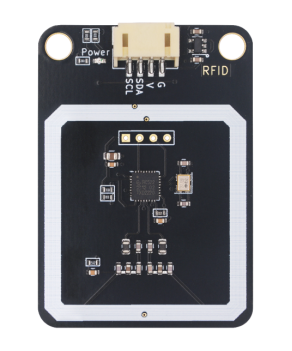
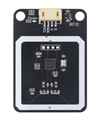
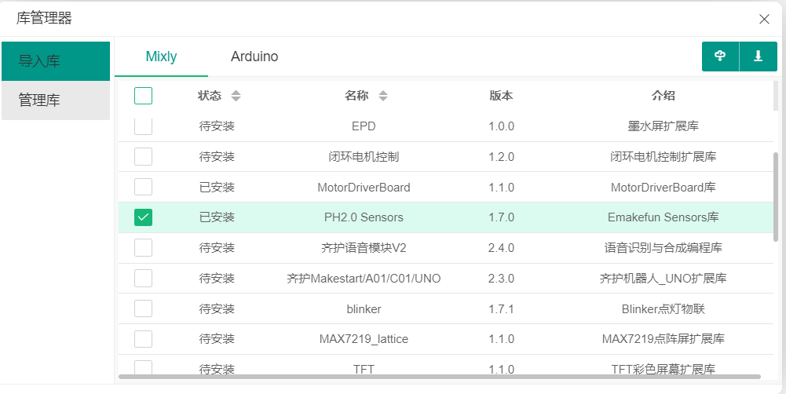
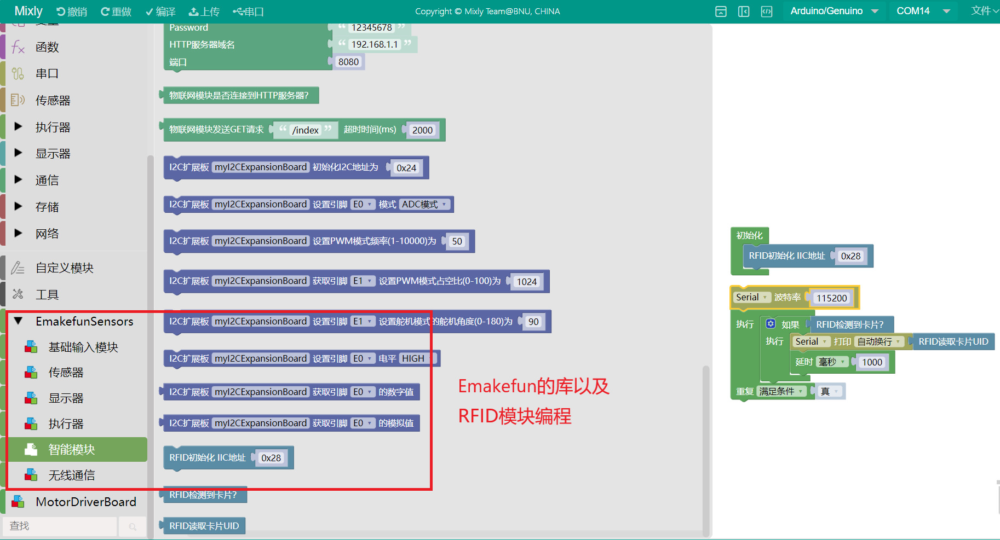
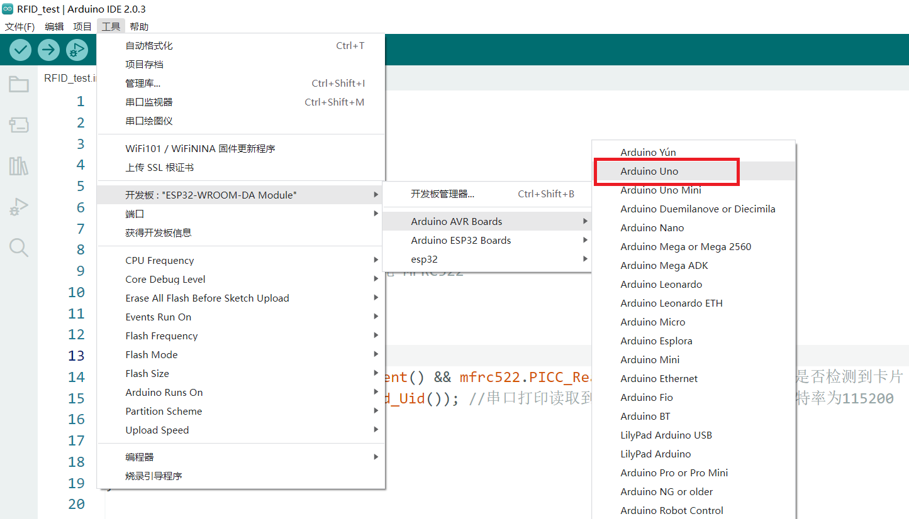
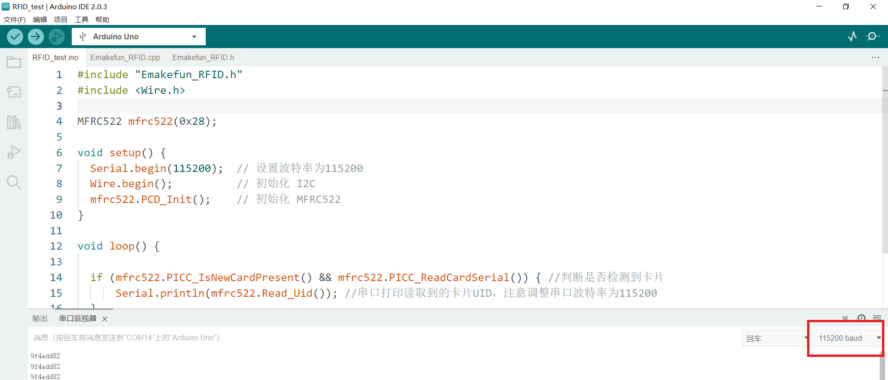
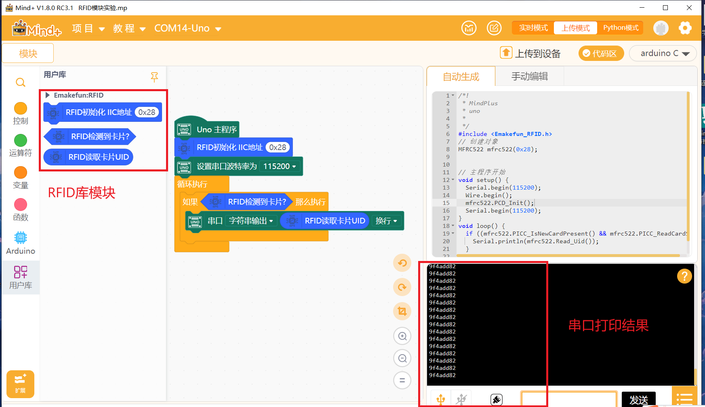

# RFID-I2C模块实验

## 模块实物图



## 概述

射频识别（RFID）是 Radio Frequency Identification 的缩写。

RFID技术的基本工作原理：标签进入阅读器后，接收阅读器发出的射频信号，凭借感应电流所获得的能量发送出存储在芯片中的产品信息（Passive Tag，无源标签或被动标签），或者由标签主动发送某一频率的信号（Active Tag，有源标签或主动标签），阅读器读取信息并解码后，送至中央信息系统进行有关数据处理。

一套完整的RFID系统， 是由阅读器与电子标签也就是所谓的应答器及应用软件系统三个部分所组成，其工作原理是阅读器（Reader）发射一特定频率的无线电波能量，用以驱动电路将内部的数据送出，此时Reader便依序接收解读数据， 送给应用程序做相应的处理。

RFID 的应用非常广泛，目前典型应用有动物晶片、汽车晶片防盗器、门禁管制、停车场管制、生产线自动化、物料管理。


## 1.1实验器件

|  |  |  |  |  |
| ------------------------ | ------------------------ | ------------------------------------ | ---------------------------------- | ---------------------- |
| BLE-UNO 主板*1           | USB数据线*1              | PH2.0 Sensor 扩展板*1                | HP2.0 4Pin线*1                     | RFID射频识别模块*1     |

## 1.2实验接线图

RFID模块接在拓展板I2C端口上。

**接线端口可自行更改，只需注意编程时调节端口，本教程全按照示例接口进行。**


## 1.3 在线运行代码

### 1.3.1.在Mixly中运行

打开Mixly软件，选择Arduino AVR 主板型号。[Mixly示例程序下载](./RFID-I2C/Milxy/FRID-I2C.zip)


点击右上角库文件管理，导入Emalefun Sensors 库。



示例程序：



自行写代码或者打开示例程序。

### 1.3.2.在Arduino IDE中运行

打开Arduino IDE软件，在工具-开发板中选择Arduino Uno主板型号。[IDE示例程序下载](./RFID-I2C/Arduino/RFID_test.zip)



打开示例程序或自行编写，注意波特率一定需要保持一致。



源代码：

```
#include "Emakefun_RFID.h"
#include <Wire.h>

MFRC522 mfrc522(0x28);

void setup() {
  Serial.begin(115200);  // 设置波特率为115200
  Wire.begin();          // 初始化 I2C
  mfrc522.PCD_Init();    // 初始化 MFRC522
}

void loop() {
  
  if (mfrc522.PICC_IsNewCardPresent() && mfrc522.PICC_ReadCardSerial()) { //判断是否检测到卡片
      Serial.println(mfrc522.Read_Uid()); //串口打印读取到的卡片UID，注意调整串口波特率为115200
  }
  delay(50);
  
}
```
### 1.3.3.在Mind+中运行

打开Mind+软件，选择Arduino UNO 主板型号，点击右上角的用户库。[Mind+示例程序下载](./RFID-I2C/Mind+/Mind+.zip)


返回主界面后，能看到用户库已经被导入。



## 1.4实验结果

将卡片靠近RFID模块，此时串口打印出当前读取值。
