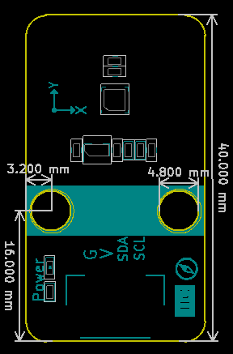
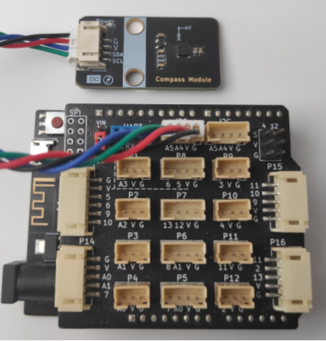

# DB5883指南针模块介绍

## 模块实物图

## 概述

​       DB5883是一种多芯片三轴磁传感器。这表面贴装，小型芯片集成了磁传感器信号条件专用集成电路，针对高精度应用，如在无人机，机器人，移动和游戏的罗盘，导航和个人手持设备。DB5883L是基于我们最先进的，高分辨率，磁阻技术授权自霍尼韦尔AMR技术。与定制设计的16位ADC ASIC，它提供的优点低噪音，高精度，低功耗，抵消和温度补偿。QMC5883L使1度到2度罗盘航向精度。

功能特点：

* 采用先进的AMR技术                 
* 拥有16位ADC
* 分辨率达到0.2uT                     
* 可实现1°航向精度
* 数据更新频率可达200Hz              
* 宽幅工作电压（2.16V to 3.6V）
* 低功耗特征(75uA)                    
* 尺寸小3*3*0.9mm³ 采用LGA封装

## 模块参数

- 工作电压：VDD供电电压为2.5V±5%、3.0V±5%、3.3V±5%；

- GND:地

- SCL:IIC通信模式时钟信号

- SDA:IIC通信模式数据信号

- SETC:S/R电容器（c2）电容连接-驱动端

- SETP：置位/复位带正-S/R电容（C2）连接

- NC:无连接

- DRDY:数据准备，中断引脚。内部被拉高。当数据为于输出寄存器上时会在低电位上停250u sec

- ADC：16位的模数转换器

- Clock Gen.：内部振荡器，用于内部操作

- QMC5883L有两种工作模式：连续测量模式和待命模式。

  

## 数据手册

 [指南针.pdf](compass/指南针.pdf) 

## 机械图

## 寄存器如下

00H~05H是数据寄存器，分别存放的是三轴传感器的X、Y和Z轴的值，每两个寄存器构成一个轴的高低字节，表示范围：-32768~32768。

06H是状态寄存器，当传感器数据已测量完毕并准备好DRDY位被置“1”，数据寄存器一旦被读取，DRDY位将被置“0”。OVL是溢出位，当有任意一个轴的测量值超过范围，OVL将被置“1”，当下一次测量不超测量范围时，OVL将会被置“0”。当处于连续模式下测量数据被跳过时DOR被置“1”，而当数据寄存器被读写后置“0”。

07H~08H存放的是QMC5883L内置的温度传感器的输出数据。这里需要注意的是温度传感器的增益出厂前校正过，但偏移没有得到补偿，所以，温度传感器测得的相对值是准确的。温度系数100 LSB/℃。

09H~0AH是QMC5883L的控制寄存器。09H设置工作模式(MODE)、数据输出更新频率(ODR)、传感器测量范围(RNG)以及过采样率(OSR)。0AH设置中断使能

(INT_ENB)、点翻转使能(POL_PNT)以及软复位(SOFT_RST)。09H寄存器的设置如下图所示：

INT_ENB被置“0”时，中断引脚(即DRDY)将被使能，置“1”时中断被禁止。

ROL_PNT被置“0”时，I2C总线接口将不会自动在00H~06H间翻转，置“1”时自动翻转。

SOFT_RST被置“1”时对QMC5883L进行软复位，软复位可以发生于任何模式下的任何时段，软复位发生后所有寄存器将会被置默认值。

0BH控制QMC5883L的设置/复位时间，推荐值是设定为0x01。

0DH是器件标识寄存器，其值为0xFF。

## Mixly示例程序

实物接线图：指南针传感器接主板I2C端口，SCL对应A5,SDA对应A4；

[点击mixly示例程序下载](./compass/指南针测试程序.mix)

