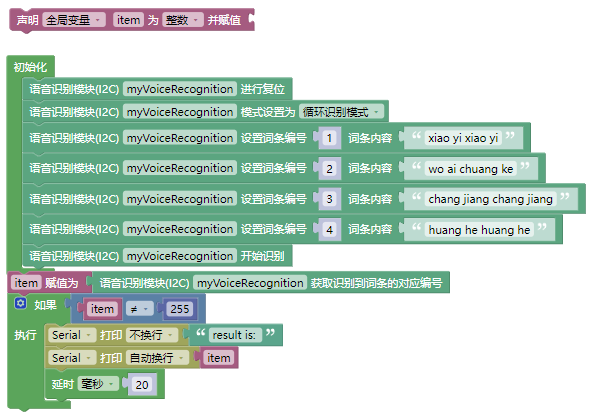

# LD3320语音识别模块


## 概述

该语音识别模块是emakefun基于非特定人语音识别LD3320SI-ASR：（Speaker-Independent Automatic Speech Recognition）芯片开发的一款语音识别模块。LD3320芯片上集成了高精度的 A/D 和 D/A 接口，不再需要外接辅助的 Flash 和RAM，即可以实现语音识别/声控/人机对话功能。提供了真正的单芯片语音识别解决方案。该模块有如下特点：

- 非特定人语音识别技术
用户不需要进行录音训练即可动态编辑的识别关键词语列表，只需要把识别的关键词语以字符串的形式传送进芯片，即可以在下次识别中立即生效。
- 支持用户自由编辑50条关键词语条
在同一时刻，最多在50条关键词语中进行识别，终端用户可以根据场景需要，随时编辑和更新关键词语的内容，每条词条字数不超过79个。
- 模块上有蓝色状态灯，亮起表示正在识别语音，灭掉表示不会识别语音，当识别到语音时状态灯会变暗，或闪烁，等待读取后会恢复当前的状态指示
- 该模块采用MCU+LD3320设计，和应用主控采用I2C通讯，大大简化了用户接线和编程难度。
该模块有四种工作模式， 用户可通过编程，设置工作模式。


**循环检测模式：**
LD3320循环检测是否有人说话。如果有人说话，就会去比对主控设置的关键字列表，并返回识别结果， 主控可以根据识别作相应处理（比如播放某个声音作为回答） 再启动一个识别过程。

**按钮检测模式：**
 模块上有一个按键，当用户按下按键时，语音模块开始检测声音，此时需要用户在这个定时过程中说出要识别的语音关键词语。 当这个过程结束后，需要用户再次触发才能再次启动一个识别过程。

**口令检测模式：**
口令模式需要用户设置唤醒关键字和唤醒等待时间（默认5s），唤醒后才可以进行识别，默认唤醒关键词为第一句，识别结束后，想再次进行识别，还需唤醒它，类似小爱同学，如果设置的唤醒等待时间到了，那么想再次识别，需要重新唤醒它。

**关键字和按键模式：**
关键字和按键都可以同时触发模块进入语音识别。

## 模块参数

* 工作电压：5V
* 连接方式：4 PIN 防反接杜邦线
* 模块尺寸：4 * 2.1cm
* 安装方式：M4螺钉螺母固定

## 引脚定义

| 引脚名称| 描述 |
|---- |----|
| G | GND地线 |
| V | 5V电源引脚 |
| SDA | I2C数据引脚 |
| SCL | I2C时钟引脚   |

## 模块尺寸


##  arduino 应用场景

### arduino函数介绍

```
bool ld3320_reset(void); // 复位语音识别模块，启动时必须先复位,才可配置和添加关键字，延时要超过200ms等待模块初始化完全完成
bool ld3320_config_mode(E_WORK_MODE m); // 配置工作模式
typedef enum
{
    LOOP_MODE = 0,           // 循环模式
    BUTTON_MODE = 1,         // 按键模式
    KEYWORDS_MODE = 2,       // 关键字模式
    KEYWORDS_AND_BUTTON = 3, // 关键字加按键模式
}E_WORK_MODE;
bool ld3320_add_words(unsigned char id, unsigned char *words); // 添加关键字第一个参数是关键字序号，1~49， 后面是关键字字符串，不超过79个字符，汉字不超过10个
bool ld3320_config_time(unsigned char t); // 配置唤醒等待时间默认为5s
bool ld3320_config_keywords(unsigned char *words); // 配置唤醒关键字
bool ld3320_asr_start(void); // 语音识别模块开始识别
unsigned char ld3320_get_result(void);  // 获取识别到关键字序号
```
### arduino示例程序

[下载最新固件](https://www.emakefun.com/uploads/data/asr_control.zip)

```
#include "asr_ld3320.h"

void setup()
{
  E_WORK_MODE asr_mode = LOOP_MODE;      // 0：循环识别模式  1：口令模式，以第一个词条为口令  2、按键模式，按下开始识别
  Wire.begin();
  Serial.begin(9600);
  ld3320_reset();
  ld3320_config_mode(asr_mode);  // 循环模式
  ld3320_add_words(0, "xiao yi xiao yi");  // 小易小易
  Serial.println("xiao yi xiao yi");
  ld3320_add_words(5, "shen zhen shi");    // 深圳市
  Serial.println("shen zhen shi");
  ld3320_add_words(1, "ni hao");  // 你好
  Serial.println("ni hao");
  ld3320_add_words(2,"kai deng");          // 开灯
  Serial.println("kai deng");
  ld3320_add_words(3, "xiao yi tong xue");              
  Serial.println("xiao yi tong xue");
  ld3320_add_words(4, "guan deng");        // 关灯
  Serial.println("guan deng");
  ld3320_add_words(8, "wo ai ni");         // 我爱你
  Serial.println("wo ai ni");
  ld3320_asr_start();
  Serial.println("ld3320 start ");
}

void loop()
{
  unsigned char result;
  result = ld3320_get_result();
  if (result != 0xFF) {
    Serial.print("asr result is:");
    Serial.println(result);   //返回识别结果，即识别到的词条编号
    delay(20);
  }

}
```
### Mixly示例程序

[下载mixly扩展库](ld3320_pic/Nulllab_Sensor.zip)



[下载mixly示例程序](ld3320_pic/ld3320mixly.zip)


## microbit示例程序

<a href="https://makecode.microbit.org/_4J7WTLfUtWYo" target="_blank">动手试一试</a>