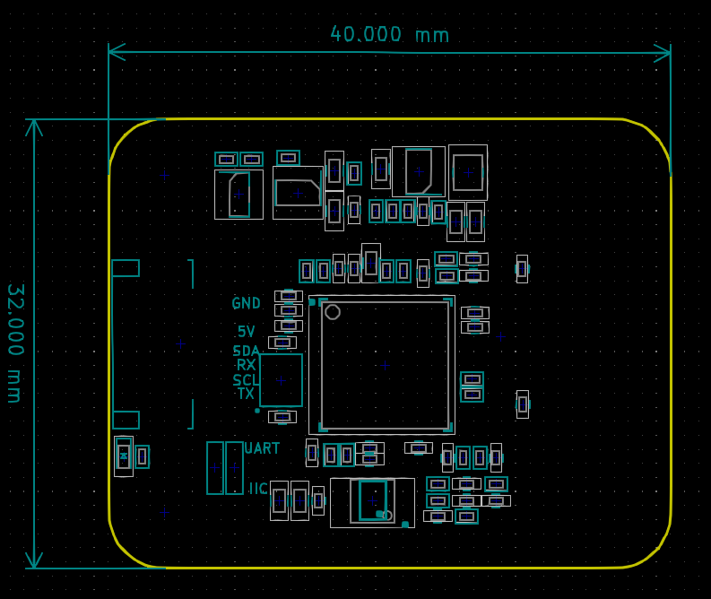

# 语音合成模块

## 实物图


## 概述

语音合成模块是一款高集成度的语音合成模块，该模块方案基于新 一代神经网络算法，选取优质的女声发音人，满足通用应用场景的合成播报。方案以中文为主，但支 持数字、字母、单词、简单的中英文混读,在合成效果（可懂度、清晰度、自然度、表现力、节奏/ 停顿、语速、语调、音质、音色、理解费力程度）方面有显著的提升。 模块可以通过异步串口（UART）接收待合成的文本，直接合成为语音输出；主要是面向中高端应 用，为其提供一套完整的物美价廉的语音解决方案。支持纯中文、常规英文文本（如字母、单词、短句）以及中英文混合合成，可实现多音字、生僻字、数字、数值、日期、时间、字母正确流畅的合成，播放清晰无杂音，支持实时更新的特殊播报（如：字母、数字穿插播报、大写字母缩写；支持五种文本编码方式，当前方案支持 GB2312、GBK、BIG5、UTF16LE 和 UTF8 五种编码方式。每次合成的文本量最多可达 4K 字节（中文不超过 2000 个字）；支持多种控制命令，控制命令包括：合成文本、停止合成、暂停合成、恢复合成、状态查询、进入省电模式、唤醒等控制命令。控制器通过通信接口发送控制命令可以对芯片进行相应的控制；可查询芯片的工作状态，通过读芯片自动返回的工作状态字、发送查询命令获得芯片工作状态的回传数据。

##  模块参数

| 引脚名称 |     描述     |
| :------: | :----------: |
|    G     |     GND      |
|    V     |    5V电源    |
|    RX    | UART接收引脚 |
|    TX    | UART发送引脚 |

- 供电电压：5V
- 连接方式：PH2.0 4PIN防反接线
- 模块尺寸：40*32mm
- 安装方式：M4螺钉兼容乐高插孔固定

## 机械尺寸图



## 通信协议

### 功能特性 

#### 支持纯中文、常规英文文本（如字母、单词、短句）以及中英文混合合成 

可实现多音字、生僻字、数字、数值、日期、时间、字母正确流畅的合成，播放清晰无杂音，支持实时更新的特殊播报（如：字母、数字穿插播报、大写字母缩写）。

 #### 支持五种文本编码方式 

当前方案支持 GB2312、GBK、BIG5、UTF16LE 和 UTF8 五种编码方式。每次合成的文本量最多支持 4K 字节（经过相应的解码格式解码后），（中文不超过 2000 个字，具体跟编解码格式相关）。具体的每种解码格式字符占用空间参考表 1-1。

| 解码格式 | 英文字符 | 中文   | 英文标点 | 中文标点 |
| -------- | -------- | ------ | -------- | -------- |
| GB2312   | 1 字节   | 2 字节 | 1 字节   | 2 字节   |
| GBK      | 1 字节   | 2 字节 | 1 字节   | 2 字节   |
| BIG5     | 1 字节   | 2 字节 | 1 字节   | 2 字节   |
| UTF16LE  | 2 字节   | 2 字节 | 2 字节   | 2 字节   |
| UTF8     | 1 字节   | 3 字节 | 1 字节   | 3 字节   |

表 1-1 不同解码方式字符占用空间 

####  支持多种控制命令 

控制命令包括：合成文本、停止合成、暂停合成、恢复合成、状态查询、进入省电模式、唤醒等控制命令。控制器通过通信接口发送控制命令可以对芯片进行相应的控制。

#### 可查询芯片的工作状态

通过读芯片自动返回的工作状态字、发送查询命令可以获得芯片工作状态的回传数据。 

## 更多详细介绍

[查看软件开发手册](tts_module/tts_软件开发手册)

## Arduino示例程序

```c++
#include "tts.h"
//新建一个ttl对象，rx:6,tx:5

TTS tt(6, 5);

void setup() {
  // put your setup code here, to run once:
  tt.begin(115200);
  Serial.begin(115200);
  strcpy(tt.buff,"小易同学");
  tt.buff_size=strlen(tt.buff);
}
//发送命令帧头

void loop() {
  // put your main code here, to run repeatedly:

  tt.StartCmd();
  Serial.println("Start_Cmd");
  tt.ReturnStatus();
  delay(3000);

  
  tt.TextCacheCmd();
  Serial.println("Text_Cache_Cmd");
  tt.ReturnStatus();
  delay(1000);
  tt.SpeechSynthesisCmd();
  Serial.println("Speech_Synthesis_Cmd");
  tt.ReturnStatus();
  delay(3000);
}
```

[下载示例程序](tts_module/tts.zip)

